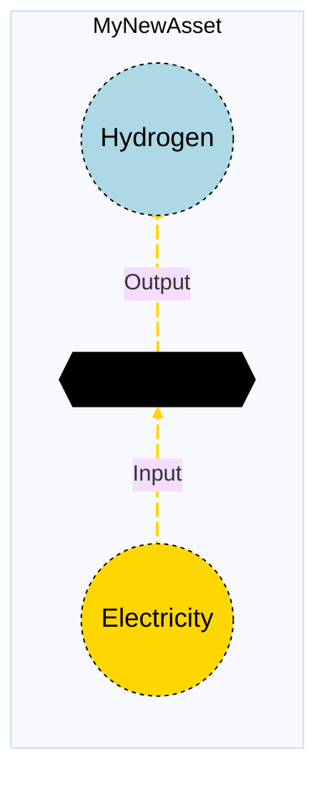

# [Adding Documentation for a New Asset](@id modeler_add_docs_to_asset)

After creating a new asset implementation, it's important to document it properly so that other users can understand how to use it. This guide will walk you through creating a documentation page for your new asset that follows the same structure and format as existing assets in the [Macro Asset Library](@ref).

## Overview

Each asset in MacroEnergy.jl has a dedicated documentation page located in `docs/src/Manual/assets/` that provides comprehensive information about the asset's functionality, configuration, and usage. The documentation follows a consistent template structure to ensure clarity and ease of use.

## Prerequisites

Before creating documentation for your asset, ensure you have:
- Successfully implemented your asset following the [Creating a New Asset](@ref modeler_create_asset) guide
- Tested your asset to ensure it works correctly
- Created a visual diagram of your asset's structure (recommended)

## Documentation Structure

Each asset documentation page follows a consistent structure with the following sections:

1. **Overview** - Brief description of what the asset represents
2. **Asset Structure** - Graphical representation showing components
3. **Flow Equations** (where applicable) - Mathematical relationships between commodities
4. **Input File (Standard Format)** - How to configure the asset
5. **Types - Asset Structure** - Julia type definition
6. **Constructors** - Julia constructors for the asset
7. **Examples** - Practical examples and use cases
8. **Best Practices** - Guidelines for effective usage
9. **Input File (Advanced Format)** - Advanced configuration options (optional)

## Step-by-Step Process

!!! warning "Code Examples"
    The following examples show how to document a new asset called `MyNewAsset`. This example asset contains a `Transformation` component and two `Edge` components (one for `Electricity` and one for `Hydrogen`). Make sure to adapt these examples to match your specific asset's structure and components.

### Step 1: Create the Documentation File

Create a new markdown file in the `docs/src/Manual/assets/` directory with a descriptive name following the pattern of existing assets:

```bash
# Example file names:
docs/src/Manual/assets/mynewasset.md
docs/src/Manual/assets/thermalpower.md
docs/src/Manual/assets/battery.md
```

### Step 2: Set Up the Basic Structure

Start your documentation file with the following basic structure. Replace `MyNewAsset` and `mynewasset` with your actual asset name:

```markdown
# My New Asset

## Contents

[Overview](@ref mynewasset_overview) | [Asset Structure](@ref mynewasset_asset_structure) | [Flow Equations](@ref mynewasset_flow_equations) | [Input File (Standard Format)](@ref mynewasset_input_file) | [Types - Asset Structure](@ref mynewasset_type_definition) | [Constructors](@ref mynewasset_constructors) | [Examples](@ref mynewasset_examples) | [Best Practices](@ref mynewasset_best_practices) | [Input File (Advanced Format)](@ref mynewasset_advanced_json_csv_input_format)

## [Overview](@id mynewasset_overview)

My New Asset assets in Macro represent [specific technology or process] that [describe main function]. These assets are defined using either JSON or CSV input files placed in the `assets` directory, typically named with descriptive identifiers like `mynewasset.json` or `mynewasset.csv`.
```

### Step 3: Create the Asset Structure Section

This section should include a mermaid diagram showing your asset's components and their connections:

````markdown
## [Asset Structure](@id mynewasset_asset_structure)

A My New Asset asset consists of [X] main components:

1. **Component 1**: Description of component
2. **Component 2**: Description of component
3. **Component 3**: Description of component

Here is a graphical representation of the My New Asset asset:


````

**Mermaid Diagram Guidelines:**
- Use consistent styling for different commodity types:
  - Electricity: `#FFD700` (gold)
  - Hydrogen: `lightblue`
  - Natural Gas: `#005F6A` (dark blue-green)
  - CO₂: `lightgray`
  - Biomass: `palegreen`
- Use `{{..}}` for transformations
- Use `[Storage]` for storage components
- Use `((Commodity))` for external commodity nodes
- Include animation with `@{ animate: true }`
- Adjust font and circle size to make the diagram more readable.

Remember to update the mermaid diagram to match your asset's structure and components.

### Step 4: Add Flow Equations (if applicable)

If your asset has mathematical relationships between flows, document them here:

````markdown
## [Flow Equations](@id mynewasset_flow_equations)

The My New Asset asset follows these stoichiometric relationships:

```math
\begin{aligned}
\phi_{input} &= \phi_{output} \cdot \epsilon_{efficiency} \\
\phi_{emissions} &= \phi_{input} \cdot \epsilon_{emission\_rate} \\
\end{aligned}
```

Where:
- ``\phi`` represents the flow of each commodity
- ``\epsilon`` represents the stoichiometric coefficients defined in the [Conversion Process Parameters](@ref mynewasset_conversion_process_parameters) section.
````

**Flow Equations Guidelines:**
- Ensure the coefficient names in your equations (e.g., ``\epsilon_{efficiency}``) match the parameter names in your **Conversion Process Parameters** table (see [Step 6: Document Parameters](@ref mynewasset_parameters))
- Use ``\phi_{commodity\_name}`` for commodity flows
- Use ``\epsilon_{parameter\_name}`` for stoichiometric coefficients
- List all variables used in the equations with clear descriptions
- Ensure the equations are dimensionally consistent with the units specified in your parameter tables
- Reference the parameter table where coefficients are defined

**Example**: If your parameter table includes `efficiency` and `emission_rate`, your equations should use ``\epsilon_{efficiency}`` and ``\epsilon_{emission\_rate}`` respectively.

### Step 5: Document Input File Format

This is one of the most important sections. Document how users can configure your asset:

````markdown
## [Input File (Standard Format)](@id mynewasset_input_file)

The easiest way to include a My New Asset asset in a model is to create a new file (either JSON or CSV) and place it in the `assets` directory together with the other assets. 

```
your_case/
├── assets/
│   ├── mynewasset.json    # or mynewasset.csv
│   ├── other_assets.json
│   └── ...
├── system/
├── settings/
└── ...
```

This file can either be created manually, or using the `template_asset` function, as shown in the [Adding an Asset to a System](@ref) section of the User Guide. The file will be automatically loaded when you run your Macro model. 

The following is an example of a My New Asset asset input file:

```json
{
    "MyNewAsset": [
        {
            "type": "MyNewAsset",
            "instance_data": [
                {
                    "id": "mynewasset_1_SE",
                    "location": "SE",
                    "efficiency": 0.8,
                    "investment_cost": 1000,
                    "fixed_om_cost": 50,
                    "variable_om_cost": 1
                }
            ]
        }
    ]
}
```

!!! tip "Global Data vs Instance Data"
    When working with JSON input files, the `global_data` field can be used to group data that is common to all instances of the same asset type. This is useful for setting constraints that are common to all instances of the same asset type and avoid repeating the same data for each instance. See the [Examples](@ref "mynewasset_examples") section below for an example.
````

Remember to update the example to match your asset's structure and components. The example above is only for illustrative purposes.

### [Step 6: Document Parameters](@id mynewasset_parameters)

Create comprehensive tables documenting all the parameters your asset accepts:

````markdown
The following tables outline the attributes that can be set for a My New Asset asset.

#### Essential Attributes
| Field | Type | Description |
|--------------|---------|------------|
| `Type` | String | Asset type identifier: "MyNewAsset" |
| `id` | String | Unique identifier for the asset instance |
| `location` | String | Geographic location/node identifier |

#### [Conversion Process Parameters](@id mynewasset_conversion_process_parameters)
| Field | Type | Description | Units | Default |
|--------------|---------|------------|----------------|----------|
| `efficiency` | Float64 | Conversion efficiency | fraction | 1.0 |
| `parameter_name` | Float64 | Description of parameter | units | default-value |

#### Investment Parameters
| Field | Type | Description | Units | Default |
|--------------|---------|------------|----------------|----------|
| `can_retire` | Boolean | Whether capacity can be retired | - | true |
| `can_expand` | Boolean | Whether capacity can be expanded | - | true |
| `existing_capacity` | Float64 | Initial installed capacity | MW | 0.0 |
| `capacity_size` | Float64 | Unit size for capacity decisions | - | 1.0 |

#### Economic Parameters
| Field | Type | Description | Units | Default |
|--------------|---------|------------|----------------|----------|
| `investment_cost` | Float64 | CAPEX per unit capacity | \$/MW | 0.0 |
| `fixed_om_cost` | Float64 | Fixed O&M costs | \$/MW/yr | 0.0 |
| `variable_om_cost` | Float64 | Variable O&M costs | \$/MWh | 0.0 |
````

### Step 7: Document Constraints

Explain how constraints can be applied to your asset, and how to configure them. If some constraints are applied by default, explain them here.

````markdown
#### [Constraints Configuration](@id "mynewasset_constraints")
My New Asset assets can have different constraints applied to them, and the user can configure them using the following fields:

| Field | Type | Description |
|--------------|---------|------------|
| `transform_constraints` | Dict{String,Bool} | List of constraints applied to the transformation component. |
| `input_constraints` | Dict{String,Bool} | List of constraints applied to the input edge component. |
| `output_constraints` | Dict{String,Bool} | List of constraints applied to the output edge component. |

For example, if the user wants to apply the [`BalanceConstraint`](@ref balance_constraint_ref) to the transformation component and the [`CapacityConstraint`](@ref capacity_constraint_ref) to the input edge, the constraints fields should be set as follows:

```json
{
    "transform_constraints": {
        "BalanceConstraint": true
    },
    "input_constraints": {
        "CapacityConstraint": true
    }
}
```

Users can refer to the [Adding Asset Constraints to a System](@ref) section of the User Guide for a list of all the constraints that can be applied to the different components of a My New Asset asset.

#### Default constraints
To simplify the input file and the asset configuration, the following constraints are applied to the My New Asset asset by default:

- [Balance constraint](@ref balance_constraint_ref) (applied to the transformation component)
- [Capacity constraint](@ref capacity_constraint_ref) (applied to the input edge)
````

### Step 8: Document Type Definition and Constructors
````markdown
## [Types - Asset Structure](@id mynewasset_type_definition)

The `MyNewAsset` asset is defined as follows:

```julia
struct MyNewAsset <: AbstractAsset
    id::AssetId
    transform::Transformation
    input_edge::Edge{Electricity}
    output_edge::Edge{Hydrogen}
end
```

## [Constructors](@id mynewasset_constructors)

### Default constructor

```julia
MyNewAsset(id::AssetId, transform::Transformation, input_edge::Edge{Electricity}, output_edge::Edge{Hydrogen})
```

### Factory constructor
```julia
make(asset_type::Type{MyNewAsset}, data::AbstractDict{Symbol,Any}, system::System)
```

| Field | Type | Description |
|--------------|---------|------------|
| `asset_type` | `Type{MyNewAsset}` | Macro type of the asset |
| `data` | `AbstractDict{Symbol,Any}` | Dictionary containing the input data for the asset |
| `system` | `System` | System to which the asset belongs |
````

Again, make sure to update the code blocks to match your asset's structure and components.

### Step 9: Provide Examples

Include practical examples showing different configurations:

````markdown
## [Examples](@id mynewasset_examples)

This section contains examples of how to use the My New Asset asset in a Macro model.

### Basic Configuration

This example shows a basic My New Asset configuration with standard parameters.

**JSON Format:**
```json
{
    "MyNewAsset": [
        {
            "type": "MyNewAsset",
            "instance_data": [
                {
                    "id": "mynewasset_1_SE",
                    "location": "SE",
                    "efficiency": 0.8,
                    "investment_cost": 1000,
                    "fixed_om_cost": 50,
                    "variable_om_cost": 1
                }
            ]
        }
    ]
}
```

**CSV Format:**

| Type | id | location | efficiency | investment_cost | fixed_om_cost | variable_om_cost |
|------|----|----------|------------|------------------|-----------------|-------------------|
| MyNewAsset | mynewasset_SE | SE | 0.8 | 1000 | 50 | 1 |

### Advanced Configuration with Global Data

This example shows how to use global data to share common parameters across multiple instances.

**JSON Format:**

```json
{
    "MyNewAsset": [
        {
            "type": "MyNewAsset",
            "global_data": {
                "investment_cost": 1000,
                "fixed_om_cost": 50,
                "variable_om_cost": 1
            },
            "instance_data": [
                {
                    "id": "mynewasset_1_SE",
                    "location": "SE",
                    "efficiency": 0.8
                },
                {
                    "id": "mynewasset_2_SE",
                    "location": "SE",
                    "efficiency": 0.85
                }
            ]
        }
    ]
}
```
````

!!! note "Handling Special Characters"
    When creating input files, especially in CSV format, pay attention to special characters like underscores (`_`). These characters might need to be escaped to prevent parsing errors. For example, the `fixed_om_cost` field should be written as `fixed\_om\_cost` to avoid being misinterpreted as italicized text.

### Step 10: Add Best Practices
Include a section on best practices for using your asset. This helps users avoid common mistakes and use the asset effectively:

````markdown
## [Best Practices](@id mynewasset_best_practices)

When using My New Asset assets, consider the following best practices:

1. **Efficiency Values**: Set realistic efficiency values based on technology specifications
2. **Cost Parameters**: Use up-to-date cost data from reliable sources
3. **Location Assignment**: Ensure locations correspond to existing nodes in your system
4. **Capacity Planning**: Consider both existing and new capacity when setting parameters
5. **Constraint Selection**: Choose constraints that reflect realistic operational limitations

### Common Pitfalls to Avoid

- **Missing Location**: Always specify a valid location for your asset
- **Unrealistic Efficiency**: Avoid efficiency values above 1.0 or below 0.0
- **Negative Costs**: Ensure all cost parameters are non-negative
- **Missing Constraints**: Consider which constraints are necessary for realistic operation
````

### Step 11: Document Advanced Format (optional)
This section is optional but recommended as it provides examples of advanced asset configuration using detailed JSON and CSV data formats. It's particularly useful for advanced users who need full control over asset configuration.

````markdown
## [Input File (Advanced Format)](@id mynewasset_advanced_json_csv_input_format)

For advanced users, the My New Asset asset supports additional configuration options:

### Advanced JSON Configuration

```json
{
    "MyNewAsset": [
        {
            "type": "MyNewAsset",
            "global_data": {
                "transforms": {
                    "constraints": {
                    "BalanceConstraint": true,
                    "CustomConstraint": true
                },
                "edges": {
                    "output_edge": {
                        "commodity": "Hydrogen",
                        "unidirectional": true,
                        "has_capacity": true,
                        "can_retire": true,
                        "can_expand": true,
                        "constraints": {
                            "CapacityConstraint": true,
                            "RampingLimitConstraint": true,
                            "MinFlowConstraint": true
                        }
                    },
                    "input_edge": {
                        "commodity": "Electricity",
                        "unidirectional": true,
                        "has_capacity": false
                    }
                }
            },
            "instance_data": [
                {
                    "id": "advanced_mynewasset_SE",
                    "transforms": {
                        "efficiency": 0.8
                    },
                    "edges": {
                        "output_edge": {
                            "end_vertex": "h2_SE",
                            "existing_capacity": 0,
                            "investment_cost": 1000,
                            "fixed_om_cost": 50,
                            "variable_om_cost": 1,
                            "capacity_size": 1,
                            "ramp_up_fraction": 0.5,
                            "ramp_down_fraction": 0.5
                        },
                        "input_edge": {
                            "start_vertex": "elec_SE"
                        }
                    }
                }
            ]
        }
    ]
}
```

````

## Documentation Best Practices

### 1. **Be Comprehensive**
- Document all parameters, even if they have default values
- Include units for all parameters
- Explain what each parameter controls

### 2. **Provide Examples**
- Include both simple and complex examples
- Show both JSON and CSV formats
- Demonstrate common use cases

### 3. **Use Consistent Formatting**
- Follow the existing documentation style
- Use consistent table formatting
- Maintain proper markdown syntax

### 4. **Include Visual Elements**
- Create clear mermaid diagrams
- Use consistent color coding for commodities
- Show the asset structure clearly

### 5. **Cross-Reference Appropriately**
- Link to related documentation sections
- Reference constraint definitions
- Point to user guides where relevant

## Updating the Asset Library 

After creating your documentation, you should update the Asset Library so that your new asset appears in the main asset list and the new page is accessible to other users.

1. **Add your asset to the main `Assets.md` file** in `docs/src/Manual/Assets.md`
2. **Include a mermaid diagram** in the asset list
3. **Ensure the asset name is correctly hyperlinked** in the `Assets.md` file
4. **Update the table of contents** if necessary
5. **Test the documentation** by building the docs locally

### Example Addition to Assets.md

````markdown
- [My New Asset](@ref)


````

### Testing Your Documentation

1. **Build the documentation locally** to check for formatting errors:
   ```bash
   julia --project=docs -e 'using Pkg; Pkg.develop(path="."); Pkg.instantiate(); include("docs/make.jl")'
   ```
2. **Open the `docs/build/index.html` file** in your browser to view the documentation
3. **Verify all links work** correctly
4. **Have others review** the documentation for clarity and consistency
5. **Update as needed** based on feedback and usage

## Next Steps

After creating your asset documentation:

1. **Submit a pull request** with your documentation: [Opening a PR](@ref opening_a_pr)
2. **Request review** from other contributors: [How to contribute guide](@ref how_to_contribute)
3. **Update related documentation** if your asset affects other parts of the system
4. **Maintain the documentation** as your asset evolves
