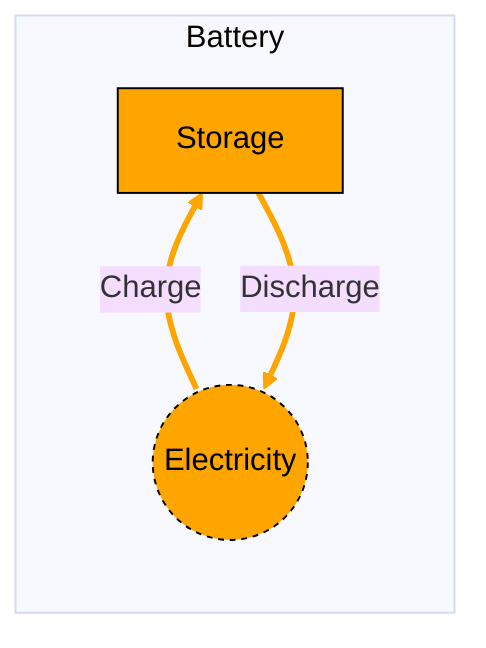

# Battery

## Contents

[Overview](@ref battery_overview) | [Asset Structure](@ref battery_asset_structure) | [Symmetric and Asymmetric Battery](@ref battery_symmetric_and_asymmetric) | [Input File (Standard Format)](@ref battery_input_file) | [Types - Asset Structure](@ref battery_types) | [Constructors](@ref battery_constructors) | [Examples](@ref battery_examples) | [Best Practices](@ref battery_best_practices) | [Advanced JSON/CSV Input Format](@ref battery_advanced_json_csv_input_format)

## [Overview](@id battery_overview)

Battery assets in Macro represent electricity storage technologies that can charge from and discharge to the electricity network. These assets are defined using either JSON or CSV input files placed in the `assets` directory, typically named `electricity_stor.json` or `electricity_stor.csv`.

## [Asset Structure](@id battery_asset_structure)

A battery storage asset consists of three main components:

1. **Storage Component**: Tracks the energy level in the battery over time
2. **Charge Edge**: Represents electricity flow from the grid to the battery
3. **Discharge Edge**: Represents electricity flow from the battery to the grid

Here is a graphical representation of the battery asset:



## [Symmetric and Asymmetric Battery](@id battery_symmetric_and_asymmetric)

Macro supports a variety of battery technologies, both with symmetric and asymmetric charge/discharge capacities. Examples of symmetric batteries are lithium-ion batteries, while asymmetric batteries are thermal storage systems.

The user can configure the battery asset to be symmetric or asymmetric simply by using the input file as described in the following section. By default, the battery asset is configured to be symmetric.

## [Input File (Standard Format)](@id battery_input_file)

The easiest way to include a battery asset in a model is to create a new file (either JSON or CSV) and place it in the `assets` directory together with the other assets. This file can either be created manually, or using the `template_asset` function, as shown in the [Adding an Asset to a System](@ref) section of the User Guide. The file will be automatically loaded when you run your Macro model. 

```
your_case/
├── assets/
│   ├── electricity_stor.json    # or electricity_stor.csv
│   ├── other_assets.json
│   └── ...
├── system/
├── settings/
└── ...
```

!!! tip "Global Data vs Instance Data"
    When working with JSON input files, the `global_data` field can be used to group data that is common to all instances of the same asset type. This is useful for setting constraints that are common to all instances of the same asset type and avoid repeating the same data for each instance. See the [Examples](@ref "battery_examples") section below for an example.

The following table summarizes the attributes that can be set for a battery asset.

### Essential Attributes
| Field | Type | Description |
|--------------|---------|------------|
| `Type` | String | Asset type identifier: "Battery" |
| `id` | String | Unique identifier for the battery instance |
| `location` | String | Geographic location/node identifier |

### [Constraints configuration](@id "battery_constraints")
Battery assets can have different constraints applied to them, and the user can configure them using the following fields:

| Field | Type | Description |
|--------------|---------|------------|
| `storage_constraints` | Dict{String,Bool} | List of constraints applied to the storage component. |
| `discharge_constraints` | Dict{String,Bool} | List of constraints applied to the discharge edge. |
| `charge_constraints` | Dict{String,Bool} | List of constraints applied to the charge edge. |

For example, if the user wants to apply the [`StorageMinDurationConstraint`](@ref storage_min_duration_constraint_ref) to the storage component and the [`MinFlowConstraint`](@ref min_flow_constraint_ref) to the discharge edge, the `storage_constraints` and `discharge_constraints` fields should be set to `{"StorageMinDurationConstraint": true}` and `{"MinFlowConstraint": true}`, respectively:

```json
{
    "storage_constraints": {
        "StorageMinDurationConstraint": true
    },
    "discharge_constraints": {
        "MinFlowConstraint": true
    }
}
```

#### Default constraints
To simplify the input file and the asset configuration, the following constraints are applied to the battery asset by default:

- [Balance constraint](@ref balance_constraint_ref) (applied to the storage component)
- [Storage capacity constraint](@ref storage_capacity_constraint_ref) (applied to the storage component)
- [Storage symmetric capacity constraint](@ref storage_symmetric_capacity_constraint_ref) (applied to the storage component)
- [Capacity constraint](@ref capacity_constraint_ref) (applied to the discharge edge)
- [Storage discharge limit constraint](@ref storage_discharge_limit_constraint_ref) (applied to the discharge edge)

If the storage is a long-duration storage, the following additional constraints are applied:
- [Long-duration storage constraints](@ref long_duration_storage_constraints_ref) (applied to the storage component)

Users can refer to the [Adding Asset Constraints to a System](@ref) section of the User Guide for a list of all the constraints that can be applied to a battery asset.

### Investment Parameters
| Field | Type | Description | Units | Default |
|--------------|---------|------------|----------------|----------|
| `storage_can_retire` | Boolean | Whether storage capacity can be retired | - | true |
| `storage_can_expand` | Boolean | Whether storage capacity can be expanded | - | true |
| `storage_existing_capacity` | Float64 | Initial installed storage capacity | MWh | 0.0 |
| `storage_capacity_size` | Float64 | Unit size for capacity decisions | - | 1.0 |
| `discharge_can_retire` | Boolean | Whether discharge capacity can be retired | - | true |
| `discharge_can_expand` | Boolean | Whether discharge capacity can be expanded | - | true |
| `discharge_existing_capacity` | Float64 | Initial installed discharge capacity | MWh/hr | 0.0 |
| `discharge_capacity_size` | Float64 | Unit size for capacity decisions | - | 1.0 |

#### Asymmetric battery
If the battery is asymmetric, the following investment parameters are also used:

| Field | Type | Description | Units | Default |
|--------------|---------|------------|----------------|----------|
| `charge_has_capacity` | Boolean | Whether the charge edge has capacity variables and limits | - | false |
| `charge_can_retire` | Boolean | Whether charge capacity can be retired | - | false |
| `charge_can_expand` | Boolean | Whether charge capacity can be expanded | - | false |
| `charge_existing_capacity` | Float64 | Initial installed charge capacity | MWh/hr | 0.0 |
| `charge_capacity_size` | Float64 | Unit size for capacity decisions | - | 1.0 |

#### Additional capacity constraints
If [`MaxCapacityConstraint`](@ref max_capacity_constraint_ref) or [`MinCapacityConstraint`](@ref min_capacity_constraint_ref) are added to the constraints dictionary for any of the three components, the following parameters are used by Macro:

| Field | Type | Description | Units | Default |
|--------------|---------|------------|----------------|----------|
| `storage_max_capacity` | Float64 | Maximum allowed storage capacity | MWh | Inf |
| `storage_min_capacity` | Float64 | Minimum allowed storage capacity | MWh | 0.0 |
| `discharge_max_capacity` | Float64 | Maximum allowed discharge capacity | MWh/hr | Inf |
| `discharge_min_capacity` | Float64 | Minimum allowed discharge capacity | MWh/hr | 0.0 |
| `charge_max_capacity` | Float64 | Maximum allowed charge capacity | MWh/hr | Inf |
| `charge_min_capacity` | Float64 | Minimum allowed charge capacity | MWh/hr | 0.0 |

### Economic Parameters
| Field | Type | Description | Units | Default |
|--------------|---------|------------|----------------|----------|
| `storage_investment_cost` | Float64 | CAPEX per unit storage capacity | \$/MWh | 0.0 |
| `storage_annualized_investment_cost` | Union{Nothing,Float64} | Annualized CAPEX | \$/MWh/yr | calculated |
| `storage_fixed_om_cost` | Float64 | Fixed O&M costs of the storage component | \$/MWh/yr | 0.0 |
| `storage_variable_om_cost` | Float64 | Variable O&M costs of the storage component | \$/MWh | 0.0 |
| `storage_wacc` | Float64 | Weighted average cost of capital | fraction | 0.0 |
| `storage_lifetime` | Int | Asset lifetime in years | years | 1 |
| `storage_capital_recovery_period` | Int | Investment recovery period | years | 1 |
| `storage_retirement_period` | Int | Retirement period | years | 1 |
| `discharge_investment_cost` | Float64 | CAPEX per unit discharge capacity | \$/MW | 0.0 |
| `discharge_annualized_investment_cost` | Union{Nothing,Float64} | Annualized CAPEX | \$/MW/yr | calculated |
| `discharge_fixed_om_cost` | Float64 | Fixed O&M costs of the discharge edge | \$/MW/yr | 0.0 |
| `discharge_variable_om_cost` | Float64 | Variable O&M costs of the discharge edge | \$/MWh | 0.0 |
| `discharge_wacc` | Float64 | Weighted average cost of capital | fraction | 0.0 |
| `discharge_lifetime` | Int | Asset lifetime in years | years | 1 |
| `discharge_capital_recovery_period` | Int | Investment recovery period | years | 1 |
| `discharge_retirement_period` | Int | Retirement period | years | 1 |
| `charge_variable_om_cost` | Float64 | Variable O&M costs of the charge edge | \$/MWh | 0.0 |


#### Asymmetric battery
If the battery is asymmetric, the following economic parameters are also used:

| Field | Type | Description | Units | Default |
|--------------|---------|------------|----------------|----------|
| `charge_investment_cost` | Float64 | CAPEX per unit charge capacity | \$/MW | 0.0 |
| `charge_annualized_investment_cost` | Union{Nothing,Float64} | Annualized CAPEX | \$/MW/yr | calculated |
| `charge_fixed_om_cost` | Float64 | Fixed O&M costs of the charge edge | \$/MW/yr | 0.0 |

### Charge and Discharge Efficiency

| Field | Type | Description | Default |
|--------------|---------|------------|----------|
| `discharge_efficiency` | Float64 | Efficiency of discharging process | 1.0 |
| `charge_efficiency` | Float64 | Efficiency of charging process | 1.0 |

### Operational Parameters
| Field | Type | Description | Units | Default |
|--------------|---------|------------|----------------|----------|
| `storage_max_duration` | Float64 | Maximum storage duration | hours | 0.0 |
| `storage_min_duration` | Float64 | Minimum storage duration | hours | 0.0 |
| `storage_loss_fraction` | Float64 | Fraction of stored energy lost per timestep | fraction | 0.0 |

#### Additional Operational Parameters

**Maximum and minimum storage level constraints**

If [`MaxStorageLevelConstraint`](@ref max_storage_level_constraint_ref) or [`MinStorageLevelConstraint`](@ref min_storage_level_constraint_ref) are added to the constraints dictionary for the storage component, the following parameters are used:

| Field | Type | Description | Units | Default |
|--------------|---------|------------|----------------|----------|
| `storage_max_storage_level` | Float64 | Maximum storage level as fraction of capacity | fraction | 1.0 |
| `storage_min_storage_level` | Float64 | Minimum storage level as fraction of capacity | fraction | 0.0 |

**Storage charge/discharge ratio constraint**

If [`StorageChargeDischargeRatioConstraint`](@ref storage_charge_discharge_ratio_constraint_ref) is added to the constraints dictionary for the storage component, the following parameter is used:

| Field | Type | Description | Units | Default |
|--------------|---------|------------|----------------|----------|
| `storage_charge_discharge_ratio` | Float64 | Ratio between charging and discharging rates | fraction | 1.0 |

**Long-duration storage constraint**

If [`LongDurationStorageImplicitMinMaxConstraint`](@ref long_duration_storage_constraints_ref) is added to the constraints dictionary for the storage component, the following parameter is used:

| Field | Type | Description | Default |
|--------------|---------|------------|----------|
| `storage_long_duration` | Boolean | Whether this is long-duration storage | false |

**Minimum flow constraint**

If [`MinFlowConstraint`](@ref min_flow_constraint_ref) is added to the constraints dictionary for the discharge edge, the following parameter is used:

| Field | Type | Description | Units | Default |
|--------------|---------|------------|----------------|----------|
| `discharge_min_flow_fraction` | Float64 | Minimum discharge as fraction of capacity | fraction | 0.0 |
| `charge_min_flow_fraction` | Float64 | Minimum charge as fraction of capacity | fraction | 0.0 |

**Ramping limit constraint**

If [`RampingLimitConstraint`](@ref ramping_limits_constraint_ref) is added to the constraints dictionary for the discharge edge, the following parameter is used:

| Field | Type | Description | Units | Default |
|--------------|---------|------------|----------------|----------|
| `discharge_ramp_up_fraction` | Float64 | Maximum increase in discharge between timesteps | fraction | 1.0 |
| `discharge_ramp_down_fraction` | Float64 | Maximum decrease in discharge between timesteps | fraction | 1.0 |
| `charge_ramp_up_fraction` | Float64 | Maximum increase in charge between timesteps | fraction | 1.0 |
| `charge_ramp_down_fraction` | Float64 | Maximum decrease in charge between timesteps | fraction | 1.0 |

## [Types - Asset Structure](@id battery_types)

The `Battery` asset is defined as follows:

```julia
struct Battery <: AbstractAsset
    id::AssetId
    battery_storage::AbstractStorage{<:Electricity}
    discharge_edge::Edge{<:Electricity}
    charge_edge::Edge{<:Electricity}
end
```

## [Constructors](@id battery_constructors)

### Default constructor

```julia
Battery(id::AssetId, storage::AbstractStorage{<:Electricity}, discharge_edge::Edge{<:Electricity}, charge_edge::Edge{<:Electricity})
```

### Factory constructor
```julia
make(asset_type::Type{Battery}, data::AbstractDict{Symbol,Any}, system::System)
```

| Field | Type | Description |
|--------------|---------|------------|
| `asset_type` | `Type{Battery}` | Macro type of the asset |
| `data` | `AbstractDict{Symbol,Any}` | Dictionary containing the input data for the asset |
| `system` | `System` | System to which the asset belongs |

## [Examples](@id battery_examples)
This section contains examples of how to use the battery asset in a Macro model.

### Two batteries in the same zone (SE)

**JSON Format:**

Note that the `global_data` field is used to set the fields and constraints that are common to all instances of the same asset type.

```json
{
    "elec_stor": [
        {
            "type": "Battery",
            "global_data": {
                "storage_constraints": {
                    "StorageMinDurationConstraint": true,
                    "StorageMaxDurationConstraint": true,
                }
            },
            "instance_data": [
                {
                    "id": "battery_1_SE",
                    "location": "SE",
                    "storage_investment_cost": 10000,
                    "storage_fixed_om_cost": 500,
                    "storage_max_duration": 10,
                    "storage_min_duration": 1,
                    "discharge_investment_cost": 20000,
                    "discharge_fixed_om_cost": 1000,
                    "discharge_variable_om_cost": 1,
                    "charge_variable_om_cost": 1,
                    "discharge_efficiency": 0.95,
                    "charge_efficiency": 0.95
                },
                {
                    "id": "battery_2_SE",
                    "location": "SE",
                    "storage_investment_cost": 15000,
                    "storage_fixed_om_cost": 800,
                    "storage_max_duration": 4,
                    "storage_min_duration": 1,
                    "discharge_investment_cost": 25000,
                    "discharge_fixed_om_cost": 1200,
                    "discharge_variable_om_cost": 1.2,
                    "charge_variable_om_cost": 1.2,
                    "discharge_efficiency": 0.92,
                    "charge_efficiency": 0.92
                }
            ]
        }
    ]
}
```

**CSV Format:**

| Type | id | location | storage\_constraints--StorageMinDurationConstraint | storage\_constraints--StorageMaxDurationConstraint | storage\_investment\_cost | storage\_fixed\_om\_cost | storage\_max\_duration | storage\_min\_duration | discharge\_investment\_cost | discharge\_fixed\_om\_cost | discharge\_variable\_om\_cost | charge\_variable\_om\_cost | discharge\_efficiency | charge\_efficiency |
|------|----|----------|--------------------------------------------------|--------------------------------------------------|------------------------|---------------------|---------------------|---------------------|---------------------------|------------------------|---------------------------|------------------------|---------------------|-------------------|
| Battery | battery_1_SE | SE | true | true | 10000 | 500 | 10 | 1 | 20000 | 1000 | 1 | 1 | 0.95 | 0.95 |
| Battery | battery_2_SE | SE | true | true | 15000 | 800 | 4 | 1 | 25000 | 1200 | 1.2 | 1.2 | 0.92 | 0.92 |

### Pumped Hydro Storage
This example shows a pumped hydro storage asset with a fixed discharge and storage capacity (capacity cannot be expanded or retired).

**JSON Format:**
```json
{
    "elec_stor": [
        {
            "type": "Battery",
            "global_data": {
                "discharge_can_expand": false,
                "discharge_can_retire": false,
                "storage_can_expand": false,
                "storage_can_retire": false,
                "discharge_constraints": {
                    "MinFlowConstraint": true
                }
            },
            "instance_data": [
                {
                    "id": "pumpedhydro_SE",
                    "location": "SE",
                    "discharge_capacity_size": 200,
                    "discharge_existing_capacity": 5000,
                    "discharge_fixed_om_cost": 40000,
                    "discharge_min_flow_fraction": 0.5,
                    "discharge_efficiency": 0.87,
                    "charge_efficiency": 0.87
                }
            ]
        }
    ]
}
```

**CSV Format:**

| Type | id | location | discharge\_can\_expand | discharge\_can\_retire | storage\_can\_expand | storage\_can\_retire | discharge\_constraints--MinFlowConstraint | discharge\_capacity\_size | discharge\_existing\_capacity | discharge\_fixed\_om\_cost | discharge\_min\_flow\_fraction | discharge\_efficiency | charge\_efficiency |
|------|----|----------|---------------------|---------------------|-------------------|-------------------|------------------------------------------|------------------------|------------------------------|------------------------|------------------------------|---------------------|-------------------|
| Battery | pumpedhydro_SE | SE | false | false | false | false | true | 200 | 5000 | 40000 | 0.5 | 0.87 | 0.87 |

## [Best Practices](@id battery_best_practices)

1. **Use meaningful IDs**: Choose descriptive identifiers that indicate location and technology type
2. **Use global data for common constraints**: Use the `global_data` field to set the fields and constraints that are common to all instances of the same asset type.
3. **Set realistic efficiencies**: Make sure the efficiencies are realistic for the technology being modeled
4. **Consider duration constraints**: Set appropriate min/max duration based on technology
5. **Use constraints selectively**: Only enable constraints that are necessary for your modeling needs
6. **Validate costs**: Ensure investment and O&M costs are in appropriate units and time periods
7. **Test configurations**: Start with simple configurations and gradually add complexity

## TO BE UPDATED
## [Advanced JSON/CSV Input Format](@id battery_advanced_json_csv_input_format)

As for all the other assets, the structure of the input file for a battery asset follows the graph representation. Each `global_data` and `instance_data` will look like this:

```json
{
    "storage":{
        // ... storage-specific attributes ...
    },
    "edges":{
        "charge_edge": {
            // ... charge_edge-specific attributes ...
        },
        "discharge_edge": {
            // ... discharge_edge-specific attributes ...
        }
    }
}
```
where the possible attributes that the user can set are reported in the following tables. 

### Storage component
The definition of the `Storage` object can be found here [MacroEnergy.Storage](@ref).

| **Attribute** | **Type** | **Values** | **Default** | **Description** |
|:--------------| :------: |:------: | :------: |:-------|
| **commodity** | `String` | `Electricity` | Required | Commodity being stored. |
| **constraints** | `Dict{String,Bool}` | Any Macro constraint type for storage | `BalanceConstraint`, `StorageCapacityConstraint`, `StorageSymmetricCapacityConstraint` | List of constraints applied to the storage. E.g. `{"BalanceConstraint": true}`. |
| **can_expand** | `Bool` | `Bool` | `false` | Whether the storage is eligible for capacity expansion. |
| **can\_retire** | `Bool` | `Bool` | `false` | Whether the storage is eligible for capacity retirement. |
| **charge\_discharge\_ratio** | `Float64` | `Float64` | `1.0` | Ratio between charging and discharging rates. |
| **existing\_capacity** | `Float64` | `Float64` | `0.0` | Initial installed storage capacity (MWh). |
| **fixed\_om\_cost** | `Float64` | `Float64` | `0.0` | Fixed operations and maintenance cost (USD/MWh-year). |
| **investment\_cost** | `Float64` | `Float64` | `0.0` | Annualized investment cost of the energy capacity for a storage technology (USD/MWh-year). |
| **long\_duration** | `Bool` | `Bool` | `false` | Whether the storage is a long-duration storage. (**Note**: if `true`, the model will add the long-duration storage constraints to the storage). |
| **loss\_fraction** | `Float64` | Number $\in$ [0,1] | `0.0` | Fraction of stored commodity lost per timestep. |
| **max\_capacity** | `Float64` | `Float64` | `Inf` | Maximum allowed storage capacity (MWh). |
| **max\_duration** | `Float64` | `Float64` | `0.0` | Maximum ratio of installed energy to discharged capacity that can be installed (hours).|
| **max\_storage\_level** | `Float64` | `Float64` | `1.0` | Maximum storage level as a fraction of capacity. |
| **min\_capacity** | `Float64` | `Float64` | `0.0` | Minimum allowed storage capacity (MWh). |
| **min\_duration** | `Float64` | `Float64` | `0.0` | Minimum ratio of installed energy to discharged capacity that can be installed (hours).|
| **min\_outflow\_fraction** | `Float64` | `Float64` | `0.0` | Minimum outflow as a fraction of capacity. |
| **min\_storage\_level** | `Float64` | `Float64` | `0.0` | Minimum storage level as a fraction of capacity. |

!!! tip "Default constraints"
    As noted in the above table, the **default constraints** for the storage component of the battery are the following:

    - [Balance constraint](@ref balance_constraint_ref)
    - [Storage capacity constraint](@ref storage_capacity_constraint_ref)
    - [Storage symmetric capacity constraint](@ref storage_symmetric_capacity_constraint_ref)


    If the storage is a long-duration storage, the following additional constraints are applied:
    - [Long-duration storage constraints](@ref long_duration_storage_constraints_ref)

### Charge and discharge edges
Both the charge and discharge edges are represented by the same set of attributes. The definition of the `Edge` object can be found here [MacroEnergy.Edge](@ref).

| **Attribute** | **Type** | **Values** | **Default** | **Description** |
|:--------------| :------: |:------: | :------: |:-------|
| **type** | `String` | `Electricity` | Required | Commodity of the edge. E.g. "Electricity". |
| **start_vertex** | `String` | Any electricity node id present in the system | Required | ID of the starting vertex of the edge. The node must be present in the `nodes.json` file. E.g. "elec\_node\_1". |
| **end_vertex** | `String` | Any electricity node id present in the system | Required | ID of the ending vertex of the edge. The node must be present in the `nodes.json` file. E.g. "elec\_node\_2". |
| **constraints** | `Dict{String,Bool}` | Any Macro constraint type for Edges | Empty for charge edge, check box below for discharge edge | List of constraints applied to the edge. E.g. `{"CapacityConstraint": true}`. |
| **can_expand** | `Bool` | `Bool` | `false` | Whether the edge is eligible for capacity expansion. |
| **can_retire** | `Bool` | `Bool` | `false` | Whether the edge is eligible for capacity retirement. |
| **efficiency** | `Float64` | Number $\in$ [0,1] | `1.0` | Efficiency of the charging/discharging process. |
| **existing_capacity** | `Float64` | `Float64` | `0.0` | Existing capacity of the edge in MW. |
| **fixed\_om\_cost** | `Float64` | `Float64` | `0.0` | Fixed operations and maintenance cost (USD/MW-year). |
| **has\_capacity** | `Bool` | `Bool` | `false` | Whether capacity variables are created for the edge. |
| **integer\_decisions** | `Bool` | `Bool` | `false` | Whether capacity variables are integers. |
| **investment\_cost** | `Float64` | `Float64` | `0.0` | Annualized capacity investment cost (USD/MW-year) |
| **max\_capacity** | `Float64` | `Float64` | `Inf` | Maximum allowed capacity of the edge (MW). **Note: add the `MaxCapacityConstraint` to the constraints dictionary to activate this constraint**. |
| **min\_capacity** | `Float64` | `Float64` | `0.0` | Minimum allowed capacity of the edge (MW). **Note: add the `MinCapacityConstraint` to the constraints dictionary to activate this constraint**. |
| **min\_flow\_fraction** | `Float64` | Number $\in$ [0,1] | `0.0` | Minimum flow of the edge as a fraction of the total capacity. **Note: add the `MinFlowConstraint` to the constraints dictionary to activate this constraint**. |
| **ramp\_down\_fraction** | `Float64` | Number $\in$ [0,1] | `1.0` | Maximum decrease in flow between two time steps, reported as a fraction of the capacity. **Note: add the `RampingLimitConstraint` to the constraints dictionary to activate this constraint**. |
| **ramp\_up\_fraction** | `Float64` | Number $\in$ [0,1] | `1.0` | Maximum increase in flow between two time steps, reported as a fraction of the capacity. **Note: add the `RampingLimitConstraint` to the constraints dictionary to activate this constraint**. |
| **unidirectional** | `Bool` | `Bool` | `false` | Whether the edge is unidirectional. |
| **variable\_om\_cost** | `Float64` | `Float64` | `0.0` | Variable operation and maintenance cost (USD/MWh). |

!!! tip "Efficiency"
    The efficiency of the charging/discharging process can be set in the `charge_edge` and `discharge_edge` parts of the input file. These parameters are used, for example, in the [Balance constraint](@ref balance_constraint_ref) to balance the charge and discharge flows. 

!!! tip "Default constraints - discharge edge"
    The **default constraints** for the discharge edge are the following:

    - [Capacity constraint](@ref capacity_constraint_ref)
    - [Storage discharge limit constraint](@ref storage_discharge_limit_constraint_ref)
    - [Ramping limits constraint](@ref ramping_limits_constraint_ref)

## Example
The following is an example of the input file for a battery asset that creates three batteries, one in each of the SE, MIDAT and NE regions.

```json
{
    "elec_stor": [
        {
            "type": "Battery",
            "global_data": {
                "storage": {
                    "commodity": "Electricity",
                    "can_expand": true,
                    "can_retire": false,
                    "constraints": {
                        "BalanceConstraint": true,
                        "StorageCapacityConstraint": true,
                        "StorageSymmetricCapacityConstraint": true,
                        "StorageMinDurationConstraint": true,
                        "StorageMaxDurationConstraint": true,
                    }
                },
                "edges": {
                    "discharge_edge": {
                        "type": "Electricity",
                        "unidirectional": true,
                        "has_capacity": true,
                        "can_expand": true,
                        "can_retire": false,
                        "constraints": {
                            "CapacityConstraint": true,
                            "StorageDischargeLimitConstraint": true
                        }
                    },
                    "charge_edge": {
                        "type": "Electricity",
                        "unidirectional": true,
                        "has_capacity": false
                    }
                }
            },
            "instance_data": [
                {
                    "id": "battery_SE",
                    "edges": {
                        "discharge_edge": {
                            "end_vertex": "elec_SE",
                            "capacity_size": 1.0,
                            "existing_capacity": 0.0,
                            "fixed_om_cost": 4536.98,
                            "investment_cost": 17239.56121,
                            "variable_om_cost": 0.15,
                            "efficiency": 0.92
                        },
                        "charge_edge": {
                            "start_vertex": "elec_SE",
                            "efficiency": 0.92,
                            "variable_om_cost": 0.15
                        }
                    },
                    "storage": {
                        "existing_capacity_storage": 0.0,
                        "fixed_om_cost_storage": 2541.19,
                        "investment_cost_storage": 9656.002735,
                        "max_duration": 10,
                        "min_duration": 1
                    }
                },
                {
                    "id": "battery_MIDAT",
                    "edges": {
                        "discharge_edge": {
                            "end_vertex": "elec_SE",
                            "capacity_size": 1.0,
                            "existing_capacity": 0.0,
                            "fixed_om_cost": 4536.98,
                            "investment_cost": 17239.56121,
                            "variable_om_cost": 0.15,
                            "efficiency": 0.92
                        },
                        "charge_edge": {
                            "start_vertex": "elec_SE",
                            "efficiency": 0.92,
                            "variable_om_cost": 0.15
                        }
                    },
                    "storage": {
                        "existing_capacity_storage": 0.0,
                        "fixed_om_cost_storage": 2541.19,
                        "investment_cost_storage": 9656.002735,
                        "max_duration": 10,
                        "min_duration": 1
                    }
                },
                {
                    "id": "battery_NE",
                    "edges": {
                        "discharge_edge": {
                            "end_vertex": "elec_SE",
                            "capacity_size": 1.0,
                            "existing_capacity": 0.0,
                            "fixed_om_cost": 4536.98,
                            "investment_cost": 17239.56121,
                            "variable_om_cost": 0.15,
                            "efficiency": 0.92
                        },
                        "charge_edge": {
                            "start_vertex": "elec_SE",
                            "efficiency": 0.92,
                            "variable_om_cost": 0.15
                        }
                    },
                    "storage": {
                        "existing_capacity_storage": 0.0,
                        "fixed_om_cost_storage": 2541.19,
                        "investment_cost_storage": 9656.002735,
                        "max_duration": 10,
                        "min_duration": 1
                    }
                }
            ]
        }
    ]
}
```