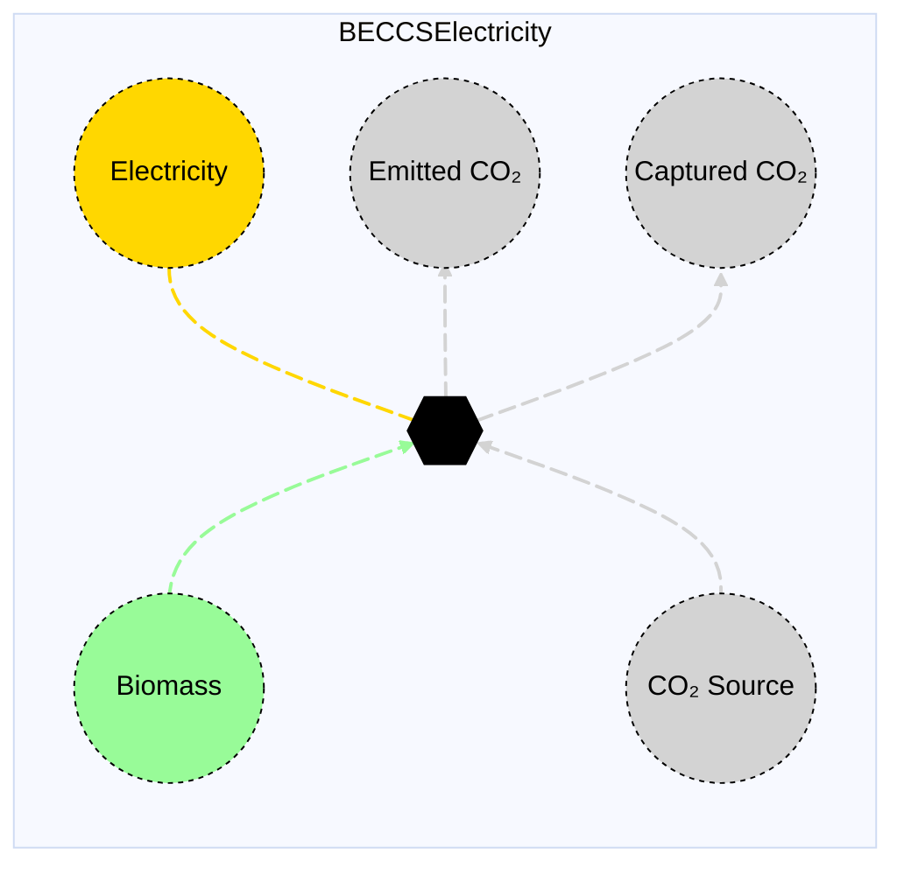

# BECCS Electricity

## Contents

[Overview](@ref beccselectricity_overview) | [Asset Structure](@ref beccselectricity_asset_structure) | [Flow Equations](@ref beccselectricity_flow_equations) | [Input File (Standard Format)](@ref beccselectricity_input_file) | [Types - Asset Structure](@ref beccselectricity_type_definition) | [Constructors](@ref beccselectricity_constructors) | [Examples](@ref beccselectricity_examples) | [Best Practices](@ref beccselectricity_best_practices) | [Input File (Advanced Format)](@ref beccselectricity_advanced_json_csv_input_format)

## [Overview](@id beccselectricity_overview)

BECCS Electricity assets in Macro represent Bioenergy with Carbon Capture and Storage (BECCS) technologies that produce electricity from biomass while capturing CO₂. These assets are defined using either JSON or CSV input files placed in the `assets` directory, typically named `beccs_electricity.json` or `beccs_electricity.csv`.

## [Asset Structure](@id beccselectricity_asset_structure)

A BECCS electricity asset consists of one transformation component and five edge components:

1. **Biomass Edge**: Incoming edge representing biomass supply
2. **CO₂ Edge**: Incoming edge representing CO₂ absorption from atmosphere
3. **Transformation Component**: Balances flows of biomass, CO₂, electricity, and CO₂ captured
4. **Electricity Edge**: Outgoing edge representing electricity production
5. **CO₂ Emission Edge**: Outgoing edge representing CO₂ emissions from the process
6. **CO₂ Captured Edge**: Outgoing edge representing captured CO₂

Here is a graphical representation of the BECCS electricity asset:



## [Flow Equations](@id beccselectricity_flow_equations)
The BECCS electricity asset follows these stoichiometric relationships:

```math
\begin{aligned}
\phi_{elec} &= \phi_{biomass} \cdot \epsilon_{elec\_prod} \\
\phi_{co2} &= \phi_{biomass} \cdot \epsilon_{co2\_content} \\
\phi_{co2\_emitted} &= \phi_{biomass} \cdot \epsilon_{emission\_rate} \\
\phi_{co2\_captured} &= \phi_{biomass} \cdot \epsilon_{capture\_rate} \\
\end{aligned}
```

Where:
- ``\phi`` represents the flow of each commodity
- ``\epsilon`` represents the stoichiometric coefficients defined in the table below (see table [Conversion Process Parameters](@ref beccselectricity_conversion_process_parameters))

## [Input File (Standard Format)](@id beccselectricity_input_file)

The easiest way to include a BECCS electricity asset in a model is to create a new file (either JSON or CSV) and place it in the `assets` directory together with the other assets.

```
your_case/
├── assets/
│   ├── beccs_electricity.json    # or beccs_electricity.csv
│   ├── other_assets.json
│   └── ...
├── system/
├── settings/
└── ...
```

This file can either be created manually, or using the `template_asset` function, as shown in the [Adding an Asset to a System](@ref) section of the User Guide. The file will be automatically loaded when you run your Macro model.

The following is an example of a BECCS electricity asset input file:

```json
{
    "BECCS_Electricity": [
        {
            "type": "BECCSElectricity",
            "global_data": {
                "biomass_constraints": {
                    "MinFlowConstraint": true
                },
                "capacity_size": 400,
                "investment_cost": 765260.16,
                "fixed_om_cost": 212409.12,
                "variable_om_cost": 47.2,
                "emission_rate": 0.116756,
                "co2_content": 1.717,
                "capture_rate": 1.600244,
                "electricity_production": 1.606568331,
                "min_flow_fraction": 0.4,
                "co2_sink": "co2_sink"
            },
            "instance_data": [
                {
                    "id": "SE_BECCS_Electricity_Herb",
                    "location": "SE",
                    "biomass_commodity": "Biomass_Herb",
                    "availability": {
                        "timeseries": {
                            "path": "system/availability.csv",
                            "header": "SE_BECCS_Electricity_Herb"
                        }
                    }
                }
            ]
        }
    ]
}
```

!!! tip "Global Data vs Instance Data"
    When working with JSON input files, the `global_data` field can be used to group data that is common to all instances of the same asset type. This is useful for setting constraints that are common to all instances of the same asset type and avoid repeating the same data for each instance. See the [Examples](@ref "beccselectricity_examples") section below for an example.

The following tables outline the attributes that can be set for a BECCS electricity asset.

### Essential Attributes
| Field | Type | Description |
|--------------|---------|------------|
| `Type` | String | Asset type identifier: "BECCSElectricity" |
| `id` | String | Unique identifier for the BECCS electricity instance |
| `location` | String | Geographic location/node identifier |
| `biomass_commodity` | String | Commodity identifier for the biomass supply (can be a sub-commodity of `Biomass`) |
| `co2_sink` | String | ID of a CO₂ sink vertex (has to be defined in the nodes input file) |

### [Conversion Process Parameters](@id beccselectricity_conversion_process_parameters)
The following set of parameters control the conversion process and stoichiometry of the BECCS electricity asset (see [Flow Equations](@ref beccselectricity_flow_equations) for more details).

| Field | Type | Description | Units | Default |
|--------------|---------|------------|----------------|----------|
| `electricity_production` | Float64 | Electricity production per unit biomass | $MWh/t_{Biomass}$ | 0.0 |
| `capture_rate` | Float64 | CO₂ capture rate per unit biomass | $t_{CO2}/t_{Biomass}$ | 1.0 |
| `co2_content` | Float64 | CO₂ content in biomass | $t_{CO2}/t_{Biomass}$ | 0.0 |
| `emission_rate` | Float64 | CO₂ emission rate per unit biomass | $t_{CO2}/t_{Biomass}$ | 1.0 |

### [Constraints Configuration](@id "beccselectricity_constraints")
BECCS electricity assets can have different constraints applied to them, and the user can configure them using the following fields:

| Field | Type | Description |
|--------------|---------|------------|
| `transform_constraints` | Dict{String,Bool} | List of constraints applied to the transformation component. |
| `biomass_constraints` | Dict{String,Bool} | List of constraints applied to the biomass edge. |
| `co2_constraints` | Dict{String,Bool} | List of constraints applied to the CO₂ edge. |
| `co2_emission_constraints` | Dict{String,Bool} | List of constraints applied to the CO₂ emission edge. |
| `co2_captured_constraints` | Dict{String,Bool} | List of constraints applied to the CO₂ captured edge. |

For example, if the user wants to apply the [`BalanceConstraint`](@ref balance_constraint_ref) to the transformation component and the [`CapacityConstraint`](@ref capacity_constraint_ref) to the biomass edge, the constraints fields should be set as follows:

```json
{
    "transform_constraints": {
        "BalanceConstraint": true
    },
    "biomass_constraints": {
        "CapacityConstraint": true
    }
}
```

Users can refer to the [Adding Asset Constraints to a System](@ref) section of the User Guide for a list of all the constraints that can be applied to the different components of a BECCS electricity asset.

#### Default constraints
To simplify the input file and the asset configuration, the following constraints are applied to the BECCS electricity asset by default:

- [Balance constraint](@ref balance_constraint_ref) (applied to the transformation component)
- [Capacity constraint](@ref capacity_constraint_ref) (applied to the biomass edge)

### Investment Parameters
| Field | Type | Description | Units | Default |
|--------------|---------|------------|----------------|----------|
| `can_retire` | Boolean | Whether BECCS electricity asset capacity can be retired | - | true |
| `can_expand` | Boolean | Whether BECCS electricity asset capacity can be expanded | - | true |
| `existing_capacity` | Float64 | Initial installed BECCS electricity asset capacity | $t_{Biomass}/hr$ | 0.0 |
| `capacity_size` | Float64 | Unit size for capacity decisions | - | 1.0 |

#### Additional Investment Parameters

**Maximum and minimum capacity constraints**

If [`MaxCapacityConstraint`](@ref max_capacity_constraint_ref) or [`MinCapacityConstraint`](@ref min_capacity_constraint_ref) are added to the constraints dictionary for the biomass edge, the following parameters are used by Macro:

| Field | Type | Description | Units | Default |
|--------------|---------|------------|----------------|----------|
| `max_capacity` | Float64 | Maximum allowed BECCS electricity asset capacity | $t_{Biomass}/hr$ | Inf |
| `min_capacity` | Float64 | Minimum allowed BECCS electricity asset capacity | $t_{Biomass}/hr$ | 0.0 |

### Economic Parameters
| Field | Type | Description | Units | Default |
|--------------|---------|------------|----------------|----------|
| `investment_cost` | Float64 | CAPEX per unit BECCS electricity asset capacity | ``\$/(t_{Biomass}/hr)`` | 0.0 |
| `annualized_investment_cost` | Union{Nothing,Float64} | Annualized CAPEX | ``\$/(t_{Biomass}/hr/yr)`` | calculated |
| `fixed_om_cost` | Float64 | Fixed O&M costs of the BECCS electricity asset | ``\$/(t_{Biomass}/hr/yr)`` | 0.0 |
| `variable_om_cost` | Float64 | Variable O&M costs of the BECCS electricity asset | ``\$/t_{Biomass}`` | 0.0 |

### Operational Parameters
| Field | Type | Description | Units | Default |
|--------------|---------|------------|----------------|----------|
| `availability` | Dict | Path to availability file and column name | - | Empty |

#### Additional Operational Parameters

**Minimum flow constraint**

If [`MinFlowConstraint`](@ref min_flow_constraint_ref) is added to the constraints dictionary for the biomass edge, the following parameter is used:

| Field | Type | Description | Units | Default |
|--------------|---------|------------|----------------|----------|
| `min_flow_fraction` | Float64 | Minimum flow as fraction of capacity | fraction | 0.0 |

## [Types - Asset Structure](@id beccselectricity_type_definition)

The `BECCSElectricity` asset is defined as follows:

```julia
struct BECCSElectricity <: AbstractAsset
    id::AssetId
    beccs_transform::Transformation
    biomass_edge::Edge{<:Biomass}
    elec_edge::Edge{<:Electricity}
    co2_edge::Edge{<:CO2}
    co2_emission_edge::Edge{<:CO2}
    co2_captured_edge::Edge{<:CO2Captured}
end
```

## [Constructors](@id beccselectricity_constructors)

### Default constructor

```julia
BECCSElectricity(id::AssetId, beccs_transform::Transformation, biomass_edge::Edge{<:Biomass}, co2_edge::Edge{<:CO2}, elec_edge::Edge{<:Electricity}, co2_captured_edge::Edge{<:CO2Captured}, co2_emission_edge::Edge{<:CO2})
```

### Factory constructor
```julia
make(asset_type::Type{BECCSElectricity}, data::AbstractDict{Symbol,Any}, system::System)
```

| Field | Type | Description |
|--------------|---------|------------|
| `asset_type` | `Type{BECCSElectricity}` | Macro type of the asset |
| `data` | `AbstractDict{Symbol,Any}` | Dictionary containing the input data for the asset |
| `system` | `System` | System to which the asset belongs |

## [Examples](@id beccselectricity_examples)
This section contains examples of how to use the BECCS electricity asset in a Macro model.

### Simple BECCS Electricity Asset
This example shows a single BECCS electricity asset with existing capacity using `Biomass_Herb` as the biomass commodity.

**JSON Format:**
```json
{
    "BECCS_Electricity": [
        {
            "type": "BECCSElectricity",
            "instance_data": [
                {
                    "id": "Fixed_BECCS_Electricity_SE",
                    "location": "SE",
                    "biomass_commodity": "Biomass_Herb",
                    "co2_sink": "co2_sink",
                    "electricity_production": 1.6,
                    "capture_rate": 1.5,
                    "co2_content": 1.8,
                    "emission_rate": 0.3,
                    "existing_capacity": 500.0,
                    "fixed_om_cost": 150000.0,
                    "variable_om_cost": 40.0
                }
            ]
        }
    ]
}
```

**CSV Format:**

| Type | id | location | biomass\_commodity | co2\_sink | electricity\_production | capture\_rate | co2\_content | emission\_rate | existing\_capacity | fixed\_om\_cost | variable\_om\_cost |
|------|----|----------|---------------------|------------------------------------------|---------------------------|--------------------------------|------------------------------|---------------------------|---------------------------|------------------------------------------------|---------------------------|
| BECCSElectricity | Fixed\_BECCS\_Electricity\_SE | SE | Biomass_Herb | co2_sink | 1.6 | 1.5 | 1.8 | 0.3 | 500.0 | 150000.0 | 40.0 |

### Two BECCS Electricity Assets in the SE Region

This example shows two BECCS electricity assets in the SE region with different biomass types. The biomass constraints are set to the [`MinFlowConstraint`](@ref min_flow_constraint_ref) constraint with a minimum flow fraction of 0.4, and the availability time series are set to the `SE_BECCS_Electricity_Herb` and `SE_BECCS_Electricity_Wood` time series.

**JSON Format:**

Note that the `global_data` field is used to set the fields and constraints that are common to all instances of the same asset type.

```json
{
    "BECCS_Electricity": [
        {
            "type": "BECCSElectricity",
            "global_data": {
                "biomass_constraints": {
                    "MinFlowConstraint": true
                },
                "co2_sink": "co2_sink",
                "electricity_production": 1.606568331,
                "capture_rate": 1.600244,
                "co2_content": 1.717,
                "emission_rate": 0.116756,
                "investment_cost": 765260.16,
                "fixed_om_cost": 212409.12,
                "variable_om_cost": 47.2,
                "capacity_size": 400,
                "min_flow_fraction": 0.4
            },
            "instance_data": [
                {
                    "id": "SE_BECCS_Electricity_Herb",
                    "location": "SE",
                    "biomass_commodity": "Biomass_Herb",
                    "availability": {
                        "timeseries": {
                            "path": "system/availability.csv",
                            "header": "SE_BECCS_Electricity_Herb"
                        }
                    }
                },
                {
                    "id": "SE_BECCS_Electricity_Wood",
                    "location": "SE",
                    "biomass_commodity": "Biomass_Wood",
                    "availability": {
                        "timeseries": {
                            "path": "system/availability.csv",
                            "header": "SE_BECCS_Electricity_Wood"
                        }
                    }
                }
            ]
        }
    ]
}
```

**CSV Format:**

|Type|id|fixed\_om\_cost|capture\_rate|electricity\_production|capacity\_size|co2\_sink|emission\_rate|variable\_om\_cost|investment\_cost|min\_flow\_fraction|co2\_content|biomass\_constraints--MinFlowConstraint|location|biomass\_commodity|availability--timeseries--path|availability--timeseries--header |
|------|----|----------|---------------------|------------------------------------------|---------------------------|--------------------------------|------------------------------|---------------------------|---------------------------|------------------------------------------------|---------------------------|------------------------|------------------------|------------------------|--------------------------------|------------------------|
BECCSElectricity | SE\_BECCS\_Electricity\_Herb | 212409.12 | 1.600244 | 1.606568331 | 400 | co2\_sink | 0.116756 | 47.2 | 765260.16 | 0.4 | 1.717 | true | SE | Biomass\_Herb | system/availability.csv | SE\_BECCS\_Electricity\_Herb
BECCSElectricity | SE\_BECCS\_Electricity\_Wood | 212409.12 | 1.600244 | 1.606568331 | 400 | co2\_sink | 0.116756 | 47.2 | 765260.16 | 0.4 | 1.717 | true | SE | Biomass\_Wood | system/availability.csv | SE\_BECCS\_Electricity\_Wood

## [Best Practices](@id beccselectricity_best_practices)

1. **Use global data for common fields and constraints**: Use the `global_data` field to set the fields and constraints that are common to all instances of the same asset type.
2. **Set realistic stoichiometric coefficients**: Ensure the transformation parameters reflect actual technology performance
3. **Use meaningful IDs**: Choose descriptive identifiers that indicate location and biomass type
4. **Consider availability profiles**: Use availability time series to model seasonal variations in biomass supply
5. **Validate costs**: Ensure investment and O&M costs are in appropriate units
6. **Test configurations**: Start with simple configurations and gradually add complexity
7. **Monitor CO₂ balance**: Ensure the CO₂ capture and emission rates are consistent with the overall system CO₂ balance

## [Input File (Advanced Format)](@id beccselectricity_advanced_json_csv_input_format)

Macro provides an advanced format for defining BECCS electricity assets, offering users and modelers detailed control over asset specifications. This format builds upon the standard format and is ideal for those who need more comprehensive customization.

To understand the advanced format, consider the [graph representation](@ref beccselectricity_asset_structure) and the [type definition](@ref beccselectricity_type_definition) of a BECCS electricity asset. The input file mirrors this hierarchical structure.

A BECCS electricity asset in Macro is composed of a transformation component, represented by a `Transformation` object, and five edges, each represented by an `Edge` object. The input file for a BECCS electricity asset is therefore organized as follows:

```json
{
    "transforms":{
        // ... transformation-specific attributes ...
    },
    "edges":{
        "biomass_edge": {
            // ... biomass_edge-specific attributes ...
        },
        "co2_edge": {
            // ... co2_edge-specific attributes ...
        },
        "elec_edge": {
            // ... elec_edge-specific attributes ...
        },
        "co2_emission_edge": {
            // ... co2_emission_edge-specific attributes ...
        },
        "co2_captured_edge": {
            // ... co2_captured_edge-specific attributes ...
        }
    }
}
```

Each top-level key (e.g., "transforms" or "edges") denotes a component type. The second-level keys either specify the attributes of the component (when there is a single instance) or identify the instances of the component (e.g., "biomass\_edge", "elec\_edge", etc.) when there are multiple instances. For multiple instances, a third-level key details the attributes for each instance.

Below is an example of an input file for a BECCS electricity asset that sets up a single asset in the SE region with detailed edge specifications.

```json
{
    "BECCS_Electricity": [
        {
            "type": "BECCSElectricity",
            "global_data": {
                "transforms": {
                    "commodity": "Biomass",
                    "timedata": "Biomass",
                    "constraints": {
                        "BalanceConstraint": true
                    }
                },
                "edges": {
                    "biomass_edge": {
                        "type": "Biomass",
                        "unidirectional": true,
                        "has_capacity": true,
                        "can_expand": true,
                        "can_retire": true,
                        "constraints": {
                            "CapacityConstraint": true,
                            "MinFlowConstraint": true
                        }
                    },
                    "co2_edge": {
                        "type": "CO2",
                        "unidirectional": true,
                        "has_capacity": false
                    },
                    "elec_edge": {
                        "type": "Electricity",
                        "unidirectional": true,
                        "has_capacity": false
                    },
                    "co2_captured_edge": {
                        "type": "CO2Captured",
                        "unidirectional": true,
                        "has_capacity": false
                    },
                    "co2_emission_edge": {
                        "type": "CO2",
                        "unidirectional": true,
                        "has_capacity": false
                    }
                }
            },
            "instance_data": [
                {
                    "id": "SE_BECCS_Electricity_Herb",
                    "transforms": {
                        "electricity_production": 1.656626506,
                        "capture_rate": 1.5313914,
                        "co2_content": 1.76022,
                        "emission_rate": 0.2288286
                    },
                    "edges": {
                        "biomass_edge": {
                            "start_vertex": "bioherb_SE",
                            "availability": {
                                "timeseries": {
                                    "path": "assets/availability.csv",
                                    "header": "SE_BECCS_Electricity_Herb"
                                }
                            },
                            "existing_capacity": 0.0,
                            "investment_cost": 696050.2868,
                            "fixed_om_cost": 193228.9157,
                            "variable_om_cost": 42.93975904,
                            "capacity_size": 400,
                            "min_flow_fraction": 0.4
                        },
                        "co2_edge": {
                            "start_vertex": "co2_sink"
                        },
                        "elec_edge": {
                            "end_vertex": "elec_SE"
                        },
                        "co2_captured_edge": {
                            "end_vertex": "co2_captured_sink"
                        },
                        "co2_emission_edge": {
                            "end_vertex": "co2_sink"
                        }
                    }
                }
            ]
        }
    ]
}
```

### Key Points
- The `global_data` field is utilized to define attributes and constraints that apply universally to all instances of a particular asset type.
- The `start_vertex` and `end_vertex` fields indicate the nodes to which the edges are connected. These nodes must be defined in the `nodes.json` file.
- By default, only the biomass edge is allowed to have capacity variables and constraints, as this represents the main capacity decision for the BECCS facility. However, the user can add capacity variables and constraints to the other edges as well (*see note below*).
- The biomass edge uses availability time series to model seasonal variations in biomass supply.
- For a comprehensive list of attributes that can be configured for the transformation and edge components, refer to the [transformation](@ref manual-transformation-fields) and [edges](@ref manual-edges-fields) pages of the Macro manual.

!!! note "The `has_capacity` Edge Attribute"
    The `has_capacity` attribute is a flag that indicates whether a specific edge of an asset has a capacity variable, allowing it to be expanded or retired. Typically, users do not need to manually adjust this flag, as the asset creators in Macro have already configured it correctly for each edge. However, advanced users can use this flag to override the default settings for each edge if needed.

!!! tip "Prefixes"
    Users can apply prefixes to adjust parameters for the components of a BECCS electricity asset, even when using the standard format. For instance, `co2_can_retire` will adjust the `can_retire` parameter for the CO₂ edge, and `co2_existing_capacity` will adjust the `existing_capacity` parameter for the CO₂ edge.
    Below are the prefixes available for modifying parameters for the components of a BECCS electricity asset:
    - `transform_` for the transformation component
    - `biomass_` for the biomass edge
    - `co2_` for the CO₂ edge
    - `co2_emission_` for the CO₂ emission edge
    - `co2_captured_` for the CO₂ captured edge
    - `elec_` for the electricity edge
    