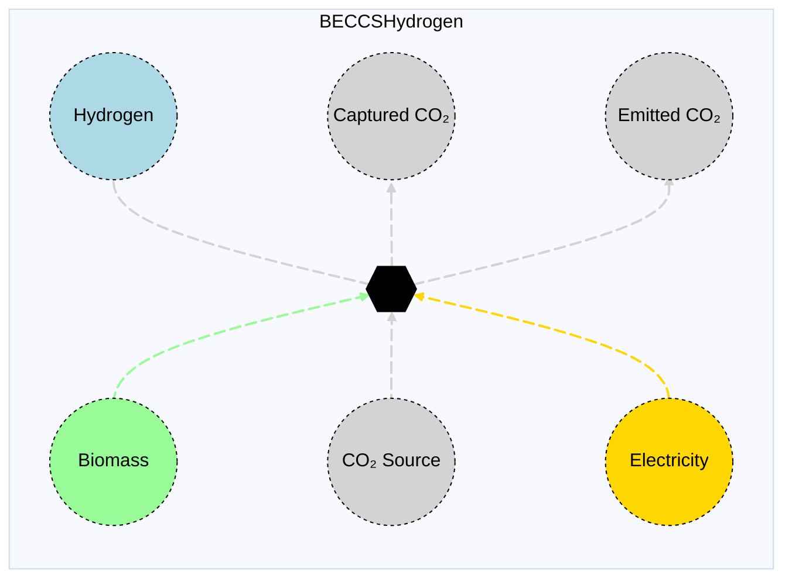

# BECCS Hydrogen

## Contents

[Overview](@ref beccshydrogen_overview) | [Asset Structure](@ref beccshydrogen_asset_structure) | [Flow Equations](@ref beccshydrogen_flow_equations) | [Input File (Standard Format)](@ref beccshydrogen_input_file) | [Types - Asset Structure](@ref beccshydrogen_type_definition) | [Constructors](@ref beccshydrogen_constructors) | [Examples](@ref beccshydrogen_examples) | [Best Practices](@ref beccshydrogen_best_practices) | [Input File (Advanced Format)](@ref beccshydrogen_advanced_json_csv_input_format)

## [Overview](@id beccshydrogen_overview)

BECCS Hydrogen assets in Macro represent Bioenergy with Carbon Capture and Storage (BECCS) technologies that produce hydrogen from biomass while capturing CO₂. These assets are defined using either JSON or CSV input files placed in the `assets` directory, typically named `beccs_hydrogen.json` or `beccs_hydrogen.csv`.

## [Asset Structure](@id beccshydrogen_asset_structure)

A BECCS hydrogen asset consists of one transformation component and six edge components:

1. **Biomass Edge**: Incoming edge representing biomass supply
2. **CO₂ Edge**: Incoming edge representing CO₂ absorption from atmosphere
3. **Electricity Edge**: Incoming edge representing electricity consumption
4. **Transformation Component**: Balances flows of biomass, CO₂, electricity, hydrogen, and CO₂ captured
5. **Hydrogen Edge**: Outgoing edge representing hydrogen production
6. **CO₂ Captured Edge**: Outgoing edge representing captured CO₂
7. **CO₂ Emission Edge**: Outgoing edge representing CO₂ emissions from the process

Here is a graphical representation of the BECCS hydrogen asset:



## [Flow Equations](@id beccshydrogen_flow_equations)
The BECCS hydrogen asset follows these stoichiometric relationships:

```math
\begin{aligned}
\phi_{h2} &= \phi_{biomass} \cdot \epsilon_{h2\_prod} \\
\phi_{elec} &= -\phi_{biomass} \cdot \epsilon_{elec\_cons} \\
\phi_{co2} &= -\phi_{biomass} \cdot \epsilon_{co2\_content} \\
\phi_{co2} &= \phi_{biomass} \cdot \epsilon_{emission\_rate} \\
\phi_{co2\_captured} &= \phi_{biomass} \cdot \epsilon_{capture\_rate} \\
\end{aligned}
```

Where:
- ``\phi`` represents the flow of each commodity
- ``\epsilon`` represents the stoichiometric coefficients defined in the table below (see table [Conversion Process Parameters](@ref beccshydrogen_conversion_process_parameters))

## [Input File (Standard Format)](@id beccshydrogen_input_file)

The easiest way to include a BECCS hydrogen asset in a model is to create a new file (either JSON or CSV) and place it in the `assets` directory together with the other assets.

```
your_case/
├── assets/
│   ├── beccs_hydrogen.json    # or beccs_hydrogen.csv
│   ├── other_assets.json
│   └── ...
├── system/
├── settings/
└── ...
```

This file can either be created manually, or using the `template_asset` function, as shown in the [Adding an Asset to a System](@ref) section of the User Guide. The file will be automatically loaded when you run your Macro model.

The following is an example of a BECCS hydrogen asset input file:

```json
{
    "BECCS_H2": [
        {
            "type": "BECCSHydrogen",
            "global_data": {
                "biomass_constraints": {
                    "MinFlowConstraint": true
                },
                "capacity_size": 400,
                "investment_cost": 585304,
                "fixed_om_cost": 66030,
                "variable_om_cost": 42.26,
                "hydrogen_production": 2.996580638,
                "electricity_consumption": 0.0834,
                "co2_content": 1.717,
                "emission_rate": 0.252399,
                "capture_rate": 1.464601,
                "min_flow_fraction": 0.85,
                "co2_sink": "co2_sink"
            },
            "instance_data": [
                {
                    "id": "SE_BECCS_H2_Herb",
                    "location": "SE",
                    "biomass_commodity": "Biomass_Herb",
                    "availability": {
                        "timeseries": {
                            "path": "system/availability.csv",
                            "header": "SE_BECCS_H2_Herb"
                        }
                    }
                },
                {
                    "id": "SE_BECCS_H2_Wood",
                    "location": "SE",
                    "biomass_commodity": "Biomass_Wood",
                    "availability": {
                        "timeseries": {
                            "path": "system/availability.csv",
                            "header": "SE_BECCS_H2_Wood"
                        }
                    }
                }
            ]
        }
    ]
}
```

!!! tip "Global Data vs Instance Data"
    When working with JSON input files, the `global_data` field can be used to group data that is common to all instances of the same asset type. This is useful for setting constraints that are common to all instances of the same asset type and avoid repeating the same data for each instance. See the [Examples](@ref "beccshydrogen_examples") section below for an example.

The following tables outline the attributes that can be set for a BECCS hydrogen asset.

### Essential Attributes
| Field | Type | Description |
|--------------|---------|------------|
| `Type` | String | Asset type identifier: "BECCSHydrogen" |
| `id` | String | Unique identifier for the BECCS hydrogen instance |
| `location` | String | Geographic location/node identifier |
| `biomass_commodity` | String | Commodity identifier for the biomass supply (can be a sub-commodity of `Biomass`) |
| `co2_sink` | String | ID of a CO₂ sink vertex (must be defined in the nodes input file) |

### [Conversion Process Parameters](@id beccshydrogen_conversion_process_parameters)
The following set of parameters control the converssion process and stoichiometry of the BECCS hydrogen asset (see [Flow Equations](@ref beccshydrogen_flow_equations) for more details).

| Field | Type | Description | Units | Default |
|--------------|---------|------------|----------------|----------|
| `hydrogen_production` | Float64 | Hydrogen production per unit biomass | $MWh_{H₂}/t_{Biomass}$ | 0.0 |
| `electricity_consumption` | Float64 | Electricity consumption per unit biomass | $MWh/t_{Biomass}$ | 0.0 |
| `capture_rate` | Float64 | CO₂ capture rate per unit biomass | $t_{CO₂}/t_{Biomass}$ | 1.0 |
| `co2_content` | Float64 | CO₂ content in biomass | $t_{CO₂}/t_{Biomass}$ | 0.0 |
| `emission_rate` | Float64 | CO₂ emission rate per unit biomass | $t_{CO₂}/t_{Biomass}$ | 1.0 |

### [Constraints Configuration](@id "beccshydrogen_constraints")
BECCS hydrogen assets can have different constraints applied to them, and the user can configure them using the following fields:

| Field | Type | Description |
|--------------|---------|------------|
| `transform_constraints` | Dict{String,Bool} | List of constraints applied to the transformation component. |
| `biomass_constraints` | Dict{String,Bool} | List of constraints applied to the biomass edge. |
| `co2_constraints` | Dict{String,Bool} | List of constraints applied to the CO₂ edge. |
| `elec_constraints` | Dict{String,Bool} | List of constraints applied to the electricity edge. |
| `h2_constraints` | Dict{String,Bool} | List of constraints applied to the hydrogen edge. |
| `co2_captured_constraints` | Dict{String,Bool} | List of constraints applied to the CO₂ captured edge. |
| `co2_emission_constraints` | Dict{String,Bool} | List of constraints applied to the CO₂ emission edge. |

For example, if the user wants to apply the [`BalanceConstraint`](@ref balance_constraint_ref) to the transformation component and the [`CapacityConstraint`](@ref capacity_constraint_ref) to the biomass edge, the constraints fields should be set as follows:

```json
{
    "transform_constraints": {
        "BalanceConstraint": true
    },
    "biomass_constraints": {
        "CapacityConstraint": true
    }
}
```

#### Default constraints
To simplify the input file and the asset configuration, the following constraints are applied to the BECCS hydrogen asset by default:

- [Balance constraint](@ref balance_constraint_ref) (applied to the transformation component)
- [Capacity constraint](@ref capacity_constraint_ref) (applied to the biomass edge)

Users can refer to the [Adding Asset Constraints to a System](@ref) section of the User Guide for a list of all the constraints that can be applied to the different components of a BECCS hydrogen asset.

### Investment Parameters
| Field | Type | Description | Units | Default |
|--------------|---------|------------|----------------|----------|
| `can_retire` | Boolean | Whether BECCS hydrogen asset capacity can be retired | - | true |
| `can_expand` | Boolean | Whether BECCS hydrogen asset capacity can be expanded | - | true |
| `existing_capacity` | Float64 | Initial installed BECCS hydrogen asset capacity | MW | 0.0 |
| `capacity_size` | Float64 | Unit size for capacity decisions | - | 1.0 |

#### Additional Investment Parameters

**Maximum and minimum capacity constraints**

If [`MaxCapacityConstraint`](@ref max_capacity_constraint_ref) or [`MinCapacityConstraint`](@ref min_capacity_constraint_ref) are added to the constraints dictionary for the biomass edge, the following parameters are used by Macro:

| Field | Type | Description | Units | Default |
|--------------|---------|------------|----------------|----------|
| `max_capacity` | Float64 | Maximum allowed BECCS hydrogen asset capacity | MW | Inf |
| `min_capacity` | Float64 | Minimum allowed BECCS hydrogen asset capacity | MW | 0.0 |

### Economic Parameters
| Field | Type | Description | Units | Default |
|--------------|---------|------------|----------------|----------|
| `investment_cost` | Float64 | CAPEX per unit BECCS hydrogen asset capacity | \$/MW/yr | 0.0 |
| `fixed_om_cost` | Float64 | Fixed O&M costs of the BECCS hydrogen asset | \$/MW/yr | 0.0 |
| `variable_om_cost` | Float64 | Variable O&M costs of the BECCS hydrogen asset | \$/MWh | 0.0 |

### Operational Parameters
| Field | Type | Description | Units | Default |
|--------------|---------|------------|----------------|----------|
| `availability` | Dict | Path to availability file and column name | - | Empty |

#### Additional Operational Parameters

**Minimum flow constraint**

If [`MinFlowConstraint`](@ref min_flow_constraint_ref) is added to the constraints dictionary for the biomass edge, the following parameter is used:

| Field | Type | Description | Units | Default |
|--------------|---------|------------|----------------|----------|
| `min_flow_fraction` | Float64 | Minimum flow as fraction of capacity | fraction | 0.0 |

## [Types - Asset Structure](@id beccshydrogen_type_definition)

The `BECCSHydrogen` asset is defined as follows:

```julia
struct BECCSHydrogen <: AbstractAsset
    id::AssetId
    transformation::Transformation
    biomass_edge::Edge{<:Biomass}
    co2_edge::Edge{<:CO2}
    elec_edge::Edge{<:Electricity}
    h2_edge::Edge{<:Hydrogen}
    co2_captured_edge::Edge{<:CO2Captured}
    co2_emission_edge::Edge{<:CO2}
end
```

## [Constructors](@id beccshydrogen_constructors)

### Default constructor

```julia
BECCSHydrogen(id::AssetId, transformation::Transformation, biomass_edge::Edge{<:Biomass}, co2_edge::Edge{<:CO2}, elec_edge::Edge{<:Electricity}, h2_edge::Edge{<:Hydrogen}, co2_captured_edge::Edge{<:CO2Captured}, co2_emission_edge::Edge{<:CO2})
```

### Factory constructor
```julia
make(asset_type::Type{BECCSHydrogen}, data::AbstractDict{Symbol,Any}, system::System)
```

| Field | Type | Description |
|--------------|---------|------------|
| `asset_type` | `Type{BECCSHydrogen}` | Macro type of the asset |
| `data` | `AbstractDict{Symbol,Any}` | Dictionary containing the input data for the asset |
| `system` | `System` | System to which the asset belongs |

## [Examples](@id beccshydrogen_examples)
This section contains examples of how to use the BECCS hydrogen asset in a Macro model.

### Simple BECCS Hydrogen Asset
This example shows a single BECCS hydrogen asset with existing capacity using `Biomass_Herb` as the biomass commodity.

**JSON Format:**
```json
{
    "BECCS_H2": [
        {
            "type": "BECCSHydrogen",
            "instance_data": [
                {
                    "id": "SE_BECCS_H2_Herb",
                    "location": "SE",
                    "biomass_commodity": "Biomass_Herb",
                    "hydrogen_production": 2.996580638,
                    "electricity_consumption": 0.0834,
                    "capture_rate": 1.464601,
                    "co2_content": 1.717,
                    "emission_rate": 0.252399,
                    "investment_cost": 585304,
                    "fixed_om_cost": 66030,
                    "variable_om_cost": 42.26,
                    "existing_capacity": 400,
                    "co2_sink": "co2_sink",
                    "availability": {
                        "timeseries": {
                            "path": "system/availability.csv",
                            "header": "SE_BECCS_H2_Herb"
                        }
                    }
                }
            ]
        }
    ]
}
```

**CSV Format:**

| Type | id | location | biomass_commodity | hydrogen_production | electricity_consumption | capture_rate | co2_content | emission_rate | investment_cost | fixed\_om\_cost | variable\_om\_cost | existing_capacity | co2_sink | availability--timeseries--path | availability--timeseries--header |
|------|----|----------|---------------------|------------------------------------------|---------------------------|--------------------------------|------------------------------|---------------------------|---------------------------|------------------------------------------------|---------------------------|--------------------------------|---------------------------|------------------------|------------------------|
| BECCSHydrogen | SE\_BECCS\_H2\_Herb | SE | Biomass\_Herb | 2.996580638 | 0.0834 | 1.464601 | 1.717 | 0.252399 | 585304 | 66030 | 42.26 | 400 | co2\_sink | system/availability.csv | SE\_BECCS\_H2\_Herb |

### Multiple BECCS Hydrogen Assets in Different Zones

**JSON Format:**

Note that the `global_data` field is used to set the fields and constraints that are common to all instances of the same asset type.

```json
{
    "BECCS_H2": [
        {
            "type": "BECCSHydrogen",
            "global_data": {
                "biomass_constraints": {
                    "MinFlowConstraint": true
                },
                "hydrogen_production": 2.996580638,
                "electricity_consumption": 0.0834,
                "capture_rate": 1.464601,
                "co2_content": 1.717,
                "emission_rate": 0.252399,
                "investment_cost": 585304,
                "fixed_om_cost": 66030,
                "variable_om_cost": 42.26,
                "capacity_size": 400,
                "min_flow_fraction": 0.85,
                "co2_sink": "co2_sink"
            },
            "instance_data": [
                {
                    "id": "SE_BECCS_H2_Herb",
                    "location": "SE",
                    "biomass_commodity": "Biomass_Herb",
                    "availability": {
                        "timeseries": {
                            "path": "system/availability.csv",
                            "header": "SE_BECCS_H2_Herb"
                        }
                    }
                },
                {
                    "id": "MIDAT_BECCS_H2_Herb",
                    "location": "MIDAT",
                    "biomass_commodity": "Biomass_Herb",
                    "availability": {
                        "timeseries": {
                            "path": "system/availability.csv",
                            "header": "MIDAT_BECCS_H2_Herb"
                        }
                    }
                },
                {
                    "id": "NE_BECCS_H2_Herb",
                    "location": "NE",
                    "biomass_commodity": "Biomass_Herb",
                    "availability": {
                        "timeseries": {
                            "path": "system/availability.csv",
                            "header": "NE_BECCS_H2_Herb"
                        }
                    }
                },
                {
                    "id": "SE_BECCS_H2_Wood",
                    "location": "SE",
                    "biomass_commodity": "Biomass_Wood",
                    "availability": {
                        "timeseries": {
                            "path": "system/availability.csv",
                            "header": "SE_BECCS_H2_Wood"
                        }
                    }
                },
                {
                    "id": "MIDAT_BECCS_H2_Wood",
                    "location": "MIDAT",
                    "biomass_commodity": "Biomass_Wood",
                    "availability": {
                        "timeseries": {
                            "path": "system/availability.csv",
                            "header": "MIDAT_BECCS_H2_Wood"
                        }
                    }
                },
                {
                    "id": "NE_BECCS_H2_Wood",
                    "location": "NE",
                    "biomass_commodity": "Biomass_Wood",
                    "availability": {
                        "timeseries": {
                            "path": "system/availability.csv",
                            "header": "NE_BECCS_H2_Wood"
                        }
                    }
                }
            ]
        }
    ]
}
```

**CSV Format:**

| Type | id | location | biomass_commodity | hydrogen_production | electricity_consumption | capture_rate | co2_content | emission_rate | investment_cost | fixed\_om\_cost | variable\_om\_cost | existing_capacity | co2_sink | availability--timeseries--path | availability--timeseries--header |
|------|----|----------|---------------------|------------------------------------------|---------------------------|--------------------------------|------------------------------|---------------------------|---------------------------|------------------------------------------------|---------------------------|--------------------------------|--------------------------------|------------------------|------------------------|
| BECCSHydrogen | SE\_BECCS\_H2\_Herb | SE | Biomass\_Herb | 2.996580638 | 0.0834 | 1.464601 | 1.717 | 0.252399 | 585304 | 66030 | 42.26 | 400 | co2\_sink | system/availability.csv | SE\_BECCS\_H2\_Herb |
| BECCSHydrogen | MIDAT\_BECCS\_H2\_Herb | MIDAT | Biomass\_Herb | 2.996580638 | 0.0834 | 1.464601 | 1.717 | 0.252399 | 585304 | 66030 | 42.26 | 400 | co2\_sink | system/availability.csv | MIDAT\_BECCS\_H2\_Herb |
| BECCSHydrogen | NE\_BECCS\_H2\_Herb | NE | Biomass\_Herb | 2.996580638 | 0.0834 | 1.464601 | 1.717 | 0.252399 | 585304 | 66030 | 42.26 | 400 | co2\_sink | system/availability.csv | NE\_BECCS\_H2\_Herb |
| BECCSHydrogen | SE\_BECCS\_H2\_Wood | SE | Biomass\_Wood | 2.996580638 | 0.0834 | 1.464601 | 1.717 | 0.252399 | 585304 | 66030 | 42.26 | 400 | co2\_sink | system/availability.csv | SE\_BECCS\_H2\_Wood |
| BECCSHydrogen | MIDAT\_BECCS\_H2\_Wood | MIDAT | Biomass\_Wood | 2.996580638 | 0.0834 | 1.464601 | 1.717 | 0.252399 | 585304 | 66030 | 42.26 | 400 | co2\_sink | system/availability.csv | MIDAT\_BECCS\_H2\_Wood |
| BECCSHydrogen | NE\_BECCS\_H2\_Wood | NE | Biomass\_Wood | 2.996580638 | 0.0834 | 1.464601 | 1.717 | 0.252399 | 585304 | 66030 | 42.26 | 400 | co2\_sink | system/availability.csv | NE\_BECCS\_H2\_Wood |

## [Best Practices](@id beccshydrogen_best_practices)

1. **Use global data for common fields and constraints**: Use the `global_data` field to set the fields and constraints that are common to all instances of the same asset type.
2. **Set realistic stoichiometric coefficients**: Ensure the transformation parameters reflect actual technology performance
3. **Use meaningful IDs**: Choose descriptive identifiers that indicate location and biomass type
4. **Consider availability profiles**: Use availability time series to model seasonal variations in biomass supply
5. **Validate costs**: Ensure investment and O&M costs are in appropriate units
6. **Test configurations**: Start with simple configurations and gradually add complexity
7. **Monitor CO₂ balance**: Ensure the CO₂ capture and emission rates are consistent with the overall system CO₂ balance

## [Input File (Advanced Format)](@id beccshydrogen_advanced_json_csv_input_format)

Macro provides an advanced format for defining BECCS hydrogen assets, offering users and modelers detailed control over asset specifications. This format builds upon the standard format and is ideal for those who need more comprehensive customization.

To understand the advanced format, consider the [graph representation](@ref beccshydrogen_asset_structure) and the [type definition](@ref beccshydrogen_type_definition) of a BECCS hydrogen asset. The input file mirrors this hierarchical structure.

A BECCS hydrogen asset in Macro is composed of a transformation component, represented by a `Transformation` object, and six edges, each represented by an `Edge` object. The input file for a BECCS hydrogen asset is therefore organized as follows:

```json
{
    "transforms":{
        // ... transformation-specific attributes ...
    },
    "edges":{
        "biomass_edge": {
            // ... biomass_edge-specific attributes ...
        },
        "co2_edge": {
            // ... co2_edge-specific attributes ...
        },
        "h2_edge": {
            // ... h2_edge-specific attributes ...
        },
        "elec_edge": {
            // ... elec_edge-specific attributes ...
        },
        "co2_emission_edge": {
            // ... co2_emission_edge-specific attributes ...
        },
        "co2_captured_edge": {
            // ... co2_captured_edge-specific attributes ...
        }
    }
}
```

Each top-level key (e.g., "transforms" or "edges") denotes a component type. The second-level keys either specify the attributes of the component (when there is a single instance) or identify the instances of the component (e.g., "biomass_edge", "h2_edge", etc.) when there are multiple instances. For multiple instances, a third-level key details the attributes for each instance.

Below is an example of an input file for a BECCS hydrogen asset that sets up a pair of assets (one with `Biomass_Herb` and one with `Biomass_Wood`) in the SE, MIDAT, and NE regions.

```json
{
    "BECCS_Hydrogen": [
        {
            "type": "BECCSHydrogen",
            "global_data": {
                "transforms": {
                    "timedata": "Biomass",
                    "constraints": {
                        "BalanceConstraint": true
                    }
                },
                "edges": {
                    "elec_edge": {
                        "commodity": "Electricity",
                        "unidirectional": true,
                        "has_capacity": false
                    },
                    "h2_edge": {
                        "commodity": "Hydrogen",
                        "unidirectional": true,
                        "has_capacity": false
                    },
                    "biomass_edge": {
                        "unidirectional": true,
                        "has_capacity": true,
                        "can_expand": true,
                        "can_retire": true,
                        "integer_decisions": false,
                        "constraints": {
                            "CapacityConstraint": true,
                            "MinFlowConstraint": true
                        }
                    },
                    "co2_edge": {
                        "commodity": "CO2",
                        "unidirectional": true,
                        "has_capacity": false,
                        "start_vertex": "co2_sink"
                    },
                    "co2_emission_edge": {
                        "commodity": "CO2",
                        "unidirectional": true,
                        "has_capacity": false,
                        "end_vertex": "co2_sink"
                    },
                    "co2_captured_edge": {
                        "commodity": "CO2Captured",
                        "unidirectional": true,
                        "has_capacity": false
                    }
                }
            },
            "instance_data": [
                {
                    "id": "SE_BECCS_H2_Herb",
                    "transforms": {
                        "hydrogen_production": 2.996580638,
                        "electricity_consumption": 0.0834,
                        "capture_rate": 1.464601,
                        "co2_content": 1.717,
                        "emission_rate": 0.252399
                    },
                    "edges": {
                        "biomass_edge": {
                            "commodity": "Biomass_Herb",
                            "start_vertex": "bioherb_SE",
                            "availability": {
                                "timeseries": {
                                    "path": "system/availability.csv",
                                    "header": "SE_BECCS_H2_Herb"
                                }
                            },
                            "investment_cost": 585304,
                            "fixed_om_cost": 66030,
                            "variable_om_cost": 42.26,
                            "capacity_size": 400,
                            "min_flow_fraction": 0.85
                        },
                        "elec_edge": {
                            "start_vertex": "elec_SE"
                        },
                        "h2_edge": {
                            "end_vertex": "h2_SE"
                        },
                        "co2_captured_edge": {
                            "end_vertex": "co2_captured_SE"
                        }
                    }
                },
                {
                    "id": "MIDAT_BECCS_H2_Herb",
                    "transforms": {
                        "hydrogen_production": 2.996580638,
                        "electricity_consumption": 0.0834,
                        "capture_rate": 1.464601,
                        "co2_content": 1.717,
                        "emission_rate": 0.252399
                    },
                    "edges": {
                        "biomass_edge": {
                            "commodity": "Biomass_Herb",
                            "start_vertex": "bioherb_MIDAT",
                            "availability": {
                                "timeseries": {
                                    "path": "system/availability.csv",
                                    "header": "MIDAT_BECCS_H2_Herb"
                                }
                            },
                            "investment_cost": 585304,
                            "fixed_om_cost": 66030,
                            "variable_om_cost": 42.26,
                            "capacity_size": 400,
                            "min_flow_fraction": 0.85
                        },
                        "elec_edge": {
                            "start_vertex": "elec_MIDAT"
                        },
                        "h2_edge": {
                            "end_vertex": "h2_MIDAT"
                        },
                        "co2_captured_edge": {
                            "end_vertex": "co2_captured_MIDAT"
                        }
                    }
                },
                {
                    "id": "NE_BECCS_H2_Herb",
                    "transforms": {
                        "hydrogen_production": 2.996580638,
                        "electricity_consumption": 0.0834,
                        "capture_rate": 1.464601,
                        "co2_content": 1.717,
                        "emission_rate": 0.252399
                    },
                    "edges": {
                        "biomass_edge": {
                            "commodity": "Biomass_Herb",
                            "start_vertex": "bioherb_NE",
                            "availability": {
                                "timeseries": {
                                    "path": "system/availability.csv",
                                    "header": "NE_BECCS_H2_Herb"
                                }
                            },
                            "investment_cost": 585304,
                            "fixed_om_cost": 66030,
                            "variable_om_cost": 42.26,
                            "capacity_size": 400,
                            "min_flow_fraction": 0.85
                        },
                        "elec_edge": {
                            "start_vertex": "elec_NE"
                        },
                        "h2_edge": {
                            "end_vertex": "h2_NE"
                        },
                        "co2_captured_edge": {
                            "end_vertex": "co2_captured_NE"
                        }
                    }
                },
                {
                    "id": "SE_BECCS_H2_Wood",
                    "transforms": {
                        "hydrogen_production": 2.996580638,
                        "electricity_consumption": 0.0834,
                        "capture_rate": 1.464601,
                        "co2_content": 1.717,
                        "emission_rate": 0.252399
                    },
                    "edges": {
                        "biomass_edge": {
                            "commodity": "Biomass_Wood",
                            "start_vertex": "biowood_SE",
                            "availability": {
                                "timeseries": {
                                    "path": "system/availability.csv",
                                    "header": "SE_BECCS_H2_Wood"
                                }
                            },
                            "investment_cost": 585304,
                            "fixed_om_cost": 66030,
                            "variable_om_cost": 42.26,
                            "capacity_size": 400,
                            "min_flow_fraction": 0.85
                        },
                        "elec_edge": {
                            "start_vertex": "elec_SE"
                        },
                        "h2_edge": {
                            "end_vertex": "h2_SE"
                        },
                        "co2_captured_edge": {
                            "end_vertex": "co2_captured_SE"
                        }
                    }
                },
                {
                    "id": "MIDAT_BECCS_H2_Wood",
                    "transforms": {
                        "hydrogen_production": 2.996580638,
                        "electricity_consumption": 0.0834,
                        "capture_rate": 1.464601,
                        "co2_content": 1.717,
                        "emission_rate": 0.252399
                    },
                    "edges": {
                        "biomass_edge": {
                            "commodity": "Biomass_Wood",
                            "start_vertex": "biowood_MIDAT",
                            "availability": {
                                "timeseries": {
                                    "path": "system/availability.csv",
                                    "header": "MIDAT_BECCS_H2_Wood"
                                }
                            },
                            "investment_cost": 585304,
                            "fixed_om_cost": 66030,
                            "variable_om_cost": 42.26,
                            "capacity_size": 400,
                            "min_flow_fraction": 0.85
                        },
                        "elec_edge": {
                            "start_vertex": "elec_MIDAT"
                        },
                        "h2_edge": {
                            "end_vertex": "h2_MIDAT"
                        },
                        "co2_captured_edge": {
                            "end_vertex": "co2_captured_MIDAT"
                        }
                    }
                },
                {
                    "id": "NE_BECCS_H2_Wood",
                    "transforms": {
                        "hydrogen_production": 2.996580638,
                        "electricity_consumption": 0.0834,
                        "capture_rate": 1.464601,
                        "co2_content": 1.717,
                        "emission_rate": 0.252399
                    },
                    "edges": {
                        "biomass_edge": {
                            "commodity": "Biomass_Wood",
                            "start_vertex": "biowood_NE",
                            "availability": {
                                "timeseries": {
                                    "path": "system/availability.csv",
                                    "header": "NE_BECCS_H2_Wood"
                                }
                            },
                            "investment_cost": 585304,
                            "fixed_om_cost": 66030,
                            "variable_om_cost": 42.26,
                            "capacity_size": 400,
                            "min_flow_fraction": 0.85
                        },
                        "elec_edge": {
                            "start_vertex": "elec_NE"
                        },
                        "h2_edge": {
                            "end_vertex": "h2_NE"
                        },
                        "co2_captured_edge": {
                            "end_vertex": "co2_captured_NE"
                        }
                    }
                }
            ]
        }
    ]
}
```

### Key Points

- The `global_data` field is utilized to define attributes and constraints that apply universally to all instances of a particular asset type.
- The `start_vertex` and `end_vertex` fields indicate the nodes to which the edges are connected. These nodes must be defined in the `nodes.json` file.
- By default, only the biomass edge is allowed to have capacity variables and constraints, as this represents the main capacity decision for the BECCS facility.
- The biomass edge uses availability time series to model seasonal variations in biomass supply.
- For a comprehensive list of attributes that can be configured for the transformation and edge components, refer to the [transformation](@ref manual-transformation-fields) and [edges](@ref manual-edges-fields) pages of the Macro manual.

!!! tip "Prefixes"
    Users can apply prefixes to adjust parameters for the components of a BECCS hydrogen asset, even when using the standard format. For instance, `co2_can_retire` will adjust the `can_retire` parameter for the CO2 edge, and `co2_existing_capacity` will adjust the `existing_capacity` parameter for the CO2 edge.
    Below are the prefixes available for modifying parameters for the components of a BECCS hydrogen asset:
    - `transform_` for the transformation component
    - `biomass_` for the biomass edge
    - `co2_` for the CO2 edge
    - `co2_emission_` for the CO2 emission edge
    - `co2_captured_` for the CO2 captured edge
    - `h2_` for the hydrogen edge
    - `elec_` for the electricity edge
    