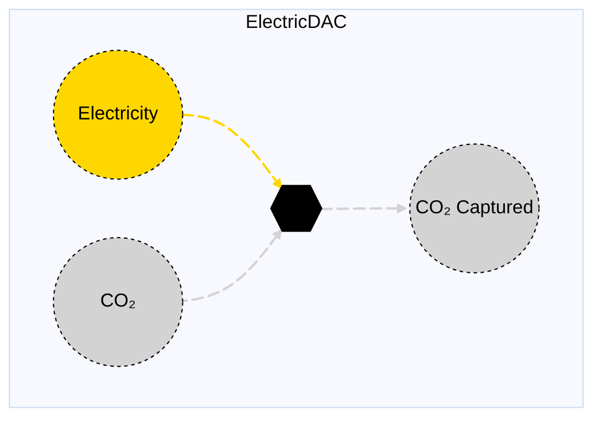

# Electric DAC

## Contents

[Overview](@ref electricdac_overview) | [Asset Structure](@ref electricdac_asset_structure) | [Flow Equations](@ref electricdac_flow_equations) | [Input File (Standard Format)](@ref electricdac_input_file) | [Types - Asset Structure](@ref electricdac_type_definition) | [Constructors](@ref electricdac_constructors) | [Examples](@ref electricdac_examples) | [Best Practices](@ref electricdac_best_practices) | [Input File (Advanced Format)](@ref electricdac_advanced_json_csv_input_format)

## [Overview](@id electricdac_overview)

Electric DAC (Direct Air Capture) assets in Macro represent carbon capture technologies that use electricity to capture CO₂ directly from the atmosphere. These assets are defined using either JSON or CSV input files placed in the `assets` directory, typically named `electricdac.json` or `electricdac.csv`.

## [Asset Structure](@id electricdac_asset_structure)

An electric DAC asset consists of one transformation component and three edge components:

1. **Transformation Component**: Balances flows of electricity, CO₂, and CO₂ captured
2. **Electricity Edge**: Incoming edge representing electricity consumption
3. **CO₂ Edge**: Incoming edge representing CO₂ absorption from atmosphere
4. **CO₂ Captured Edge**: Outgoing edge representing captured CO₂

Here is a graphical representation of the electric DAC asset:



## [Flow Equations](@id electricdac_flow_equations)
The electric DAC asset follows these stoichiometric relationships:

```math
\begin{aligned}
\phi_{elec} &= \phi_{co2\_captured} \cdot \epsilon_{elec\_consumption} \\
\phi_{co2} &= \phi_{co2\_captured} \\
\end{aligned}
```

Where:
- ``\phi`` represents the flow of each commodity
- ``\epsilon`` represents the stoichiometric coefficients defined in the table below (see table [Conversion Process Parameters](@ref electricdac_conversion_process_parameters))

## [Input File (Standard Format)](@id electricdac_input_file)

The easiest way to include an electric DAC asset in a model is to create a new file (either JSON or CSV) and place it in the `assets` directory together with the other assets.

```
your_case/
├── assets/
│   ├── electricdac.json    # or electricdac.csv
│   ├── other_assets.json
│   └── ...
├── system/
├── settings/
└── ...
```

This file can either be created manually, or using the `template_asset` function, as shown in the [Adding an Asset to a System](@ref) section of the User Guide. The file will be automatically loaded when you run your Macro model.

The following is an example of an electric DAC asset input file:

```json
{
    "ElectricDAC": [
        {
            "type": "ElectricDAC",
            "instance_data": [
                {
                    "id": "SE_Sorbent_DAC",
                    "location": "SE",
                    "investment_cost": 1050000,
                    "fixed_om_cost": 837000,
                    "variable_om_cost": 24.64,
                    "electricity_consumption": 4.38,
                    "co2_sink": "co2_sink"
                }
            ]
        }
    ]
}
```

!!! tip "Global Data vs Instance Data"
    When working with JSON input files, the `global_data` field can be used to group data that is common to all instances of the same asset type. This is useful for setting constraints that are common to all instances of the same asset type and avoid repeating the same data for each instance. See the [Examples](@ref "electricdac_examples") section below for an example.

The following tables outline the attributes that can be set for an electric DAC asset.

### Essential Attributes
| Field | Type | Description |
|--------------|---------|------------|
| `Type` | String | Asset type identifier: "ElectricDAC" |
| `id` | String | Unique identifier for the electric DAC instance |
| `location` | String | Geographic location/node identifier |
| `co2_sink` | String | CO₂ sink node identifier |

### [Conversion Process Parameters](@id electricdac_conversion_process_parameters)
The following parameters control the conversion process and stoichiometry of the electricdac asset (see [Flow Equations](@ref electricdac_flow_equations) for more details).

| Field | Type | Description | Units | Default |
|--------------|---------|------------|----------------|----------|
| `electricity_consumption` | Float64 | Electricity consumption per unit CO₂ captured | $MWh_{elec}/t_{CO₂}$ | 0.0 |

### [Constraints Configuration](@id "electricdac_constraints")
Electric DAC assets can have different constraints applied to them, and the user can configure them using the following fields:

| Field | Type | Description |
|--------------|---------|------------|
| `transform_constraints` | Dict{String,Bool} | List of constraints applied to the transformation component. |
| `co2_constraints` | Dict{String,Bool} | List of constraints applied to the CO₂ edge. |
| `elec_constraints` | Dict{String,Bool} | List of constraints applied to the electricity edge. |
| `co2_captured_constraints` | Dict{String,Bool} | List of constraints applied to the CO₂ captured edge. |

For example, if the user wants to apply the [`BalanceConstraint`](@ref balance_constraint_ref) to the transformation component and the [`CapacityConstraint`](@ref capacity_constraint_ref) to the CO₂ edge, the constraints fields should be set as follows:

```json
{
    "transform_constraints": {
        "BalanceConstraint": true
    },
    "co2_constraints": {
        "CapacityConstraint": true
    }
}
```

Users can refer to the [Adding Asset Constraints to a System](@ref) section of the User Guide for a list of all the constraints that can be applied to the different components of an electric DAC asset.

#### Default constraints
To simplify the input file and the asset configuration, the following constraints are applied to the electric DAC asset by default:

- [Balance constraint](@ref balance_constraint_ref) (applied to the transformation component)
- [Capacity constraint](@ref capacity_constraint_ref) (applied to the CO₂ edge)

### Investment Parameters
| Field | Type | Description | Units | Default |
|--------------|---------|------------|----------------|----------|
| `can_retire` | Boolean | Whether electric DAC asset capacity can be retired | - | true |
| `can_expand` | Boolean | Whether electric DAC asset capacity can be expanded | - | true |
| `existing_capacity` | Float64 | Initial installed electric DAC asset capacity | MW | 0.0 |
| `capacity_size` | Float64 | Unit size for capacity decisions | - | 1.0 |

#### Additional Investment Parameters

**Maximum and minimum capacity constraints**

If [`MaxCapacityConstraint`](@ref max_capacity_constraint_ref) or [`MinCapacityConstraint`](@ref min_capacity_constraint_ref) are added to the constraints dictionary for the CO₂ edge, the following parameters are used by Macro:

| Field | Type | Description | Units | Default |
|--------------|---------|------------|----------------|----------|
| `max_capacity` | Float64 | Maximum allowed electric DAC asset capacity | MW | Inf |
| `min_capacity` | Float64 | Minimum allowed electric DAC asset capacity | MW | 0.0 |

### Economic Parameters
| Field | Type | Description | Units | Default |
|--------------|---------|------------|----------------|----------|
| `investment_cost` | Float64 | CAPEX per unit electric DAC asset capacity | \$/MW/yr | 0.0 |
| `fixed_om_cost` | Float64 | Fixed O&M costs of the electric DAC asset | \$/MW/yr | 0.0 |
| `variable_om_cost` | Float64 | Variable O&M costs of the electric DAC asset | \$/MWh | 0.0 |

### Operational Parameters
| Field | Type | Description | Units | Default |
|--------------|---------|------------|----------------|----------|
| `availability` | Dict | Path to availability file and column name | - | Empty |

#### Additional Operational Parameters

**Minimum flow constraint**

If [`MinFlowConstraint`](@ref min_flow_constraint_ref) is added to the constraints dictionary for the CO₂ edge, the following parameter is used:

| Field | Type | Description | Units | Default |
|--------------|---------|------------|----------------|----------|
| `min_flow_fraction` | Float64 | Minimum flow as fraction of capacity | fraction | 0.0 |

**Ramping limit constraint**

If [`RampingLimitConstraint`](@ref ramping_limits_constraint_ref) is added to the constraints dictionary for the CO₂ edge, the following parameters are used:

| Field | Type | Description | Units | Default |
|--------------|---------|------------|----------------|----------|
| `ramp_up_fraction` | Float64 | Maximum increase in flow between timesteps | fraction | 1.0 |
| `ramp_down_fraction` | Float64 | Maximum decrease in flow between timesteps | fraction | 1.0 |

## [Types - Asset Structure](@id electricdac_type_definition)

The `ElectricDAC` asset is defined as follows:

```julia
struct ElectricDAC <: AbstractAsset
    id::AssetId
    electricdac_transform::Transformation
    co2_edge::Edge{<:CO2}
    elec_edge::Edge{<:Electricity}
    co2_captured_edge::Edge{<:CO2Captured}
end
```

## [Constructors](@id electricdac_constructors)

### Default constructor

```julia
ElectricDAC(id::AssetId, electricdac_transform::Transformation, co2_edge::Edge{<:CO2}, elec_edge::Edge{<:Electricity}, co2_captured_edge::Edge{<:CO2Captured})
```

### Factory constructor
```julia
make(asset_type::Type{ElectricDAC}, data::AbstractDict{Symbol,Any}, system::System)
```

| Field | Type | Description |
|--------------|---------|------------|
| `asset_type` | `Type{ElectricDAC}` | Macro type of the asset |
| `data` | `AbstractDict{Symbol,Any}` | Dictionary containing the input data for the asset |
| `system` | `System` | System to which the asset belongs |

## [Examples](@id electricdac_examples)
This section contains examples of how to use the electric DAC asset in a Macro model.

### Simple Electric DAC Asset
This example shows a single electric DAC asset with ramping limits and availability time series.

**JSON Format:**
```json
{
    "ElectricDAC": [
        {
            "type": "ElectricDAC",
            "instance_data": [
                {
                    "id": "SE_Sorbent_DAC",
                    "location": "SE",
                    "investment_cost": 1050000,
                    "fixed_om_cost": 837000,
                    "variable_om_cost": 24.64,
                    "electricity_consumption": 4.38,
                    "co2_sink": "co2_sink",
                    "co2_constraints": {
                        "RampingLimitConstraint": true
                    },
                    "ramp_up_fraction": 1.0,
                    "ramp_down_fraction": 1.0,
                    "availability": {
                        "timeseries": {
                            "path": "system/availability.csv",
                            "header": "SE_Sorbent_DAC"
                        }
                    }
                }
            ]
        }
    ]
}
```

**CSV Format:**

| Type | id | location | investment\_cost | fixed\_om\_cost | variable\_om\_cost | electricity\_consumption | co2\_sink | co2\_constraints--RampingLimitConstraint | ramp\_up\_fraction | ramp\_down\_fraction | availability--timeseries--path | availability--timeseries--header |
|------|----|----------|----------------|----------------|----------------|----------------|----------------|----------------|----------------|----------------|----------------|----------------|
| ElectricDAC | SE\_Sorbent\_DAC | SE | 1050000 | 837000 | 24.64 | 4.38 | co2\_sink | true | 1.0 | 1.0 | system/availability.csv | SE\_Sorbent\_DAC |

### Multiple Electric DAC Assets in Different Zones

**JSON Format:**

Note that the `global_data` field is used to set the fields and constraints that are common to all instances of the same asset type.

```json
{
    "ElectricDAC": [
        {
            "type": "ElectricDAC",
            "global_data": {
                "electricity_consumption": 4.38,
                "co2_sink": "co2_sink",
                "co2_constraints": {
                    "RampingLimitConstraint": true
                },
                "investment_cost": 1050000,
                "fixed_om_cost": 837000,
                "variable_om_cost": 24.64,
                "ramp_up_fraction": 1.0,
                "ramp_down_fraction": 1.0
            },
            "instance_data": [
                {
                    "id": "SE_Sorbent_DAC",
                    "location": "SE",
                    "availability": {
                        "timeseries": {
                            "path": "system/availability.csv",
                            "header": "SE_Sorbent_DAC"
                        }
                    }
                },
                {
                    "id": "MIDAT_Sorbent_DAC",
                    "location": "MIDAT",
                    "availability": {
                        "timeseries": {
                            "path": "system/availability.csv",
                            "header": "MIDAT_Sorbent_DAC"
                        }
                    }
                },
                {
                    "id": "NE_Sorbent_DAC",
                    "location": "NE",
                    "availability": {
                        "timeseries": {
                            "path": "system/availability.csv",
                            "header": "NE_Sorbent_DAC"
                        }
                    }
                }
            ]
        }
    ]
}
```

**CSV Format:**

| Type | id | location | investment\_cost | fixed\_om\_cost | variable\_om\_cost | electricity\_consumption | co2\_sink | co2\_constraints--RampingLimitConstraint | ramp\_up\_fraction | ramp\_down\_fraction | availability--timeseries--path | availability--timeseries--header |
|------|----|----------|----------------|----------------|----------------|----------------|----------------|----------------|----------------|----------------|----------------|----------------|
| ElectricDAC | SE\_Sorbent\_DAC | SE | 1050000 | 837000 | 24.64 | 4.38 | co2\_sink | true | 1.0 | 1.0 | system/availability.csv | SE\_Sorbent\_DAC |
| ElectricDAC | MIDAT\_Sorbent\_DAC | MIDAT | 1050000 | 837000 | 24.64 | 4.38 | co2\_sink | true | 1.0 | 1.0 | system/availability.csv | MIDAT\_Sorbent\_DAC |
| ElectricDAC | NE\_Sorbent\_DAC | NE | 1050000 | 837000 | 24.64 | 4.38 | co2\_sink | true | 1.0 | 1.0 | system/availability.csv | NE\_Sorbent\_DAC |

## [Best Practices](@id electricdac_best_practices)

1. **Use global data for common fields and constraints**: Use the `global_data` field to set the fields and constraints that are common to all instances of the same asset type.
2. **Set realistic electricity consumption**: Ensure electricity consumption per unit CO₂ captured reflects actual technology performance
3. **Use meaningful IDs**: Choose descriptive identifiers that indicate location and technology type
4. **Consider availability profiles**: Use availability time series to model operational constraints
5. **Validate costs**: Ensure investment and O&M costs are in appropriate units
6. **Test configurations**: Start with simple configurations and gradually add complexity

## [Input File (Advanced Format)](@id electricdac_advanced_json_csv_input_format)

Macro provides an advanced format for defining electric DAC assets, offering users and modelers detailed control over asset specifications. This format builds upon the standard format and is ideal for those who need more comprehensive customization.

To understand the advanced format, consider the [graph representation](@ref electricdac_asset_structure) and the [type definition](@ref electricdac_type_definition) of an electric DAC asset. The input file mirrors this hierarchical structure.

An electric DAC asset in Macro is composed of a transformation component, represented by a `Transformation` object, and three edges, each represented by an `Edge` object. The input file for an electric DAC asset is therefore organized as follows:

```json
{
    "transforms":{
        // ... transformation-specific attributes ...
    },
    "edges":{
        "elec_edge": {
            // ... elec_edge-specific attributes ...
        },
        "co2_edge": {
            // ... co2_edge-specific attributes ...
        },
        "co2_captured_edge": {
            // ... co2_captured_edge-specific attributes ...
        }
    }
}
```

Each top-level key (e.g., "transforms" or "edges") denotes a component type. The second-level keys either specify the attributes of the component (when there is a single instance) or identify the instances of the component (e.g., "elec\_edge", "co2\_edge", etc.) when there are multiple instances. For multiple instances, a third-level key details the attributes for each instance.

Below is an example of an input file for an electric DAC asset that sets up a single instance at three different locations, SE, MIDAT, and NE.

```json
{
    "ElectricDAC": [
        {
            "type": "ElectricDAC",
            "global_data": {
                "transforms": {
                    "timedata": "Electricity",
                    "constraints": {
                        "BalanceConstraint": true
                    }
                },
                "edges": {
                    "co2_edge": {
                        "commodity": "CO2",
                        "unidirectional": true,
                        "has_capacity": true,
                        "start_vertex": "co2_sink",
                        "can_retire": true,
                        "can_expand": true,
                        "uc": false,
                        "constraints": {
                            "CapacityConstraint": true,
                            "RampingLimitConstraint": true
                        },
                        "integer_decisions": false
                    },
                    "elec_edge": {
                        "commodity": "Electricity",
                        "unidirectional": true,
                        "has_capacity": false
                    },
                    "co2_captured_edge": {
                        "commodity": "CO2Captured",
                        "unidirectional": true,
                        "has_capacity": false
                    }
                }
            },
            "instance_data": [
                {
                    "id": "SE_Sorbent_DAC",
                    "transforms": {
                        "electricity_consumption": 4.38
                    },
                    "edges": {
                        "co2_edge": {
                            "availability": {
                                "timeseries": {
                                    "path": "system/availability.csv",
                                    "header": "SE_Sorbent_DAC"
                                }
                            },
                            "existing_capacity": 0.0,
                            "investment_cost": 1050000,
                            "fixed_om_cost": 837000,
                            "variable_om_cost": 24.64,
                            "ramp_up_fraction": 1.0,
                            "ramp_down_fraction": 1.0
                        },
                        "elec_edge": {
                            "start_vertex": "elec_SE"
                        },
                        "co2_captured_edge": {
                            "end_vertex": "co2_captured_SE"
                        }
                    }
                },
                {
                    "id": "MIDAT_Sorbent_DAC",
                    "transforms": {
                        "electricity_consumption": 4.38
                    },
                    "edges": {
                        "co2_edge": {
                            "availability": {
                                "timeseries": {
                                    "path": "system/availability.csv",
                                    "header": "MIDAT_Sorbent_DAC"
                                }
                            },
                            "existing_capacity": 0.0,
                            "investment_cost": 1050000,
                            "fixed_om_cost": 837000,
                            "variable_om_cost": 24.64,
                            "ramp_up_fraction": 1.0,
                            "ramp_down_fraction": 1.0
                        },
                        "elec_edge": {
                            "start_vertex": "elec_MIDAT"
                        },
                        "co2_captured_edge": {
                            "end_vertex": "co2_captured_MIDAT"
                        }
                    }
                },
                {
                    "id": "NE_Sorbent_DAC",
                    "transforms": {
                        "electricity_consumption": 4.38
                    },
                    "edges": {
                        "co2_edge": {
                            "availability": {
                                "timeseries": {
                                    "path": "system/availability.csv",
                                    "header": "NE_Sorbent_DAC"
                                }
                            },
                            "existing_capacity": 0.0,
                            "investment_cost": 1050000,
                            "fixed_om_cost": 837000,
                            "variable_om_cost": 24.64,
                            "ramp_up_fraction": 1.0,
                            "ramp_down_fraction": 1.0
                        },
                        "elec_edge": {
                            "start_vertex": "elec_NE"
                        },
                        "co2_captured_edge": {
                            "end_vertex": "co2_captured_NE"
                        }
                    }
                }
            ]
        }
    ]
}
```

### Key Points

- The `global_data` field is utilized to define attributes and constraints that apply universally to all instances of a particular asset type.
- The `start_vertex` and `end_vertex` fields indicate the nodes to which the edges are connected. These nodes must be defined in the `nodes.json` file.
- By default, only the CO₂ edge is allowed to have capacity variables and constraints, as this represents the main capacity decision for the DAC facility (*see note below*).
- The CO₂ edge uses availability time series to model operational constraints.
- For a comprehensive list of attributes that can be configured for the transformation and edge components, refer to the [transformation](@ref manual-transformation-fields) and [edges](@ref manual-edges-fields) pages of the Macro manual.

!!! note "The `has_capacity` Edge Attribute"
    The `has_capacity` attribute is a flag that indicates whether a specific edge of an asset has a capacity variable, allowing it to be expanded or retired. Typically, users do not need to manually adjust this flag, as the asset creators in Macro have already configured it correctly for each edge. However, advanced users can use this flag to override the default settings for each edge if needed.

!!! tip "Prefixes"
    Users can apply prefixes to adjust parameters for the components of a electric DAC asset, even when using the standard format. For instance, `co2_can_retire` will adjust the `can_retire` parameter for the CO₂ edge, and `co2_existing_capacity` will adjust the `existing_capacity` parameter for the CO₂ edge.
    Below are the prefixes available for modifying parameters for the components of a electric DAC asset:
    - `transform_` for the transformation component
    - `co2_` for the CO₂ edge
    - `co2_captured_` for the CO₂ captured edge
    - `elec_` for the electricity edge