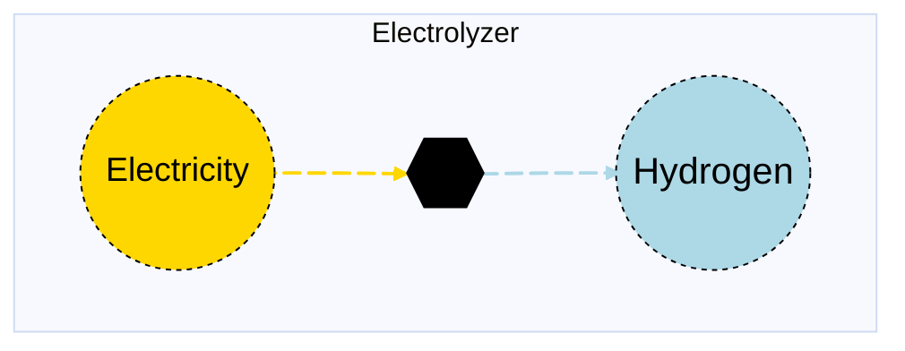

# Electrolyzer

## Contents

[Overview](@ref electrolyzer_overview) | [Asset Structure](@ref electrolyzer_asset_structure) | [Flow Equations](@ref electrolyzer_flow_equations) | [Input File (Standard Format)](@ref electrolyzer_input_file) | [Types - Asset Structure](@ref electrolyzer_type_definition) | [Constructors](@ref electrolyzer_constructors) | [Examples](@ref electrolyzer_examples) | [Best Practices](@ref electrolyzer_best_practices) | [Input File (Advanced Format)](@ref electrolyzer_advanced_json_csv_input_format)

## [Overview](@id electrolyzer_overview)

Electrolyzer assets in Macro represent hydrogen production technologies that convert electricity into hydrogen through electrolysis. These assets are defined using either JSON or CSV input files placed in the `assets` directory, typically named with descriptive identifiers like `electrolyzer.json` or `electrolyzer.csv`.

## [Asset Structure](@id electrolyzer_asset_structure)

An electrolyzer asset consists of three main components:

1. **Transformation Component**: Balances the electricity and hydrogen flows
2. **Electricity Edge**: Represents the electricity consumption from the grid
3. **Hydrogen Edge**: Represents the hydrogen production flow

Here is a graphical representation of the electrolyzer asset:



## [Flow Equations](@id electrolyzer_flow_equations)
The electrolyzer asset follows these stoichiometric relationships:

```math
\begin{aligned}
\phi_{h2} &= \phi_{elec} \cdot \epsilon_{efficiency\_rate} \\
\end{aligned}
```

Where:
- ``\phi`` represents the flow of each commodity
- ``\epsilon`` represents the efficiency rate defined in the table below (see [Conversion Process Parameters](@ref electrolyzer_conversion_process_parameters))

## [Input File (Standard Format)](@id electrolyzer_input_file)

The easiest way to include an electrolyzer asset in a model is to create a new file (either JSON or CSV) and place it in the `assets` directory together with the other assets. 

```
your_case/
├── assets/
│   ├── electrolyzer.json    # or electrolyzer.csv
│   ├── other_assets.json
│   └── ...
├── system/
├── settings/
└── ...
```

This file can either be created manually, or using the `template_asset` function, as shown in the [Adding an Asset to a System](@ref) section of the User Guide. The file will be automatically loaded when you run your Macro model. 

The following is an example of an electrolyzer asset input file:
```json
{
    "electrolyzer": [
        {
            "type": "Electrolyzer",
            "instance_data": [
                {
                    "id": "SE_Electrolyzer",
                    "location": "SE",
                    "capacity_size": 1.5756,
                    "investment_cost": 41139.12592,
                    "fixed_om_cost": 1174.680271,
                    "variable_om_cost": 0.0,
                    "efficiency_rate": 0.87455595,
                    "h2_constraints": {
                        "MinFlowConstraint": true,
                        "RampingLimitConstraint": true
                    },
                    "min_flow_fraction": 0.1,
                    "ramp_up_fraction": 1,
                    "ramp_down_fraction": 1
                }
            ]
        }
    ]
}
```

!!! tip "Global Data vs Instance Data"
    When working with JSON input files, the `global_data` field can be used to group data that is common to all instances of the same asset type. This is useful for setting constraints that are common to all instances of the same asset type and avoid repeating the same data for each instance. See the [Examples](@ref "electrolyzer_examples") section below for an example.

The following tables outline the attributes that can be set for an electrolyzer asset.

### Essential Attributes
| Field | Type | Description |
|--------------|---------|------------|
| `Type` | String | Asset type identifier: "Electrolyzer" |
| `id` | String | Unique identifier for the electrolyzer instance |
| `location` | String | Geographic location/node identifier |

### [Conversion Process Parameters](@id electrolyzer_conversion_process_parameters)
The following set of parameters control the conversion process and stoichiometry of the electrolyzer asset (see [Flow Equations](@ref electrolyzer_flow_equations) for more details).

| Field | Type | Description | Units | Default |
|--------------|---------|------------|----------------|----------|
| `efficiency_rate` | Float64 | Electrolysis efficiency | $MWh_{h2}/MWh_{elec}$ | 0.0 |

### [Constraints configuration](@id "electrolyzer_constraints")
Electrolyzer assets can have different constraints applied to them, and the user can configure them using the following fields:

| Field | Type | Description |
|--------------|---------|------------|
| `transform_constraints` | Dict{String,Bool} | List of constraints applied to the transformation component. |
| `h2_constraints` | Dict{String,Bool} | List of constraints applied to the hydrogen edge. |
| `elec_constraints` | Dict{String,Bool} | List of constraints applied to the electricity edge. |

Users can refer to the [Adding Asset Constraints to a System](@ref) section of the User Guide for a list of all the constraints that can be applied to the different components of an electrolyzer asset.

#### Default constraints
To simplify the input file and the asset configuration, the following constraints are applied to the electrolyzer asset by default:

- [Balance constraint](@ref balance_constraint_ref) (applied to the transformation component)
- [Capacity constraint](@ref capacity_constraint_ref) (applied to the hydrogen edge)

### Investment Parameters
| Field | Type | Description | Units | Default |
|--------------|---------|------------|----------------|----------|
| `can_retire` | Boolean | Whether electrolyzer capacity can be retired | - | true |
| `can_expand` | Boolean | Whether electrolyzer capacity can be expanded | - | true |
| `existing_capacity` | Float64 | Initial installed electrolyzer capacity | MW | 0.0 |
| `capacity_size` | Float64 | Unit size for capacity decisions | - | 1.0 |

#### Additional Investment Parameters

**Maximum and minimum capacity constraints**

If [`MaxCapacityConstraint`](@ref max_capacity_constraint_ref) or [`MinCapacityConstraint`](@ref min_capacity_constraint_ref) are added to the constraints dictionary for the hydrogen edge, the following parameters are used by Macro:

| Field | Type | Description | Units | Default |
|--------------|---------|------------|----------------|----------|
| `max_capacity` | Float64 | Maximum allowed electrolyzer capacity | MW | Inf |
| `min_capacity` | Float64 | Minimum allowed electrolyzer capacity | MW | 0.0 |

### Economic Parameters
| Field | Type | Description | Units | Default |
|--------------|---------|------------|----------------|----------|
| `investment_cost` | Float64 | CAPEX per unit electrolyzer capacity | \$/MW | 0.0 |
| `annualized_investment_cost` | Union{Nothing,Float64} | Annualized CAPEX | \$/MW/yr | calculated |
| `fixed_om_cost` | Float64 | Fixed O&M costs | \$/MW/yr | 0.0 |
| `variable_om_cost` | Float64 | Variable O&M costs | \$/MWh | 0.0 |
| `wacc` | Float64 | Weighted average cost of capital | fraction | 0.0 |
| `lifetime` | Int | Asset lifetime in years | years | 1 |
| `capital_recovery_period` | Int | Investment recovery period | years | 1 |
| `retirement_period` | Int | Retirement period | years | 0 |

### Operational Parameters
| Field | Type | Description | Units | Default |
|--------------|---------|------------|----------------|----------|
| `availability` | Dict | Path to availability file and column name | - | Empty |

#### Additional Operational Parameters

**Minimum flow constraint**

If [`MinFlowConstraint`](@ref min_flow_constraint_ref) is added to the constraints dictionary for the hydrogen edge, the following parameter is used:

| Field | Type | Description | Units | Default |
|--------------|---------|------------|----------------|----------|
| `min_flow_fraction` | Float64 | Minimum flow as fraction of capacity | fraction | 0.0 |

**Ramping limit constraint**

If [`RampingLimitConstraint`](@ref ramping_limits_constraint_ref) is added to the constraints dictionary for the hydrogen edge, the following parameters are used:

| Field | Type | Description | Units | Default |
|--------------|---------|------------|----------------|----------|
| `ramp_up_fraction` | Float64 | Maximum increase in flow between timesteps | fraction | 1.0 |
| `ramp_down_fraction` | Float64 | Maximum decrease in flow between timesteps | fraction | 1.0 |

## [Types - Asset Structure](@id electrolyzer_type_definition)

The `Electrolyzer` asset is defined as follows:

```julia
struct Electrolyzer <: AbstractAsset
    id::AssetId
    electrolyzer_transform::Transformation
    h2_edge::Edge{<:Hydrogen}
    elec_edge::Edge{<:Electricity}
end
```

## [Constructors](@id electrolyzer_constructors)

### Default constructor

```julia
Electrolyzer(id::AssetId, electrolyzer_transform::Transformation, h2_edge::Edge{<:Hydrogen}, elec_edge::Edge{<:Electricity})
```

### Factory constructor
```julia
make(asset_type::Type{Electrolyzer}, data::AbstractDict{Symbol,Any}, system::System)
```

| Field | Type | Description |
|--------------|---------|------------|
| `asset_type` | `Type{Electrolyzer}` | Macro type of the asset |
| `data` | `AbstractDict{Symbol,Any}` | Dictionary containing the input data for the asset |
| `system` | `System` | System to which the asset belongs |

## [Examples](@id electrolyzer_examples)
This section contains examples of how to use the electrolyzer asset in a Macro model.

### Single electrolyzer in a single zone

This example shows a single electrolyzer in a single zone, SE, with ramping limits and minimum flow constraints.

**JSON Format:**

```json
{
    "electrolyzer": [
        {
            "type": "Electrolyzer",
            "instance_data": [
                {
                    "id": "SE_Electrolyzer",
                    "location": "SE",
                    "investment_cost": 41139.12592,
                    "fixed_om_cost": 1174.680271,
                    "variable_om_cost": 0.0,
                    "capacity_size": 1.5756,
                    "efficiency_rate": 0.87455595,
                    "h2_constraints": {
                        "RampingLimitConstraint": true,
                        "MinFlowConstraint": true
                    },
                    "ramp_up_fraction": 1,
                    "ramp_down_fraction": 1,
                    "min_flow_fraction": 0.1
                }
            ]
        }
    ]
}
```

**CSV Format:**

| Type | id | location | investment\_cost | fixed\_om\_cost | variable\_om\_cost | efficiency\_rate | h2\_constraints--RampingLimitConstraint | h2\_constraints--MinFlowConstraint | capacity\_size | ramp\_up\_fraction | ramp\_down\_fraction | min\_flow\_fraction |
|------|----|----------|----------------|----------------|----------------|----------------|----------------|----------------|----------------|----------------|----------------|----------------|
| Electrolyzer | SE\_Electrolyzer | SE | 41139.12592 | 1174.680271 | 0.0 | 0.87455595 | true | true | 1.5756 | 1 | 1 | 0.1 |

### Multiple electrolyzers in different zones

**JSON Format:**

Note that the `global_data` field is used to set the fields and constraints that are common to all instances of the same asset type.

```json
{
    "electrolyzer": [
        {
            "type": "Electrolyzer",
            "global_data": {
                "h2_constraints": {
                    "RampingLimitConstraint": true,
                    "MinFlowConstraint": true
                },
                "efficiency_rate": 0.87455595,
                "investment_cost": 41139.12592,
                "fixed_om_cost": 1174.680271,
                "variable_om_cost": 0.0,
                "capacity_size": 1.5756,
                "ramp_up_fraction": 1,
                "ramp_down_fraction": 1,
                "min_flow_fraction": 0.1
            },
            "instance_data": [
                {
                    "id": "SE_Electrolyzer",
                    "location": "SE"
                },
                {
                    "id": "MIDAT_Electrolyzer",
                    "location": "MIDAT"
                },
                {
                    "id": "NE_Electrolyzer",
                    "location": "NE"
                }
            ]
        }
    ]
}
```

**CSV Format:**

| Type | id | location | investment\_cost | fixed\_om\_cost | variable\_om\_cost | efficiency\_rate | h2\_constraints--RampingLimitConstraint | h2\_constraints--MinFlowConstraint | capacity\_size | ramp\_up\_fraction | ramp\_down\_fraction | min\_flow\_fraction |
|------|----|----------|----------------|----------------|----------------|----------------|----------------|----------------|----------------|----------------|----------------|----------------|
| Electrolyzer | SE\_Electrolyzer | SE | 41139.12592 | 1174.680271 | 0.0 | 0.87455595 | true | true | 1.5756 | 1 | 1 | 0.1 |
| Electrolyzer | MIDAT\_Electrolyzer | MIDAT | 41139.12592 | 1174.680271 | 0.0 | 0.87455595 | true | true | 1.5756 | 1 | 1 | 0.1 |
| Electrolyzer | NE\_Electrolyzer | NE | 41139.12592 | 1174.680271 | 0.0 | 0.87455595 | true | true | 1.5756 | 1 | 1 | 0.1 |

## [Best Practices](@id electrolyzer_best_practices)

1. **Use global data for common fields and constraints**: Use the `global_data` field to set the fields and constraints that are common to all instances of the same asset type.
2. **Set realistic efficiency rates**: Ensure the electrolysis efficiency is accurate for the technology being modeled
3. **Use meaningful IDs**: Choose descriptive identifiers that indicate location and technology type
4. **Consider operational constraints**: Set appropriate ramp rates and minimum flow fractions based on technology characteristics
5. **Use constraints selectively**: Only enable constraints that are necessary for your modeling needs
6. **Validate costs**: Ensure investment and O&M costs are in appropriate units
7. **Test configurations**: Start with simple configurations and gradually add complexity

## [Input File (Advanced Format)](@id electrolyzer_advanced_json_csv_input_format)

Macro provides an advanced format for defining electrolyzer assets, offering users and modelers detailed control over asset specifications. This format builds upon the standard format and is ideal for those who need more comprehensive customization.

To understand the advanced format, consider the [graph representation](@ref electrolyzer_asset_structure) and the [type definition](@ref electrolyzer_type_definition) of an electrolyzer asset. The input file mirrors this hierarchical structure.

An electrolyzer asset in Macro is composed of a transformation component, represented by a `Transformation` object, and two edges (electricity and hydrogen), each represented by an `Edge` object. The input file for an electrolyzer asset is therefore organized as follows:

```json
{
    "transforms":{
        // ... transformation-specific attributes ...
    },
    "edges":{
        "elec_edge": {
            // ... elec_edge-specific attributes ...
        },
        "h2_edge": {
            // ... h2_edge-specific attributes ...
        }
    }
}
```

Each top-level key (e.g., "transforms" or "edges") denotes a component type. The second-level keys either specify the attributes of the component (when there is a single instance) or identify the instances of the component (e.g., "elec\_edge", "h2\_edge", etc.) when there are multiple instances. For multiple instances, a third-level key details the attributes for each instance.

Below is an example of an input file for an electrolyzer asset that sets up multiple electrolyzers across different regions:

```json
{
    "electrolyzer": [
        {
            "type": "Electrolyzer",
            "global_data": {
                "transforms": {
                    "timedata": "Electricity"
                },
                "edges": {
                    "h2_edge": {
                        "commodity": "Hydrogen",
                        "unidirectional": true,
                        "has_capacity": true,
                        "can_retire": true,
                        "can_expand": true,
                        "constraints": {
                            "RampingLimitConstraint": true,
                            "MinFlowConstraint": true
                        }
                    },
                    "elec_edge": {
                        "commodity": "Electricity",
                        "unidirectional": true,
                        "has_capacity": false
                    }
                }
            },
            "instance_data": [
                {
                    "id": "SE_Electrolyzer",
                    "transforms": {
                        "efficiency_rate": 0.87455595
                    },
                    "edges": {
                        "elec_edge": {
                            "start_vertex": "elec_SE"
                        },
                        "h2_edge": {
                            "end_vertex": "h2_SE",
                            "existing_capacity": 0,
                            "investment_cost": 41139.12592,
                            "fixed_om_cost": 1174.680271,
                            "variable_om_cost": 0.0,
                            "capacity_size": 1.5756,
                            "ramp_up_fraction": 1,
                            "ramp_down_fraction": 1,
                            "min_flow_fraction": 0.1
                        }
                    }
                },
                {
                    "id": "MIDAT_Electrolyzer",
                    "transforms": {
                        "efficiency_rate": 0.87455595
                    },
                    "edges": {
                        "elec_edge": {
                            "start_vertex": "elec_MIDAT"
                        },
                        "h2_edge": {
                            "end_vertex": "h2_MIDAT",
                            "existing_capacity": 0,
                            "investment_cost": 41139.12592,
                            "fixed_om_cost": 1174.680271,
                            "variable_om_cost": 0.0,
                            "capacity_size": 1.5756,
                            "ramp_up_fraction": 1,
                            "ramp_down_fraction": 1,
                            "min_flow_fraction": 0.1
                        }
                    }
                },
                {
                    "id": "NE_Electrolyzer",
                    "transforms": {
                        "efficiency_rate": 0.87455595
                    },
                    "edges": {
                        "elec_edge": {
                            "start_vertex": "elec_NE"
                        },
                        "h2_edge": {
                            "end_vertex": "h2_NE",
                            "existing_capacity": 0,
                            "investment_cost": 41139.12592,
                            "fixed_om_cost": 1174.680271,
                            "variable_om_cost": 0.0,
                            "capacity_size": 1.5756,
                            "ramp_up_fraction": 1,
                            "ramp_down_fraction": 1,
                            "min_flow_fraction": 0.1
                        }
                    }
                }
            ]
        }
    ]
}
```

### Key Points

- The `global_data` field is utilized to define attributes and constraints that apply universally to all instances of a particular asset type.
- The `start_vertex` and `end_vertex` fields indicate the nodes to which the edges are connected. These nodes must be defined in the `nodes.json` file.
- By default, the hydrogen edge has capacity variables and can be expanded or retired (*see note below*).
- For a comprehensive list of attributes that can be configured for the transformation and edge components, refer to the [transformation](@ref manual-transformation-fields) and [edges](@ref manual-edges-fields) pages of the Macro manual.

!!! note "The `has_capacity` Edge Attribute"
    The `has_capacity` attribute is a flag that indicates whether a specific edge of an asset has a capacity variable, allowing it to be expanded or retired. Typically, users do not need to manually adjust this flag, as the asset creators in Macro have already configured it correctly for each edge. However, advanced users can use this flag to override the default settings for each edge if needed.