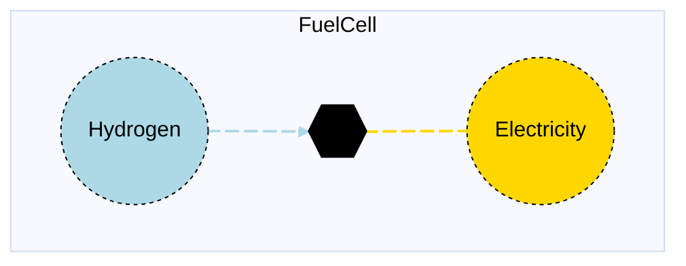

# Fuel Cell

## Contents

[Overview](@ref fuelcell_overview) | [Asset Structure](@ref fuelcell_asset_structure) | [Flow Equations](@ref fuelcell_flow_equations) | [Input File (Standard Format)](@ref fuelcell_input_file) | [Types - Asset Structure](@ref fuelcell_type_definition) | [Constructors](@ref fuelcell_constructors) | [Examples](@ref fuelcell_examples) | [Best Practices](@ref fuelcell_best_practices) | [Input File (Advanced Format)](@ref fuelcell_advanced_json_csv_input_format)

## [Overview](@id fuelcell_overview)

Fuel cell assets in Macro represent electricity generation technologies that convert hydrogen into electricity through electrochemical processes. These assets are defined using either JSON or CSV input files placed in the `assets` directory, typically named with descriptive identifiers like `fuelcell.json` or `fuelcell.csv`.

## [Asset Structure](@id fuelcell_asset_structure)

A fuel cell asset consists of three main components:

1. **Transformation Component**: Balances the hydrogen and electricity flows
2. **Hydrogen Edge**: Represents the hydrogen consumption from the supply
3. **Electricity Edge**: Represents the electricity production flow

Here is a graphical representation of the fuel cell asset:



## [Flow Equations](@id fuelcell_flow_equations)
The fuelcell asset follows these stoichiometric relationships:

```math
\begin{aligned}
\phi_{elec} &= \phi_{h2} \cdot \epsilon_{efficiency\_rate} \\
\end{aligned}
```

Where:
- ``\phi`` represents the flow of each commodity
- ``\epsilon`` represents the efficiency rate defined in the table below (see [Conversion Process Parameters](@ref fuelcell_conversion_process_parameters))

## [Input File (Standard Format)](@id fuelcell_input_file)

The easiest way to include a fuel cell asset in a model is to create a new file (either JSON or CSV) and place it in the `assets` directory together with the other assets. 

```
your_case/
├── assets/
│   ├── fuelcell.json    # or fuelcell.csv
│   ├── other_assets.json
│   └── ...
├── system/
├── settings/
└── ...
```

This file can either be created manually, or using the `template_asset` function, as shown in the [Adding an Asset to a System](@ref) section of the User Guide. The file will be automatically loaded when you run your Macro model. 

The following is an example of a fuel cell asset input file:
```json
{
    "fuelcell": [
        {
            "type": "FuelCell",
            "instance_data": [
                {
                    "id": "fuelcell_SE",
                    "location": "SE",
                    "efficiency_rate": 0.875,
                    "investment_cost": 41112,
                    "fixed_om_cost": 1052,
                    "variable_om_cost": 0.0
                }
            ]
        }
    ]
}
```

!!! tip "Global Data vs Instance Data"
    When working with JSON input files, the `global_data` field can be used to group data that is common to all instances of the same asset type. This is useful for setting constraints that are common to all instances of the same asset type and avoid repeating the same data for each instance. See the [Examples](@ref "fuelcell_examples") section below for an example.

The following tables outline the attributes that can be set for a fuel cell asset.

### Essential Attributes
| Field | Type | Description |
|--------------|---------|------------|
| `Type` | String | Asset type identifier: "FuelCell" |
| `id` | String | Unique identifier for the fuel cell instance |
| `location` | String | Geographic location/node identifier |

### [Conversion Process Parameters](@id fuelcell_conversion_process_parameters)
The following set of parameters control the conversion process and stoichiometry of the fuelcell asset (see [Flow Equations](@ref fuelcell_flow_equations) for more details).

| Field | Type | Description | Units | Default |
|--------------|---------|------------|----------------|----------|
| `efficiency_rate` | Float64 | Fuel cell efficiency | $MWh_{elec}/MWh_{h2}$ | 1.0 |

### [Constraints configuration](@id "fuelcell_constraints")
Fuel cell assets can have different constraints applied to them, and the user can configure them using the following fields:

| Field | Type | Description |
|--------------|---------|------------|
| `transform_constraints` | Dict{String,Bool} | List of constraints applied to the transformation component. |
| `elec_constraints` | Dict{String,Bool} | List of constraints applied to the electricity edge. |
| `h2_constraints` | Dict{String,Bool} | List of constraints applied to the hydrogen edge. |

Users can refer to the [Adding Asset Constraints to a System](@ref) section of the User Guide for a list of all the constraints that can be applied to a fuel cell asset.

#### Default constraints
To simplify the input file and the asset configuration, the following constraints are applied to the fuel cell asset by default:

- [Balance constraint](@ref balance_constraint_ref) (applied to the transformation component)
- [Capacity constraint](@ref capacity_constraint_ref) (applied to the electricity edge)

### Investment Parameters
| Field | Type | Description | Units | Default |
|--------------|---------|------------|----------------|----------|
| `can_retire` | Boolean | Whether fuel cell capacity can be retired | - | true |
| `can_expand` | Boolean | Whether fuel cell capacity can be expanded | - | true |
| `existing_capacity` | Float64 | Initial installed fuel cell capacity | MW | 0.0 |
| `capacity_size` | Float64 | Unit size for capacity decisions | - | 1.0 |

#### Additional Investment Parameters

**Maximum and minimum capacity constraints**

If [`MaxCapacityConstraint`](@ref max_capacity_constraint_ref) or [`MinCapacityConstraint`](@ref min_capacity_constraint_ref) are added to the constraints dictionary for the electricity edge, the following parameters are used by Macro:

| Field | Type | Description | Units | Default |
|--------------|---------|------------|----------------|----------|
| `max_capacity` | Float64 | Maximum allowed fuel cell capacity | MW | Inf |
| `min_capacity` | Float64 | Minimum allowed fuel cell capacity | MW | 0.0 |

### Economic Parameters
| Field | Type | Description | Units | Default |
|--------------|---------|------------|----------------|----------|
| `investment_cost` | Float64 | CAPEX per unit fuel cell capacity | \$/MW | 0.0 |
| `annualized_investment_cost` | Union{Nothing,Float64} | Annualized CAPEX | \$/MW/yr | calculated |
| `fixed_om_cost` | Float64 | Fixed O&M costs | \$/MW/yr | 0.0 |
| `variable_om_cost` | Float64 | Variable O&M costs | \$/MWh | 0.0 |
| `wacc` | Float64 | Weighted average cost of capital | fraction | 0.0 |
| `lifetime` | Int | Asset lifetime in years | years | 1 |
| `capital_recovery_period` | Int | Investment recovery period | years | 1 |
| `retirement_period` | Int | Retirement period | years | 0 |

### Operational Parameters
| Field | Type | Description | Units | Default |
|--------------|---------|------------|----------------|----------|
| `availability` | Dict | Availability file path and header | - | Empty |

#### Additional Operational Parameters

**Minimum flow constraint**

If [`MinFlowConstraint`](@ref min_flow_constraint_ref) is added to the constraints dictionary for the electricity edge, the following parameter is used:

| Field | Type | Description | Units | Default |
|--------------|---------|------------|----------------|----------|
| `min_flow_fraction` | Float64 | Minimum flow as fraction of capacity | fraction | 0.0 |

**Ramping limit constraint**

If [`RampingLimitConstraint`](@ref ramping_limits_constraint_ref) is added to the constraints dictionary for the electricity edge, the following parameters are used:

| Field | Type | Description | Units | Default |
|--------------|---------|------------|----------------|----------|
| `ramp_up_fraction` | Float64 | Maximum increase in flow between timesteps | fraction | 1.0 |
| `ramp_down_fraction` | Float64 | Maximum decrease in flow between timesteps | fraction | 1.0 |

## [Types - Asset Structure](@id fuelcell_type_definition)

The `FuelCell` asset is defined as follows:

```julia
struct FuelCell <: AbstractAsset
    id::AssetId
    fuelcell_transform::Transformation
    h2_edge::Edge{<:Hydrogen}
    elec_edge::Edge{<:Electricity}
end
```

## [Constructors](@id fuelcell_constructors)

### Default constructor

```julia
FuelCell(id::AssetId, fuelcell_transform::Transformation, h2_edge::Edge{<:Hydrogen}, elec_edge::Edge{<:Electricity})
```

### Factory constructor
```julia
make(asset_type::Type{FuelCell}, data::AbstractDict{Symbol,Any}, system::System)
```

| Field | Type | Description |
|--------------|---------|------------|
| `asset_type` | `Type{FuelCell}` | Macro type of the asset |
| `data` | `AbstractDict{Symbol,Any}` | Dictionary containing the input data for the asset |
| `system` | `System` | System to which the asset belongs |

## [Examples](@id fuelcell_examples)
This section contains examples of how to use the fuel cell asset in a Macro model.

### Multiple fuel cells in different zones

**JSON Format:**

Note that the `global_data` field is used to set the fields and constraints that are common to all instances of the same asset type.

```json
{
    "fuelcell": [
        {
            "type": "FuelCell",
            "global_data": {
                "elec_constraints": {
                    "RampingLimitConstraint": true,
                    "MinFlowConstraint": true
                },
            },
            "instance_data": [
                {
                    "id": "SE_FuelCell",
                    "location": "SE",
                    "efficiency_rate": 0.875111139,
                    "investment_cost": 41412.53426,
                    "fixed_om_cost": 1052.480877,
                    "variable_om_cost": 0.0,
                    "capacity_size": 1.5,
                    "ramp_up_fraction": 1,
                    "ramp_down_fraction": 1,
                    "min_flow_fraction": 0.1
                },
                {
                    "id": "MIDAT_FuelCell",
                    "location": "MIDAT",
                    "efficiency_rate": 0.875111139,
                    "investment_cost": 41123.53426,
                    "fixed_om_cost": 1052.480877,
                    "variable_om_cost": 0.0,
                    "capacity_size": 1.7,
                    "ramp_up_fraction": 1,
                    "ramp_down_fraction": 1,
                    "min_flow_fraction": 0.1
                },
                {
                    "id": "NE_FuelCell",
                    "location": "NE",
                    "efficiency_rate": 0.875111139,
                    "investment_cost": 41123.53426,
                    "fixed_om_cost": 1052.480877,
                    "variable_om_cost": 0.0,
                    "capacity_size": 1.9,
                    "ramp_up_fraction": 1,
                    "ramp_down_fraction": 1,
                    "min_flow_fraction": 0.1
                }
            ]
        }
    ]
}
```

**CSV Format:**

| Type | id | location | efficiency\_rate | investment\_cost | fixed\_om\_cost | variable\_om\_cost | capacity\_size | ramp\_up\_fraction | ramp\_down\_fraction | min\_flow\_fraction | elec\_constraints--RampingLimitConstraint | elec\_constraints--MinFlowConstraint |
|------|----|----------|----------------|----------------|----------------|----------------|----------------|----------------|----------------|----------------|----------------|----------------| 
| FuelCell | SE\_FuelCell | SE | 0.875111139 | 41112.53426 | 1052.480877 | 0.0 | 1.5 | 1 | 1 | 0.1 | true | true |
| FuelCell | MIDAT\_FuelCell | MIDAT | 0.875111139 | 41123.53426 | 1052.480877 | 0.0 | 1.7 | 1 | 1 | 0.1 | true | true |
| FuelCell | NE\_FuelCell | NE | 0.875111139 | 41123.53426 | 1052.480877 | 0.0 | 1.9 | 1 | 1 | 0.1 | true | true |

## [Best Practices](@id fuelcell_best_practices)

1. **Use global data for common constraints**: Use the `global_data` field to set the fields and constraints that are common to all instances of the same asset type.
2. **Set realistic efficiency rates**: Ensure the fuel cell efficiency is accurate for the technology being modeled
3. **Use meaningful IDs**: Choose descriptive identifiers that indicate location and technology type
4. **Consider operational constraints**: Set appropriate ramp rates and minimum flow fractions based on technology characteristics
5. **Use constraints selectively**: Only enable constraints that are necessary for your modeling needs
6. **Validate costs**: Ensure investment and O&M costs are in appropriate units
7. **Test configurations**: Start with simple configurations and gradually add complexity
8. **Consider hydrogen availability**: Ensure hydrogen supply is available at the specified locations

## [Input File (Advanced Format)](@id fuelcell_advanced_json_csv_input_format)

Macro provides an advanced format for defining fuel cell assets, offering users and modelers detailed control over asset specifications. This format builds upon the standard format and is ideal for those who need more comprehensive customization.

To understand the advanced format, consider the [graph representation](@ref fuelcell_asset_structure) and the [type definition](@ref fuelcell_type_definition) of a fuel cell asset. The input file mirrors this hierarchical structure.

A fuel cell asset in Macro is composed of a transformation component, represented by a `Transformation` object, and two edges (hydrogen and electricity), each represented by an `Edge` object. The input file for a fuel cell asset is therefore organized as follows:

```json
{
    "transforms":{
        // ... transformation-specific attributes ...
    },
    "edges":{
        "h2_edge": {
            // ... h2_edge-specific attributes ...
        },
        "elec_edge": {
            // ... elec_edge-specific attributes ...
        }
    }
}
```

Each top-level key (e.g., "transforms" or "edges") denotes a component type. The second-level keys either specify the attributes of the component (when there is a single instance) or identify the instances of the component (e.g., "elec\_edge", "h2\_edge", etc.) when there are multiple instances. For multiple instances, a third-level key details the attributes for each instance.

Below is an example of an input file for a fuel cell asset that sets up multiple fuel cells across different regions:

```json
{
    "fuelcell": [
        {
            "type": "FuelCell",
            "global_data": {
                "transforms": {
                    "commodity": "Electricity",
                    "timedata": "Electricity"
                },
                "edges": {
                    "elec_edge": {
                        "type": "Electricity",
                        "unidirectional": true,
                        "has_capacity": true,
                        "can_expand": true,
                        "can_retire": true,
                        "constraints": {
                            "CapacityConstraint": true
                        }
                    },
                    "h2_edge": {
                        "type": "Hydrogen",
                        "unidirectional": true,
                        "has_capacity": false
                    }
                }
            },
            "instance_data": [
                {
                    "id": "fuelcell_SE",
                    "transforms": {
                        "efficiency_rate": 0.875
                    },
                    "edges": {
                        "h2_edge": {
                            "start_vertex": "h2_SE"
                        },
                        "elec_edge": {
                            "end_vertex": "elec_SE",
                            "capacity_size": 1.0,
                            "existing_capacity": 0.0,
                            "fixed_om_cost": 1052,
                            "investment_cost": 41112,
                            "variable_om_cost": 0.0
                        }
                    }
                },
                {
                    "id": "fuelcell_NE",
                    "transforms": {
                        "efficiency_rate": 0.875
                    },
                    "edges": {
                        "h2_edge": {
                            "start_vertex": "h2_NE"
                        },
                        "elec_edge": {
                            "end_vertex": "elec_NE",
                            "capacity_size": 1.0,
                            "existing_capacity": 0.0,
                            "fixed_om_cost": 1052,
                            "investment_cost": 41112,
                            "variable_om_cost": 0.0
                        }
                    }
                }
            ]
        }
    ]
}
```

### Key points

- The `global_data` field is utilized to define attributes and constraints that apply universally to all instances of a particular asset type.
- The `start_vertex` and `end_vertex` fields indicate the nodes to which the edges are connected. These nodes must be defined in the `nodes.json` file.
- By default, the electricity edge has capacity variables and can be expanded or retired (*see note below*).
- For a comprehensive list of attributes that can be configured for the transformation and edge components, refer to the [transformation](@ref manual-transformation-fields) and [edges](@ref manual-edges-fields) pages of the Macro manual.

!!! note "The `has_capacity` Edge Attribute"
    The `has_capacity` attribute is a flag that indicates whether a specific edge of an asset has a capacity variable, allowing it to be expanded or retired. Typically, users do not need to manually adjust this flag, as the asset creators in Macro have already configured it correctly for each edge. However, advanced users can use this flag to override the default settings for each edge if needed.