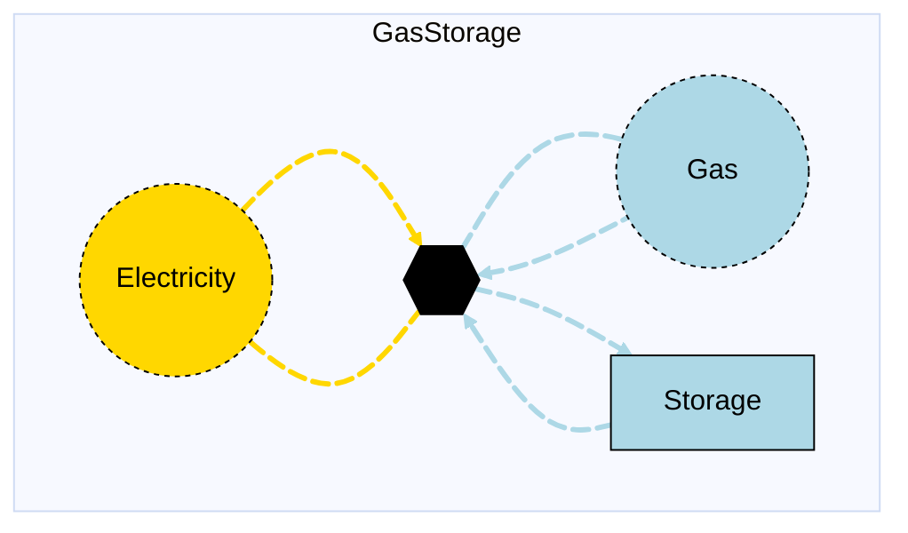

# Gas Storage

## Contents

[Overview](@ref gasstorage_overview) | [Asset Structure](@ref gasstorage_asset_structure) | [Flow Equations](@ref gasstorage_flow_equations) | [Input File (Standard Format)](@ref gasstorage_input_file) | [Types - Asset Structure](@ref gasstorage_type_definition) | [Constructors](@ref gasstorage_constructors) | [Examples](@ref gasstorage_examples) | [Best Practices](@ref gasstorage_best_practices) | [Input File (Advanced Format)](@ref gasstorage_advanced_json_csv_input_format)

## [Overview](@id gasstorage_overview)

Gas Storage assets in Macro represent storage systems for gas commodities (such as hydrogen, natural gas, etc.) that can store and release gas using compression technology. These assets are defined using either JSON or CSV input files placed in the `assets` directory, typically named `gas_storage.json` or `gas_storage.csv`.

## [Asset Structure](@id gasstorage_asset_structure)

A gas storage asset consists of one storage component, one transformation component, and six edge components:

1. **Compressor Charge Electricity Edge**: Incoming edge representing electricity consumption for compression
2. **Compressor Charge Gas Edge**: Incoming edge representing gas flow into the compressor
3. **Transformation Component**: Represents the gas compressor that balances flows
4. **Charge Edge**: Internal edge representing gas flow from the compressor to the storage
5. **Storage Component**: Tracks the energy level in the storage over time
6. **Discharge Edge**: Internal edge representing gas flow from the storage to the compressor
7. **Compressor Discharge Electricity Edge**: Outgoing edge representing electricity consumption for gas discharge
8. **Compressor Discharge Gas Edge**: Outgoing edge representing gas flow from the storage to the system

Here is a graphical representation of the gas storage asset:



## [Flow Equations](@id gasstorage_flow_equations)
The gas storage asset follows these flow relationships:

**Compressor transformation:**
```math
\begin{aligned}
\phi_{elec} &= \phi_{gas} \cdot \epsilon_{charge\_elec\_consumption} \quad \text{(charging)} \\
\phi_{elec} &= \phi_{gas} \cdot \epsilon_{discharge\_elec\_consumption} \quad \text{(discharging)} \\
\end{aligned}
```

Where:
- ``\phi`` represents the flow of each commodity
- ``\epsilon`` represents the stoichiometric coefficients defined in the table below (see table [Conversion Process Parameters](@ref gasstorage_conversion_process_parameters))

## [Input File (Standard Format)](@id gasstorage_input_file)

The easiest way to include a gas storage asset in a model is to create a new file (either JSON or CSV) and place it in the `assets` directory together with the other assets.

```
your_case/
├── assets/
│   ├── gas_storage.json    # or gas_storage.csv
│   ├── other_assets.json
│   └── ...
├── system/
├── settings/
└── ...
```

This file can either be created manually, or using the `template_asset` function, as shown in the [Adding an Asset to a System](@ref) section of the User Guide. The file will be automatically loaded when you run your Macro model.

The following is an example of a gas storage asset input file:
```json
{
    "h2stor": [
        {
            "type": "GasStorage",
            "instance_data": [
                {
                    "id": "SE_Above_ground_storage",
                    "location": "SE",
                    "timedata": "Hydrogen",
                    "storage_commodity": "Hydrogen",
                    "storage_long_duration": true,
                    "storage_can_retire": false,
                    "storage_investment_cost": 873.01,
                    "storage_fixed_om_cost": 28.76,
                    "storage_loss_fraction": 0.0,
                    "storage_min_storage_level": 0.3,
                    "storage_constraints": {
                        "BalanceConstraint": true,
                        "MinStorageLevelConstraint": true
                    },
                    "discharge_can_retire": false,
                    "charge_can_retire": false,
                    "discharge_existing_capacity": 0,
                    "charge_existing_capacity": 0,
                    "discharge_investment_cost": 0.0,
                    "charge_investment_cost": 3219.24,
                    "discharge_electricity_consumption": 0.02,
                    "charge_electricity_consumption": 0.01,
                    "discharge_efficiency": 1.0,
                    "charge_efficiency": 1.0
                }
            ]
        }
    ]
}
```

!!! tip "Global Data vs Instance Data"
    When working with JSON input files, the `global_data` field can be used to set the fields and constraints that are common to all instances of the same asset type. This is useful for setting constraints that are common to all instances of the same asset type and avoid repeating the same data for each instance. See the [Examples](@ref "gasstorage_examples") section below for an example.

The following tables outline the attributes that can be set for a gas storage asset.

### Essential Attributes
| Field | Type | Description |
|--------------|---------|------------|
| `Type` | String | Asset type identifier: "GasStorage" |
| `id` | String | Unique identifier for the gas storage instance |
| `location` | String | Geographic location/node identifier |
| `storage_commodity` | String | Commodity identifier for the gas being stored |
| `timedata` | String | Commodity identifier for the time resolution being used |
| `storage_long_duration` | Boolean | Whether the storage is long-duration | - | false |

### [Conversion Process Parameters](@id gasstorage_conversion_process_parameters)
The following set of parameters control the conversion process and stoichiometry of the gas storage asset (see [Flow Equations](@ref gasstorage_flow_equations) for more details).

| Field | Type | Description | Units | Default |
|--------------|---------|------------|----------------|----------|
| `charge_electricity_consumption` | Float64 | Electricity consumption per unit gas | $MWh_{elec}/MWh_{gas}$ | 0.0 |
| `discharge_electricity_consumption` | Float64 | Electricity consumption per unit gas | $MWh_{elec}/MWh_{gas}$ | 0.0 |
| `charge_efficiency` | Float64 | Efficiency of the charging of the storage component | fraction | 1.0 |
| `discharge_efficiency` | Float64 | Efficiency of the discharging of the storage component | fraction | 1.0 |

### [Constraints Configuration](@id "gasstorage_constraints")
Gas storage assets can have different constraints applied to them, and the user can configure them using the following fields:

| Field | Type | Description |
|--------------|---------|------------|
| `transform_constraints` | Dict{String,Bool} | List of constraints applied to the transformation component. |
| `charge_constraints` | Dict{String,Bool} | List of constraints applied to the charge edge. |
| `discharge_constraints` | Dict{String,Bool} | List of constraints applied to the discharge edge. |
| `storage_constraints` | Dict{String,Bool} | List of constraints applied to the storage component. |
| `charge_elec_constraints` | Dict{String,Bool} | List of constraints applied to the charge electricity edge. |
| `discharge_elec_constraints` | Dict{String,Bool} | List of constraints applied to the discharge electricity edge. |
| `external_charge_constraints` | Dict{String,Bool} | List of constraints applied to the charge gas edge. |
| `external_discharge_constraints` | Dict{String,Bool} | List of constraints applied to the discharge gas edge. |

For example, if the user wants to apply the [`StorageCapacityConstraint`](@ref storage_capacity_constraint_ref), [`BalanceConstraint`](@ref balance_constraint_ref) and [`MinStorageLevelConstraint`](@ref min_storage_level_constraint_ref) to the storage component, and the [`RampingLimitConstraint`](@ref ramping_limits_constraint_ref) to the discharge edge, the constraints fields should be set as follows:

```json
{
    "storage_constraints": {
        "BalanceConstraint": true,
        "StorageCapacityConstraint": true,
        "MinStorageLevelConstraint": true
    },
    "discharge_constraints": {
        "RampingLimitConstraint": true
    }
}
```

Users can refer to the [Adding Asset Constraints to a System](@ref) section of the User Guide for a list of all the constraints that can be applied to a gas storage asset.

#### Default constraints
To simplify the input file and the asset configuration, the following constraints are applied to the gas storage asset by default:

- [Balance constraint](@ref balance_constraint_ref) (applied to the transformation component)
- [Capacity constraint](@ref capacity_constraint_ref) (applied to both charge and discharge edges)
- [Storage capacity constraint](@ref storage_capacity_constraint_ref) (applied to the storage component)

If the storage is a long-duration storage (i.e., `"storage_long_duration": true` is set in the input file), the following additional constraints are applied by default:
- [Long-duration storage constraints](@ref long_duration_storage_constraints_ref) (applied to the storage component)

### Investment Parameters
| Field | Type | Description | Units | Default |
|--------------|---------|------------|----------------|----------|
| `storage_can_retire` | Boolean | Whether storage capacity can be retired | - | false |
| `storage_can_expand` | Boolean | Whether storage capacity can be expanded | - | false |
| `storage_existing_capacity` | Float64 | Initial installed storage capacity | MWh | 0.0 |
| `storage_capacity_size` | Float64 | Unit size for capacity decisions | - | 1.0 |
| `charge_can_retire` | Boolean | Whether charge edge capacity can be retired | - | true |
| `charge_can_expand` | Boolean | Whether charge edge capacity can be expanded | - | true |
| `charge_existing_capacity` | Float64 | Initial installed charge edge capacity | MW | 0.0 |
| `charge_capacity_size` | Float64 | Unit size for capacity decisions | - | 1.0 |
| `discharge_can_retire` | Boolean | Whether discharge edge capacity can be retired | - | true |
| `discharge_can_expand` | Boolean | Whether discharge edge capacity can be expanded | - | true |
| `discharge_existing_capacity` | Float64 | Initial installed discharge edge capacity | MW | 0.0 |
| `discharge_capacity_size` | Float64 | Unit size for capacity decisions | - | 1.0 |

#### Additional Investment Parameters

**Maximum and minimum capacity constraints**

If [`MaxCapacityConstraint`](@ref max_capacity_constraint_ref) or [`MinCapacityConstraint`](@ref min_capacity_constraint_ref) are added to the constraints dictionary for the storage or edges, the following parameters are used by Macro:

| Field | Type | Description | Units | Default |
|--------------|---------|------------|----------------|----------|
| `storage_max_capacity` | Float64 | Maximum allowed storage capacity | MWh | Inf |
| `storage_min_capacity` | Float64 | Minimum allowed storage capacity | MWh | 0.0 |
| `charge_max_capacity` | Float64 | Maximum allowed charge edge capacity | MW | Inf |
| `charge_min_capacity` | Float64 | Minimum allowed charge edge capacity | MW | 0.0 |
| `discharge_max_capacity` | Float64 | Maximum allowed discharge edge capacity | MW | Inf |
| `discharge_min_capacity` | Float64 | Minimum allowed discharge edge capacity | MW | 0.0 |

### Economic Parameters
| Field | Type | Description | Units | Default |
|--------------|---------|------------|----------------|----------|
| `storage_investment_cost` | Float64 | CAPEX per unit storage capacity | \$/MWh/yr | 0.0 |
| `storage_fixed_om_cost` | Float64 | Fixed O&M costs of the storage component | \$/MWh/yr | 0.0 |
| `storage_variable_om_cost` | Float64 | Variable O&M costs of the storage component | \$/MWh | 0.0 |
| `discharge_investment_cost` | Float64 | CAPEX per unit discharge edge capacity | \$/MW/yr | 0.0 |
| `discharge_fixed_om_cost` | Float64 | Fixed O&M costs of the discharge edge | \$/MW/yr | 0.0 |
| `discharge_variable_om_cost` | Float64 | Variable O&M costs of the discharge edge | \$/MWh | 0.0 |
| `charge_investment_cost` | Float64 | CAPEX per unit charge edge capacity | \$/MW/yr | 0.0 |
| `charge_fixed_om_cost` | Float64 | Fixed O&M costs of the charge edge | \$/MW/yr | 0.0 |
| `charge_variable_om_cost` | Float64 | Variable O&M costs of the charge edge | \$/MWh | 0.0 |

### Charge and Discharge Efficiency

| Field | Type | Description | Default |
|--------------|---------|------------|----------|
| `charge_efficiency` | Float64 | Efficiency of the charging process | 1.0 |
| `discharge_efficiency` | Float64 | Efficiency of the discharging process | 1.0 |

### Operational Parameters
| Field | Type | Description | Units | Default |
|--------------|---------|------------|----------------|----------|
| `storage_loss_fraction` | Float64 | Fraction of stored energy lost per timestep | fraction | 0.0 |

#### Additional Operational Parameters

**Storage duration constraints**

If [`StorageMaxDurationConstraint`](@ref storage_max_duration_constraint_ref) or [`StorageMinDurationConstraint`](@ref storage_min_duration_constraint_ref) are added to the constraints dictionary for the storage component, the following parameters are used:

| Field | Type | Description | Units | Default |
|--------------|---------|------------|----------------|----------|
| `storage_max_duration` | Float64 | Maximum ratio of installed energy to discharged capacity | hours | 0.0 |
| `storage_min_duration` | Float64 | Minimum ratio of installed energy to discharged capacity | hours | 0.0 |

**Storage level constraints**

If [`MaxStorageLevelConstraint`](@ref max_storage_level_constraint_ref) or [`MinStorageLevelConstraint`](@ref min_storage_level_constraint_ref) are added to the constraints dictionary for the storage component, the following parameters are used:

| Field | Type | Description | Units | Default |
|--------------|---------|------------|----------------|----------|
| `storage_max_storage_level` | Float64 | Maximum storage level as fraction of capacity | fraction | 1.0 |
| `storage_min_storage_level` | Float64 | Minimum storage level as fraction of capacity | fraction | 0.0 |

**Minimum flow constraint**

If [`MinFlowConstraint`](@ref min_flow_constraint_ref) is added to the constraints dictionary for the discharge edge, the following parameter is used:

| Field | Type | Description | Units | Default |
|--------------|---------|------------|----------------|----------|
| `discharge_min_flow_fraction` | Float64 | Minimum discharge as fraction of capacity | fraction | 0.0 |
| `charge_min_flow_fraction` | Float64 | Minimum charge as fraction of capacity | fraction | 0.0 |

**Ramping limit constraint**

If [`RampingLimitConstraint`](@ref ramping_limits_constraint_ref) is added to the constraints dictionary for the charge or discharge edges, the following parameters are used:

| Field | Type | Description | Units | Default |
|--------------|---------|------------|----------------|----------|
| `charge_ramp_up_fraction` | Float64 | Maximum increase in flow between timesteps | fraction | 1.0 |
| `charge_ramp_down_fraction` | Float64 | Maximum decrease in flow between timesteps | fraction | 1.0 |
| `discharge_ramp_up_fraction` | Float64 | Maximum increase in flow between timesteps | fraction | 1.0 |
| `discharge_ramp_down_fraction` | Float64 | Maximum decrease in flow between timesteps | fraction | 1.0 |

## [Types - Asset Structure](@id gasstorage_type_definition)

The `GasStorage` asset is defined as follows:

```julia
struct GasStorage{T} <: AbstractAsset
    id::AssetId
    pump_transform::Transformation
    gas_storage::AbstractStorage{<:T}
    charge_edge::Edge{<:T}
    discharge_edge::Edge{<:T}
    external_charge_edge::Edge{<:T}
    external_discharge_edge::Edge{<:T}
    charge_elec_edge::Edge{<:Electricity}
    discharge_elec_edge::Edge{<:Electricity}
end
```

## [Constructors](@id gasstorage_constructors)

### Default constructor

```julia
GasStorage(id::AssetId, pump_transform::Transformation, gas_storage::AbstractStorage{T}, charge_edge::Edge{T}, discharge_edge::Edge{T}, external_charge_edge::Edge{T}, external_discharge_edge::Edge{T}, charge_elec_edge::Edge{<:Electricity}, discharge_elec_edge::Edge{<:Electricity}) where {T<:Commodity}
```

### Factory constructor
```julia
make(asset_type::Type{GasStorage}, data::AbstractDict{Symbol,Any}, system::System)
```

| Field | Type | Description |
|--------------|---------|------------|
| `asset_type` | `Type{GasStorage}` | Macro type of the asset |
| `data` | `AbstractDict{Symbol,Any}` | Dictionary containing the input data for the asset |
| `system` | `System` | System to which the asset belongs |

## [Examples](@id gasstorage_examples)
This section contains examples of how to use the gas storage asset in a Macro model.

### Simple Gas Storage Asset
This example shows a new single asymmetric long-duration hydrogen storage asset located in the SE region with capacity that can only be expanded and not retired. The charge and discharge efficiency are set to 1.0, and the charge and discharge electricity consumption are set to 0.01 and 0.02, respectively. A `MinStorageLevelConstraint` constraint is applied to the storage component to ensure that the storage level is at least 30% of the capacity. A `RampingLimitConstraint` constraint is applied to the discharge edge with a ramping limit of 1.0. The storage component doesn't have losses.

**JSON Format:**
```json
{
    "h2stor": [
        {
            "type": "GasStorage",
            "instance_data": [
                {
                    "id": "SE_Above_ground_storage",
                    "location": "SE",
                    "timedata": "Hydrogen",
                    "charge_electricity_consumption": 0.01,
                    "discharge_electricity_consumption": 0.02,
                    "storage_commodity": "Hydrogen",
                    "storage_long_duration": true,
                    "discharge_can_retire": false,
                    "discharge_existing_capacity": 0,
                    "discharge_investment_cost": 0.0,
                    "discharge_efficiency": 1.0,
                    "discharge_ramp_up_fraction": 1,
                    "discharge_ramp_down_fraction": 1,
                    "charge_can_retire": false,
                    "charge_existing_capacity": 0,
                    "charge_investment_cost": 3219.24,
                    "charge_efficiency": 1.0,
                    "storage_can_retire": false,
                    "storage_investment_cost": 873.01,
                    "storage_fixed_om_cost": 28.76,
                    "storage_loss_fraction": 0.0,
                    "storage_min_storage_level": 0.3,
                    "storage_constraints": {
                        "BalanceConstraint": true,
                        "StorageCapacityConstraint": true,
                        "MinStorageLevelConstraint": true
                    },
                    "discharge_constraints": {
                        "RampingLimitConstraint": true
                    }
                }
            ]
        }
    ]
}
```

**CSV Format:**

| type | id | location | timedata | charge\_electricity\_consumption | discharge\_electricity\_consumption | storage\_commodity | storage\_long\_duration | discharge\_can\_retire | discharge\_existing\_capacity | discharge\_investment\_cost | discharge\_efficiency | discharge\_ramp\_up\_fraction | discharge\_ramp\_down\_fraction | charge\_can\_retire | charge\_existing\_capacity | charge\_investment\_cost | charge\_efficiency | storage\_can\_retire | storage\_investment\_cost | storage\_fixed\_om\_cost | storage\_loss\_fraction | storage\_min\_storage\_level | storage\_constraints--BalanceConstraint | storage\_constraints--StorageCapacityConstraint | storage\_constraints--MinStorageLevelConstraint | discharge\_constraints--RampingLimitConstraint |
|------|----|----------|---------------------|------------------------------------------|--------------------------------|------------------------------|--------------------------------|------------------------------|---------------------------|---------------------------|------------------------------------------------|-----------------------------------------------------|------------------------|--------------------------------|------------------------------|---------------------------|---------------------------|------------------------------------------------|-------------------|-------------------|-------------------|----------------------------------------|------------------------------------------------|----|----------------------------------------|--------------------------------|
| GasStorage | SE\_Above\_ground\_storage | SE | Hydrogen | 0.01 | 0.02 | Hydrogen | true | false | 0 | 0.0 | 1.0 | 1 | 1 | false | 0 | 3219.236569 | 1.0 | false | 873.013307 | 28.75810056 | 0.0 | 0.3 | true | true | true | true |

### Multiple Hydrogen Storage Assets in Different Zones

This example shows how to create a set of new asymmetric long-duration hydrogen storage assets in different zones (SE, MIDAT, and NE), with different costs, capacities, and efficiency rates. Ramp rates and minimum storage levels are set to 1.0 and 0.3, respectively for all storage assets.

**JSON Format:**

Note that the `global_data` field is used to set the fields and constraints that are common to all instances of the same asset type.

```json
{
    "h2stor": [
        {
            "type": "GasStorage",
            "global_data": {
                "timedata": "Hydrogen",
                "charge_electricity_consumption": 0.01,
                "discharge_electricity_consumption": 0.02,
                "storage_commodity": "Hydrogen",
                "storage_long_duration": true,
                "discharge_can_retire": false,
                "discharge_existing_capacity": 0,
                "discharge_investment_cost": 0.0,
                "discharge_efficiency": 1.0,
                "discharge_ramp_up_fraction": 1,
                "discharge_ramp_down_fraction": 1,
                "charge_can_retire": false,
                "charge_existing_capacity": 0,
                "charge_investment_cost": 3219.24,
                "charge_efficiency": 1.0,
                "storage_can_retire": false,
                "storage_investment_cost": 873.01,
                "storage_fixed_om_cost": 28.76,
                "storage_loss_fraction": 0.0,
                "storage_min_storage_level": 0.3,
                "storage_constraints": {
                    "BalanceConstraint": true,
                    "StorageCapacityConstraint": true,
                    "MinStorageLevelConstraint": true
                },
                "discharge_constraints": {
                    "RampingLimitConstraint": true
                }
            },
            "instance_data": [
                {
                    "id": "SE_Above_ground_storage",
                    "location": "SE"
                },
                {
                    "id": "MIDAT_Above_ground_storage",
                    "location": "MIDAT"
                },
                {
                    "id": "NE_Above_ground_storage",
                    "location": "NE"
                }
            ]
        }
    ]
}
```

**CSV Format:**

| type | id | location | timedata | charge_electricity_consumption | discharge_electricity_consumption | storage_commodity | storage_long_duration | discharge_can_retire | discharge_existing_capacity | discharge_investment_cost | discharge_efficiency | discharge_ramp_up_fraction | discharge_ramp_down_fraction | charge_can_retire | charge_existing_capacity | charge_investment_cost | charge_efficiency | storage_can_retire | storage_investment_cost | storage_fixed_om_cost | storage_loss_fraction | storage_min_storage_level | storage_constraints--BalanceConstraint | storage_constraints--StorageCapacityConstraint | storage_constraints--MinStorageLevelConstraint | discharge_constraints--RampingLimitConstraint |
|------|----|----------|---------------------|------------------------------------------|--------------------------------|------------------------------|--------------------------------|------------------------------|---------------------------|---------------------------|------------------------------------------------|-----------------------------------------------------|------------------------|--------------------------------|------------------------------|---------------------------|---------------------------|------------------------------------------------|-------------------|-------------------|-------------------|----------------------------------------|------------------------------------------------|----------------------------------------|--------------------------------|---------------------------|
| GasStorage | SE\_Above\_ground\_storage | SE | Hydrogen | 0.01 | 0.02 | Hydrogen | true | true | true | false | true | true | Hydrogen | true | true | true | false | true | Hydrogen | true | false | true | true | true | 0 | 0.0 | 0.0 | 0.0 | 1.0 | 1 | 1 | 0 | 3219.236569 | 0.0 | 0.0 | 1.0 | 873.013307 | 28.75810056 | 0.0 | 0.3 |
| GasStorage | MIDAT\_Above\_ground\_storage | MIDAT | Hydrogen | 0.01 | 0.02 | Hydrogen | true | true | true | false | true | true | Hydrogen | true | true | true | false | true | Hydrogen | true | false | true | true | true | 0 | 0.0 | 0.0 | 0.0 | 1.0 | 1 | 1 | 0 | 3219.236569 | 0.0 | 0.0 | 1.0 | 873.013307 | 28.75810056 | 0.0 | 0.3 |
| GasStorage | NE\_Above\_ground\_storage | NE | Hydrogen | 0.01 | 0.02 | Hydrogen | true | true | true | false | true | true | Hydrogen | true | true | true | false | true | Hydrogen | true | false | true | true | true | 0 | 0.0 | 0.0 | 0.0 | 1.0 | 1 | 1 | 0 | 3219.236569 | 0.0 | 0.0 | 1.0 | 873.013307 | 28.75810056 | 0.0 | 0.3 |

## [Best Practices](@id gasstorage_best_practices)

1. **Use global data for common fields and constraints**: Use the `global_data` field to set the fields and constraints that are common to all instances of the same asset type.
2. **Set realistic efficiency values**: Ensure charge and discharge efficiencies reflect actual technology performance
3. **Use meaningful IDs**: Choose descriptive identifiers that indicate location and storage type
4. **Consider electricity consumption**: Set appropriate electricity consumption for the compressor
5. **Validate costs**: Ensure investment and O&M costs are in appropriate units and time periods
6. **Test configurations**: Start with simple configurations and gradually add complexity
7. **Set appropriate storage levels**: Consider minimum storage levels for operational requirements

## [Input File (Advanced Format)](@id gasstorage_advanced_json_csv_input_format)

Macro provides an advanced format for defining gas storage assets, offering users and modelers detailed control over asset specifications. This format builds upon the standard format and is ideal for those who need more comprehensive customization.

To understand the advanced format, consider the [graph representation](@ref gasstorage_asset_structure) and the [type definition](@ref gasstorage_type_definition) of a gas storage asset. The input file mirrors this hierarchical structure.

A gas storage asset in Macro is composed of a storage component, represented by a `Storage` object, a transformation component, represented by a `Transformation` object, and six edges, each represented by an `Edge` object. The input file for a gas storage asset is therefore organized as follows:

```json
{
    "storage":{
        // ... storage-specific attributes ...
    },
    "transforms":{
        // ... transformation-specific attributes ...
    },
    "edges":{
        "charge_elec_edge": {
            // ... charge_elec_edge-specific attributes ...
        },
        "discharge_elec_edge": {
            // ... compressor_gas_edge-specific attributes ...
        },
        "charge_edge": {
            // ... charge_edge-specific attributes ...
        },
        "discharge_edge": {
            // ... discharge_edge-specific attributes ...
        },
        "external_charge_edge": {
            // ... external_charge_edge-specific attributes ...
        },
        "external_discharge_edge": {
            // ... external_discharge_edge-specific attributes ...
        }
    }
}
```

Each top-level key (e.g., "storage", "transforms", or "edges") denotes a component type. The second-level keys either specify the attributes of the component (when there is a single instance) or identify the instances of the component (e.g., "discharge\_elec\_edge", "charge\_edge", etc.) when there are multiple instances. For multiple instances, a third-level key details the attributes for each instance.

Below is an example of an input file for a gas storage asset that sets a single instance of the asset in each of the three zones, SE, MIDAT, and NE.

```json
{
    "h2stor": [
        {
            "type": "GasStorage",
            "global_data": {
                "transforms": {
                    "timedata": "Hydrogen",
                    "charge_electricity_consumption": 0.01,
                    "discharge_electricity_consumption": 0.02
                },
                "storage": {
                    "commodity": "Hydrogen",
                    "can_expand": true,
                    "can_retire": false,
                    "long_duration": true,
                    "investment_cost": 873.01,
                    "fixed_om_cost": 28.76,
                    "loss_fraction": 0.0,
                    "min_storage_level": 0.3,
                    "constraints": {
                        "StorageCapacityConstraint": true,
                        "BalanceConstraint": true,
                        "MinStorageLevelConstraint": true,
                        "LongDurationStorageImplicitMinMaxConstraint": true
                    }
                },
                "edges": {
                    "discharge_edge": {
                        "type": "Hydrogen",
                        "unidirectional": true,
                        "can_expand": true,
                        "can_retire": false,
                        "has_capacity": true,
                        "efficiency": 1.0,
                        "ramp_up_fraction": 1,
                        "ramp_down_fraction": 1,
                        "constraints": {
                            "CapacityConstraint": true,
                            "RampingLimitConstraint": true
                        }
                    },
                    "charge_edge": {
                        "type": "Hydrogen",
                        "unidirectional": true,
                        "has_capacity": true,
                        "can_expand": true,
                        "can_retire": false,
                        "investment_cost": 3219.24,
                        "efficiency": 1.0,
                        "constraints": {
                            "CapacityConstraint": true
                        }
                    },
                    "charge_elec_edge": {
                        "type": "Electricity",
                        "unidirectional": true,
                        "has_capacity": false
                    },
                    "discharge_elec_edge": {
                        "type": "Electricity",
                        "unidirectional": true,
                        "has_capacity": false
                    },
                    "external_charge_edge": {
                        "type": "Hydrogen",
                        "unidirectional": true,
                        "has_capacity": false
                    },
                    "external_discharge_edge": {
                        "type": "Hydrogen",
                        "unidirectional": true,
                        "has_capacity": false
                    }
                }
            },
            "instance_data": [
                {
                    "id": "SE_Above_ground_storage",
                    "edges": {
                        "external_discharge_edge": {
                            "end_vertex": "h2_SE"
                        },
                        "external_charge_edge": {
                            "start_vertex": "h2_SE"
                        },
                        "discharge_elec_edge": {
                            "start_vertex": "elec_SE"
                        },
                        "charge_elec_edge": {
                            "start_vertex": "elec_SE"
                        }
                    }
                },
                {
                    "id": "MIDAT_Above_ground_storage",
                    "edges": {
                        "external_discharge_edge": {
                            "end_vertex": "h2_MIDAT"
                        },
                        "external_charge_edge": {
                            "start_vertex": "h2_MIDAT"
                        },
                        "discharge_elec_edge": {
                            "start_vertex": "elec_MIDAT"
                        },
                        "charge_elec_edge": {
                            "start_vertex": "elec_MIDAT"
                        }
                    }
                },
                {
                    "id": "NE_Above_ground_storage",
                    "edges": {
                        "external_discharge_edge": {
                            "end_vertex": "h2_NE"
                        },
                        "external_charge_edge": {
                            "start_vertex": "h2_NE"
                        },
                        "discharge_elec_edge": {
                            "start_vertex": "elec_NE"
                        },
                        "charge_elec_edge": {
                            "start_vertex": "elec_NE"
                        }
                    }
                }
            ]
        }
    ]
}
```

### Key Points

- The `global_data` field is utilized to define attributes and constraints that apply universally to all instances of a particular asset type.
- The `start_vertex` and `end_vertex` fields indicate the nodes to which the edges are connected. These nodes must be defined in the `nodes.json` file.
- By default, both charge and discharge edges can have capacity variables and constraints, representing the power capacity of the storage system (*see note below*).
- The storage component represents the energy capacity of the storage facility.
- For a comprehensive list of attributes that can be configured for the storage, transformation, and edge components, refer to the [storage](@ref manual-storage-fields), [transformation](@ref manual-transformation-fields), and [edges](@ref manual-edges-fields) pages of the Macro manual.

!!! note "The `has_capacity` Edge Attribute"
    The `has_capacity` attribute is a flag that indicates whether a specific edge of an asset has a capacity variable, allowing it to be expanded or retired. Typically, users do not need to manually adjust this flag, as the asset creators in Macro have already configured it correctly for each edge. However, advanced users can use this flag to override the default settings for each edge if needed.

!!! tip "Prefixes"
    Users can apply prefixes to adjust parameters for the components of a gas storage asset, even when using the standard format. For instance, `discharge_can_retire` will adjust the `can_retire` parameter for the discharge edge, and `discharge_existing_capacity` will adjust the `existing_capacity` parameter for the discharge edge.
    Below are the prefixes available for modifying parameters for the components of a gas storage asset:
    - `transform_` for the transformation component
    - `storage_` for the storage component
    - `discharge_` for the discharge edge
    - `charge_` for the charge edge
    - `discharge_elec_` for the discharge electricity edge
    - `charge_elec_` for the charge electricity edge
    - `external_discharge_` for the external discharge edge
    - `external_charge_` for the external charge edge