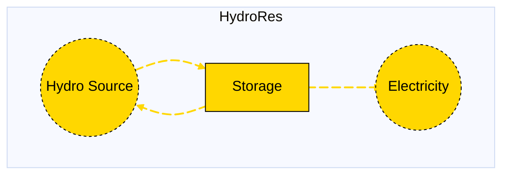

# Hydro Reservoir

## Contents

[Overview](@ref hydropower_overview) | [Asset Structure](@ref hydropower_asset_structure) | [Input File (Standard Format)](@ref hydropower_input_file) | [Types - Asset Structure](@ref hydropower_type_definition) | [Constructors](@ref hydropower_constructors) | [Examples](@ref hydropower_examples) | [Best Practices](@ref hydropower_best_practices) | [Input File (Advanced Format)](@ref hydropower_advanced_json_csv_input_format)

## [Overview](@id hydropower_overview)

Hydro Reservoir assets in Macro models hydroelectric storage systems that can store and release water to generate electricity. These assets are defined using either JSON or CSV input files placed in the `assets` directory, typically named `hydrores.json` or `hydrores.csv`.

## [Asset Structure](@id hydropower_asset_structure)

A hydro reservoir asset consists of one storage component and three edge components:

1. **Storage Component**: Represents the hydroelectric reservoir that stores water
2. **Inflow Edge**: Incoming edge representing water inflow to the reservoir
3. **Discharge Edge**: Outgoing edge representing electricity production from water release
4. **Spillage Edge**: Outgoing edge representing water spillage

Here is a graphical representation of the hydro reservoir asset:



## [Input File (Standard Format)](@id hydropower_input_file)

The easiest way to include a hydro reservoir asset in a model is to create a new file (either JSON or CSV) and place it in the `assets` directory together with the other assets.

```
your_case/
├── assets/
│   ├── hydrores.json    # or hydrores.csv
│   ├── other_assets.json
│   └── ...
├── system/
├── settings/
└── ...
```

This file can either be created manually, or using the `template_asset` function, as shown in the [Adding an Asset to a System](@ref) section of the User Guide. The file will be automatically loaded when you run your Macro model.

The following is an example of a hydro reservoir asset input file:
```json
{
    "hydrores": [
        {
            "type": "HydroRes",
            "instance_data": [
                {
                    "id": "MIDAT_conventional_hydroelectric_1",
                    "location": "MIDAT",
                    "hydro_source": "hydro_source",
                    "discharge_can_expand": false,
                    "discharge_can_retire": false,
                    "inflow_can_expand": false,
                    "inflow_can_retire": false,
                    "storage_can_expand": false,
                    "storage_can_retire": false,
                    "storage_constraints": {
                        "MinStorageOutflowConstraint": true
                    },
                    "storage_min_outflow_fraction": 0.109311313,
                    "storage_charge_discharge_ratio": 1.0,
                    "discharge_capacity_size": 29.853,
                    "discharge_existing_capacity": 2806.182,
                    "discharge_fixed_om_cost": 45648,
                    "discharge_efficiency": 1.0,
                    "inflow_availability": {
                        "timeseries": {
                            "path": "system/availability.csv",
                            "header": "MIDAT_conventional_hydroelectric_1"
                        }
                    }
                }
            ]
        }
    ]
}
```

!!! tip "Global Data vs Instance Data"
    When working with JSON input files, the `global_data` field can be used to group data that is common to all instances of the same asset type. This is useful for setting constraints that are common to all instances of the same asset type and avoid repeating the same data for each instance. See the [Examples](@ref "hydropower_examples") section below for an example.

The following tables outline the attributes that can be set for a hydro reservoir asset.

### Essential Attributes
| Field | Type | Description |
|--------------|---------|------------|
| `Type` | String | Asset type identifier: "HydroRes" |
| `id` | String | Unique identifier for the hydro reservoir instance |
| `location` | String | Geographic location/node identifier |
| `hydro_source` | String | ID of the electricity node in the system that represents the hydro source |

### [Constraints Configuration](@id "hydropower_constraints")
Hydro reservoir assets can have different constraints applied to them, and the user can configure them using the following fields:

| Field | Type | Description |
|--------------|---------|------------|
| `storage_constraints` | Dict{String,Bool} | List of constraints applied to the storage component. |
| `discharge_constraints` | Dict{String,Bool} | List of constraints applied to the discharge edge. |
| `inflow_constraints` | Dict{String,Bool} | List of constraints applied to the inflow edge. |
| `spill_constraints` | Dict{String,Bool} | List of constraints applied to the spillage edge. |

For example, if the user wants to apply the [`LongDurationStorageImplicitMinMaxConstraint`](@ref long_duration_storage_constraints_ref) to the storage component and the [`RampingLimitConstraint`](@ref ramping_limits_constraint_ref) to the discharge edge, the constraints fields should be set as follows:

```json
{
    "storage_constraints": {
        "LongDurationStorageImplicitMinMaxConstraint": true
    },
    "discharge_constraints": {
        "RampingLimitConstraint": true
    }
}
```

Users can refer to the [Adding Asset Constraints to a System](@ref) section of the User Guide for a list of all the constraints that can be applied to the different components of a hydro reservoir asset.

#### Default constraints
To simplify the input file and the asset configuration, the following constraints are applied to the hydro reservoir asset by default:

- [Balance constraint](@ref balance_constraint_ref) (applied to the storage component)
- [Storage charge discharge ratio constraint](@ref storage_charge_discharge_ratio_constraint_ref) (applied to the storage component)
- [Must run constraint](@ref must_run_constraint_ref) (applied to the inflow edge)
- [Capacity constraint](@ref capacity_constraint_ref) (applied to the discharge edge)

If the storage is a long-duration storage, the following additional constraints are applied:
- [Long-duration storage constraints](@ref long_duration_storage_constraints_ref) (applied to the storage component)

### Investment Parameters
| Field | Type | Description | Units | Default |
|--------------|---------|------------|----------------|----------|
| `storage_can_retire` | Boolean | Whether storage capacity can be retired | - | false |
| `storage_can_expand` | Boolean | Whether storage capacity can be expanded | - | false |
| `storage_existing_capacity` | Float64 | Initial installed storage capacity | MWh | 0.0 |
| `discharge_can_retire` | Boolean | Whether discharge edge capacity can be retired | - | true |
| `discharge_can_expand` | Boolean | Whether discharge edge capacity can be expanded | - | true |
| `discharge_existing_capacity` | Float64 | Initial installed discharge edge capacity | MW | 0.0 |
| `discharge_capacity_size` | Float64 | Unit size for capacity decisions | - | 1.0 |
| `inflow_can_retire` | Boolean | Whether inflow edge capacity can be retired | - | true |
| `inflow_can_expand` | Boolean | Whether inflow edge capacity can be expanded | - | true |
| `inflow_existing_capacity` | Float64 | Initial installed inflow edge capacity | MW | 0.0 |
| `inflow_capacity_size` | Float64 | Unit size for capacity decisions | - | 1.0 |

#### Additional Investment Parameters

**Maximum and minimum capacity constraints**

If [`MaxCapacityConstraint`](@ref max_capacity_constraint_ref) or [`MinCapacityConstraint`](@ref min_capacity_constraint_ref) are added to the constraints dictionary for the storage or discharge edge, the following parameters are used by Macro:

| Field | Type | Description | Units | Default |
|--------------|---------|------------|----------------|----------|
| `storage_max_capacity` | Float64 | Maximum allowed storage capacity | MWh | Inf |
| `storage_min_capacity` | Float64 | Minimum allowed storage capacity | MWh | 0.0 |
| `discharge_max_capacity` | Float64 | Maximum allowed discharge edge capacity | MW | Inf |
| `discharge_min_capacity` | Float64 | Minimum allowed discharge edge capacity | MW | 0.0 |
| `inflow_max_capacity` | Float64 | Maximum allowed inflow edge capacity | MW | Inf |
| `inflow_min_capacity` | Float64 | Minimum allowed inflow edge capacity | MW | 0.0 |

### Economic Parameters
| Field | Type | Description | Units | Default |
|--------------|---------|------------|----------------|----------|
| `storage_investment_cost` | Float64 | CAPEX per unit storage capacity | \$/MWh/yr | 0.0 |
| `storage_fixed_om_cost` | Float64 | Fixed O&M costs of the storage component | \$/MWh/yr | 0.0 |
| `discharge_investment_cost` | Float64 | CAPEX per unit discharge edge capacity | \$/MW/yr | 0.0 |
| `discharge_fixed_om_cost` | Float64 | Fixed O&M costs of the discharge edge | \$/MW/yr | 0.0 |
| `discharge_variable_om_cost` | Float64 | Variable O&M costs of the discharge edge | \$/MWh | 0.0 |
| `inflow_investment_cost` | Float64 | CAPEX per unit inflow edge capacity | \$/MW/yr | 0.0 |
| `inflow_fixed_om_cost` | Float64 | Fixed O&M costs of the inflow edge | \$/MW/yr | 0.0 |

### Operational Parameters
| Field | Type | Description | Units | Default |
|--------------|---------|------------|----------------|----------|
| `inflow_availability` | Dict | Path to availability file and column name | - | Empty |

#### Additional Operational Parameters

**Minimum Storage Outflow Constraint**

If [`MinStorageOutflowConstraint`](@ref min_storage_outflow_constraint_ref) is added to the constraints dictionary for the storage component, the following parameters are used:

| Field | Type | Description | Units | Default |
|--------------|---------|------------|----------------|----------|
| `storage_min_outflow_fraction` | Float64 | Minimum outflow as a fraction of capacity | fraction | 0.0 |

**Storage Charge Discharge Ratio Constraint**

If [`StorageChargeDischargeRatioConstraint`](@ref storage_charge_discharge_ratio_constraint_ref) is added to the constraints dictionary for the storage component, the following parameters are used:

| Field | Type | Description | Units | Default |
|--------------|---------|------------|----------------|----------|
| `storage_charge_discharge_ratio` | Float64 | Ratio between charging and discharging flows | fraction | 1.0 |

**Ramping limit constraint**

If [`RampingLimitConstraint`](@ref ramping_limits_constraint_ref) is added to the constraints dictionary for the discharge edge, the following parameters are used:

| Field | Type | Description | Units | Default |
|--------------|---------|------------|----------------|----------|
| `discharge_ramp_up_fraction` | Float64 | Maximum increase in flow between timesteps | fraction | 1.0 |
| `discharge_ramp_down_fraction` | Float64 | Maximum decrease in flow between timesteps | fraction | 1.0 |

## [Types - Asset Structure](@id hydropower_type_definition)

The `HydroRes` asset is defined as follows:

```julia
struct HydroRes <: AbstractAsset
    id::AssetId
    hydrostor::AbstractStorage{<:Electricity}
    discharge_edge::Edge{<:Electricity}
    inflow_edge::Edge{<:Electricity}
    spill_edge::Edge{<:Electricity}
end
```

## [Constructors](@id hydropower_constructors)

### Default constructor

```julia
HydroRes(id::AssetId, hydrostor::AbstractStorage{<:Electricity}, discharge_edge::Edge{<:Electricity}, inflow_edge::Edge{<:Electricity}, spill_edge::Edge{<:Electricity})
```

### Factory constructor
```julia
make(asset_type::Type{HydroRes}, data::AbstractDict{Symbol,Any}, system::System)
```

| Field | Type | Description |
|--------------|---------|------------|
| `asset_type` | `Type{HydroRes}` | Macro type of the asset |
| `data` | `AbstractDict{Symbol,Any}` | Dictionary containing the input data for the asset |
| `system` | `System` | System to which the asset belongs |

## [Examples](@id hydropower_examples)
This section contains examples of how to use the hydro reservoir asset in a Macro model.

### Simple Hydro Reservoir with Fixed Capacity
This example shows a hydro reservoir asset with existing and fixed capacity (capacity cannot be expanded or retired), minimum outflow fraction of 0.1, and an availability time series for the inflow edge loaded from a CSV file. A `MinStorageOutflowConstraint` constraint is applied to the storage component to ensure that the outflow is at least 10% of the capacity.

**JSON Format:**
```json
{
    "hydrores": [
        {
            "type": "HydroRes",
            "instance_data": [
                {
                    "id": "Fixed_Hydro_SE",
                    "location": "SE",
                    "hydro_source": "hydro_source",
                    "discharge_can_expand": false,
                    "discharge_can_retire": false,
                    "inflow_can_expand": false,
                    "inflow_can_retire": false,
                    "storage_can_expand": false,
                    "storage_can_retire": false,
                    "storage_constraints": {
                        "MinStorageOutflowConstraint": true
                    },
                    "storage_min_outflow_fraction": 0.1,
                    "discharge_capacity_size": 1.0,
                    "discharge_existing_capacity": 1000.0,
                    "discharge_fixed_om_cost": 10000.0,
                    "discharge_efficiency": 1.0,
                    "inflow_availability": {
                        "timeseries": {
                            "path": "system/availability.csv",
                            "header": "Fixed_Hydro_SE"
                        }
                    }
                }
            ]
        }
    ]
}
```

**CSV Format:**

| Type | id | location | hydro\_source | discharge\_can\_expand | discharge\_can\_retire | inflow\_can\_expand | inflow\_can\_retire | storage\_can\_expand | storage\_can\_retire | storage\_constraints--MinStorageOutflowConstraint | storage\_min\_outflow\_fraction |  discharge\_capacity\_size | discharge\_existing\_capacity | discharge\_fixed\_om\_cost | discharge\_efficiency | inflow\_availability--timeseries--path | inflow\_availability--timeseries--header |
|------|----|----------|-------------------|-------------------|-------------------|----------------------------------------|------------------------------------------------|------------------------------|--------------------------------|---------------------------|---------------------------|---------|------------------------------------------------|--------------------------------|---------------------------|---------------------------|---------------------------|
| HydroRes | Fixed\_Hydro\_SE | SE | hydro\_source | false | false | false | false | false | false | true | 0.1 | 1.0 | 1000.0 | 10000.0 | 1.0 | system/availability.csv | Fixed\_Hydro\_SE |

### Multiple Hydro Reservoir Assets in Different Zones

This example shows three hydro reservoir assets with existing and fixed capacity (capacity cannot be expanded or retired) located in the MIDAT, NE, and SE regions. A `RampingLimitConstraint` constraint is applied to the discharge edge with a ramping limit of 0.83. A `MinStorageOutflowConstraint` constraint is applied to the storage component to ensure that the outflow is at least 10% of the capacity. Finally, the storage component is set to be a long-duration storage with a `LongDurationStorageImplicitMinMaxConstraint` constraint applied to it.

**JSON Format:**

Note that the `global_data` field is used to set the fields and constraints that are common to all instances of the same asset type.

```json
{
    "hydrores": [
        {
            "type": "HydroRes",
            "global_data": {
                "hydro_source": "hydro_source",
                "discharge_constraints": {
                    "RampingLimitConstraint": true
                },
                "discharge_can_expand": false,
                "discharge_can_retire": false,
                "inflow_can_expand": false,
                "inflow_can_retire": false,
                "storage_can_expand": false,
                "storage_can_retire": false,
                "storage_long_duration": true,
                "storage_constraints": {
                    "MinStorageOutflowConstraint": true,
                    "LongDurationStorageImplicitMinMaxConstraint": true
                }
            },
            "instance_data": [
                {
                    "id": "MIDAT_conventional_hydroelectric_1",
                    "location": "MIDAT",
                    "storage_min_outflow_fraction": 0.109311313,
                    "discharge_capacity_size": 29.853,
                    "discharge_existing_capacity": 2806.182,
                    "discharge_fixed_om_cost": 45648,
                    "discharge_ramp_down_fraction": 0.83,
                    "discharge_ramp_up_fraction": 0.83,
                    "discharge_efficiency": 1.0,
                    "inflow_availability": {
                        "timeseries": {
                            "path": "system/availability.csv",
                            "header": "MIDAT_conventional_hydroelectric_1"
                        }
                    }
                },
                {
                    "id": "NE_conventional_hydroelectric_1",
                    "location": "NE",
                    "storage_min_outflow_fraction": 0.095,
                    "discharge_capacity_size": 24.13,
                    "discharge_existing_capacity": 4729.48,
                    "discharge_fixed_om_cost": 45648,
                    "discharge_ramp_down_fraction": 0.083,
                    "discharge_ramp_up_fraction": 0.083,
                    "discharge_efficiency": 1.0,
                    "inflow_availability": {
                        "timeseries": {
                            "path": "system/availability.csv",
                            "header": "NE_conventional_hydroelectric_1"
                        }
                    }
                },
                {
                    "id": "SE_conventional_hydroelectric_1",
                    "location": "SE",
                    "storage_min_outflow_fraction": 0.135129141,
                    "discharge_capacity_size": 31.333,
                    "discharge_existing_capacity": 11123.215,
                    "discharge_fixed_om_cost": 45648,
                    "discharge_ramp_down_fraction": 0.083,
                    "discharge_ramp_up_fraction": 0.083,
                    "discharge_efficiency": 1.0,
                    "inflow_availability": {
                        "timeseries": {
                            "path": "system/availability.csv",
                            "header": "SE_conventional_hydroelectric_1"
                        }
                    }
                }
            ]
        }
    ]
}
```

**CSV Format:**

| Type | id | location | hydro\_source | discharge\_can\_expand | discharge\_can\_retire | inflow\_can\_expand | inflow\_can\_retire | storage\_can\_expand | storage\_can\_retire | storage\_constraints--MinStorageOutflowConstraint | storage\_min\_outflow\_fraction | discharge\_capacity\_size | discharge\_existing\_capacity | discharge\_fixed\_om\_cost | discharge\_ramp\_down\_fraction | discharge\_ramp\_up\_fraction | discharge\_efficiency | inflow\_availability--timeseries--path | inflow\_availability--timeseries--header |
|------|----|----------|-------------------|-------------------|-------------------|----------------------------------------|------------------------------------------------|------------------------------|--------------------------------|---------------------------|---------------------------|---------|------------------------------------------------|--------------------------------|---------------------------|---------------------------|---------------------------|---------------------------|---------------------------|
| HydroRes | MIDAT\_conventional\_hydroelectric\_1 | MIDAT | hydro\_source | false | false | false | false | false | false | true | 0.109311313 | 29.853 | 2806.182 | 45648 | 0.83 | 0.83 | 1.0 | system/availability.csv | MIDAT\_conventional\_hydroelectric\_1 |
| HydroRes | NE\_conventional\_hydroelectric\_1 | NE | hydro\_source | false | false | false | false | false | false | true | 0.095 | 24.13 | 4729.48 | 45648 | 0.083 | 0.083 | 1.0 | system/availability.csv | NE\_conventional\_hydroelectric\_1 |
| HydroRes | SE\_conventional\_hydroelectric\_1 | SE | hydro\_source | false | false | false | false | false | false | true | 0.135129141 | 31.333 | 11123.215 | 45648 | 0.083 | 0.083 | 1.0 | system/availability.csv | SE\_conventional\_hydroelectric\_1 |

## [Best Practices](@id hydropower_best_practices)

1. **Use global data for common constraints**: Use the `global_data` field to set the fields and constraints that are common to all instances of the same asset type.
2. **Set realistic minimum outflow fractions**: These should reflect environmental and operational requirements
3. **Use meaningful IDs**: Choose descriptive identifiers that indicate location and technology type
4. **Consider availability profiles**: Use availability time series to model seasonal variations in water inflow
5. **Set appropriate ramping limits**: These should reflect the actual operational characteristics of the hydro plant
6. **Validate costs**: Ensure investment and O&M costs are in appropriate units and time periods
7. **Test configurations**: Start with simple configurations and gradually add complexity

## [Input File (Advanced Format)](@id hydropower_advanced_json_csv_input_format)

Macro provides an advanced format for defining hydro reservoir assets, offering users and modelers detailed control over asset specifications. This format builds upon the standard format and is ideal for those who need more comprehensive customization.

To understand the advanced format, consider the [graph representation](@ref hydropower_asset_structure) and the [type definition](@ref hydropower_type_definition) of a hydro reservoir asset. The input file mirrors this hierarchical structure.

A hydro reservoir asset in Macro is composed of a storage component, represented by a `Storage` object, and three edges, each represented by an `Edge` object. The input file for a hydro reservoir asset is therefore organized as follows:

```json
{
    "storage":{
        // ... storage-specific attributes ...
    },
    "edges":{
        "inflow_edge": {
            // ... inflow_edge-specific attributes ...
        },
        "discharge_edge": {
            // ... discharge_edge-specific attributes ...
        },
        "spill_edge": {
            // ... spill_edge-specific attributes ...
        }
    }
}
```

Each top-level key (e.g., "storage" or "edges") denotes a component type. The second-level keys either specify the attributes of the component (when there is a single instance) or identify the instances of the component (e.g., "discharge\_edge", "inflow\_edge", "spill\_edge") when there are multiple instances. For multiple instances, a third-level key details the attributes for each instance.

Below is an example of an input file for a hydro reservoir asset that sets up a single asset in the SE region with detailed edge specifications.

```json
{
    "hydrores": [
        {
            "type": "HydroRes",
            "global_data": {
                "storage": {
                    "commodity": "Electricity",
                    "can_expand": false,
                    "can_retire": false,
                    "constraints": {
                        "MinStorageOutflowConstraint": true
                    }
                },
                "edges": {
                    "inflow_edge": {
                        "type": "Electricity",
                        "unidirectional": true,
                        "start_vertex": "hydro_source",
                        "has_capacity": true,
                        "constraints": {
                            "MustRunConstraint": true
                        }
                    },
                    "discharge_edge": {
                        "type": "Electricity",
                        "unidirectional": true,
                        "has_capacity": true,
                        "can_expand": false,
                        "can_retire": false,
                        "constraints": {
                            "CapacityConstraint": true,
                            "RampingLimitConstraint": true
                        }
                    },
                    "spill_edge": {
                        "type": "Electricity",
                        "unidirectional": true,
                        "end_vertex": "hydro_source",
                        "can_expand": false,
                        "can_retire": false,
                        "has_capacity": false
                    }
                }
            },
            "instance_data": [
                {
                    "id": "SE_conventional_hydroelectric_1",
                    "storage": {
                        "min_outflow_fraction": 0.135129141,
                        "charge_discharge_ratio": 1.0
                    },
                    "edges": {
                        "inflow_edge": {
                            "efficiency": 1.0,
                            "availability": {
                                "timeseries": {
                                    "path": "assets/availability.csv",
                                    "header": "SE_conventional_hydroelectric_1"
                                }
                            }
                        },
                        "discharge_edge": {
                            "end_vertex": "elec_SE",
                            "capacity_size": 31.333,
                            "existing_capacity": 11123.215,
                            "fixed_om_cost": 45648,
                            "ramp_down_fraction": 0.083,
                            "ramp_up_fraction": 0.083,
                            "efficiency": 1.0
                        }
                    }
                }
            ]
        }
    ]
}
```

### Key Points

- The `global_data` field is utilized to define attributes and constraints that apply universally to all instances of a particular asset type.
- The `start_vertex` and `end_vertex` fields indicate the nodes to which the edges are connected. These nodes must be defined in the `nodes.json` file.
- By default, both the discharge and inflow edges are allowed to have capacity variables and constraints, as this represents the main capacity decision for the hydro facility (*see note below*).
- The inflow edge uses availability time series to model seasonal variations in water inflow.
- For a comprehensive list of attributes that can be configured for the storage and edge components, refer to the [storage](@ref manual-storage-fields) and [edges](@ref manual-edges-fields) pages of the Macro manual.

!!! tip "Prefixes"
    Users can apply prefixes to adjust parameters for the components of a hydro reservoir asset, even when using the standard format. For instance, `discharge_can_retire` will adjust the `can_retire` parameter for the discharge edge, and `discharge_existing_capacity` will adjust the `existing_capacity` parameter for the discharge edge.
    Below are the prefixes available for modifying parameters for the components of a hydro reservoir asset:
    - `storage_` for the storage component
    - `discharge_` for the discharge edge
    - `inflow_` for the inflow edge
    - `spill_` for the spill edge