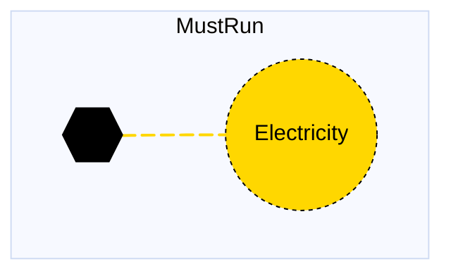

# Must Run

## Contents

[Overview](@ref mustrun_overview) | [Asset Structure](@ref mustrun_asset_structure) | [Input File (Standard Format)](@ref mustrun_input_file) | [Types - Asset Structure](@ref mustrun_type_definition) | [Constructors](@ref mustrun_constructors) | [Examples](@ref mustrun_examples) | [Best Practices](@ref mustrun_best_practices) | [Input File (Advanced Format)](@ref mustrun_advanced_json_csv_input_format)

## [Overview](@id mustrun_overview)

Must-run assets in Macro represent electricity generation technologies that must operate at their full available capacity when available. These assets are typically used for small hydroelectric plants, or other generation that has contractual or operational requirements to run when available. They are defined using either JSON or CSV input files placed in the `assets` directory, typically named with descriptive identifiers like `mustrun.json` or `mustrun.csv`.

## [Asset Structure](@id mustrun_asset_structure)

A must-run asset consists of two main components:

1. **Transformation Component**
2. **Electricity Edge**: Represents the electricity production flow to the grid

Here is a graphical representation of the must-run asset:



## [Input File (Standard Format)](@id mustrun_input_file)

The easiest way to include a must-run asset in a model is to create a new file (either JSON or CSV) and place it in the `assets` directory together with the other assets. 

```
your_case/
├── assets/
│   ├── mustrun.json    # or mustrun.csv
│   ├── other_assets.json
│   └── ...
├── system/
├── settings/
└── ...
```

This file can either be created manually, or using the `template_asset` function, as shown in the [Adding an Asset to a System](@ref) section of the User Guide. The file will be automatically loaded when you run your Macro model. 

The following is an example of a must-run asset input file:
```json
{
    "mustrun": [
        {
            "type": "MustRun",
            "instance_data": [
                {
                    "id": "SE_small_hydroelectric_1",
                    "location": "SE",
                    "can_expand": false,
                    "can_retire": false,
                    "fixed_om_cost": 45648,
                    "existing_capacity": 249.895,
                    "capacity_size": 1.219,
                    "availability": {
                        "timeseries": {
                            "path": "system/availability.csv",
                            "header": "SE_small_hydroelectric_1"
                        }
                    }
                }
            ]
        }
    ]
}
```

!!! tip "Global Data vs Instance Data"
    When working with JSON input files, the `global_data` field can be used to group data that is common to all instances of the same asset type. This is useful for setting constraints that are common to all instances of the same asset type and avoid repeating the same data for each instance. See the [Examples](@ref "mustrun_examples") section below for an example.

The following tables outline the attributes that can be set for a must-run asset.

### Essential Attributes
| Field | Type | Description |
|--------------|---------|------------|
| `Type` | String | Asset type identifier: "MustRun" |
| `id` | String | Unique identifier for the must-run instance |
| `location` | String | Geographic location/node identifier |

### [Constraints configuration](@id "mustrun_constraints")
Must-run assets can have different constraints applied to them, and the user can configure them using the following fields:

| Field | Type | Description |
|--------------|---------|------------|
| `transform_constraints` | Dict{String,Bool} | List of constraints applied to the transformation component. |
| `edge_constraints` | Dict{String,Bool} | List of constraints applied to the electricity edge. |

#### Default constraints
To simplify the input file and the asset configuration, the following constraints are applied to the must-run asset by default:

- [Balance constraint](@ref balance_constraint_ref) (applied to the transformation component)
- [Must run constraint](@ref must_run_constraint_ref) (applied to the electricity edge)

Users can refer to the [Adding Asset Constraints to a System](@ref) section of the User Guide for a list of all the constraints that can be applied to a must-run asset.

### Investment Parameters
| Field | Type | Description | Units | Default |
|--------------|---------|------------|----------------|----------|
| `can_retire` | Boolean | Whether must-run capacity can be retired | - | true |
| `can_expand` | Boolean | Whether must-run capacity can be expanded | - | true |
| `existing_capacity` | Float64 | Initial installed capacity | MW | 0.0 |
| `capacity_size` | Float64 | Unit size for capacity decisions | - | 1.0 |

#### Additional Investment Parameters

**Maximum and minimum capacity constraints**

If [`MaxCapacityConstraint`](@ref max_capacity_constraint_ref) or [`MinCapacityConstraint`](@ref min_capacity_constraint_ref) are added to the constraints dictionary for the electricity edge, the following parameters are used by Macro:

| Field | Type | Description | Units | Default |
|--------------|---------|------------|----------------|----------|
| `max_capacity` | Float64 | Maximum allowed must-run capacity | MW | Inf |
| `min_capacity` | Float64 | Minimum allowed must-run capacity | MW | 0.0 |

### Economic Parameters
| Field | Type | Description | Units | Default |
|--------------|---------|------------|----------------|----------|
| `investment_cost` | Float64 | CAPEX per unit capacity | \$/MW | 0.0 |
| `annualized_investment_cost` | Union{Nothing,Float64} | Annualized CAPEX | \$/MW/yr | calculated |
| `fixed_om_cost` | Float64 | Fixed O&M costs | \$/MW/yr | 0.0 |
| `variable_om_cost` | Float64 | Variable O&M costs | \$/MWh | 0.0 |
| `wacc` | Float64 | Weighted average cost of capital | fraction | 0.0 |
| `lifetime` | Int | Asset lifetime in years | years | 1 |
| `capital_recovery_period` | Int | Investment recovery period | years | 1 |
| `retirement_period` | Int | Retirement period | years | 1 |

### Operational Parameters
| Field | Type | Description | Units | Default |
|--------------|---------|------------|----------------|----------|
| `availability` | Dict | Availability file path and header | - | Empty |

## [Types - Asset Structure](@id mustrun_type_definition)

The `MustRun` asset is defined as follows:

```julia
struct MustRun <: AbstractAsset
    id::AssetId
    energy_transform::Transformation
    elec_edge::Edge{<:Electricity}
end
```

## [Constructors](@id mustrun_constructors)

### Default constructor

```julia
MustRun(id::AssetId, energy_transform::Transformation, elec_edge::Edge{<:Electricity})
```

### Factory constructor
```julia
make(asset_type::Type{MustRun}, data::AbstractDict{Symbol,Any}, system::System)
```

| Field | Type | Description |
|--------------|---------|------------|
| `asset_type` | `Type{MustRun}` | Macro type of the asset |
| `data` | `AbstractDict{Symbol,Any}` | Dictionary containing the input data for the asset |
| `system` | `System` | System to which the asset belongs |

## [Examples](@id mustrun_examples)
This section contains examples of how to use the must-run asset in a Macro model.

### Multiple must-run assets in different zones

This example shows three small hydroelectric plants in different regions, with existing and fixed capacity (capacity cannot be expanded or retired).

**JSON Format:**

Note that the `global_data` field is used to set the fields that are common to all instances of the same asset type.

```json
{
    "mustrun": [
        {
            "type": "MustRun",
            "global_data": {
                "can_expand": false,
                "can_retire": false,
                "fixed_om_cost": 45648
            },
            "instance_data": [
                {
                    "id": "SE_small_hydroelectric_1",
                    "location": "SE",
                    "existing_capacity": 249.895,
                    "capacity_size": 1.219,
                    "availability": {
                        "timeseries": {
                            "path": "system/availability.csv",
                            "header": "SE_small_hydroelectric_1"
                        }
                    }
                },
                {
                    "id": "MIDAT_small_hydroelectric_1",
                    "location": "MIDAT",
                    "existing_capacity": 263.268,
                    "capacity_size": 1.236,
                    "availability": {
                        "timeseries": {
                            "path": "system/availability.csv",
                            "header": "MIDAT_small_hydroelectric_1"
                        }
                    }
                },
                {
                    "id": "NE_small_hydroelectric_1",
                    "location": "NE",
                    "existing_capacity": 834.494,
                    "capacity_size": 1.051,
                    "availability": {
                        "timeseries": {
                            "path": "system/availability.csv",
                            "header": "NE_small_hydroelectric_1"
                        }
                    }
                }
            ]
        }
    ]
}
```

**CSV Format:**

| Type | id | location | can\_expand | can\_retire | fixed\_om\_cost | existing\_capacity | capacity\_size | availability--timeseries--path | availability--timeseries--header |
|------|----|----------|-------------|-------------|-----------------|-------------------|----------------|--------------------------------|----------------------------------|
| MustRun | SE\_small\_hydroelectric\_1 | SE | false | false | 45648 | 249.895 | 1.219 | system/availability.csv | SE\_small\_hydroelectric\_1 |
| MustRun | MIDAT\_small\_hydroelectric\_1 | MIDAT | false | false | 45648 | 263.268 | 1.236 | system/availability.csv | MIDAT\_small\_hydroelectric\_1 |
| MustRun | NE\_small\_hydroelectric\_1 | NE | false | false | 45648 | 834.494 | 1.051 | system/availability.csv | NE\_small\_hydroelectric\_1 |

## [Best Practices](@ref mustrun_best_practices)

1. **Use global data for common fields**: Use the `global_data` field to set the fields that are common to all instances of the same asset type.
2. **Set realistic availability profiles**: Ensure availability profiles reflect actual operational constraints
3. **Use meaningful IDs**: Choose descriptive identifiers that indicate location and technology type
4. **Consider capacity constraints**: Set appropriate capacity limits based on technology and location
5. **Use constraints selectively**: Only enable constraints that are necessary for your modeling needs
6. **Validate costs**: Ensure investment and O&M costs are in appropriate units
7. **Test configurations**: Start with simple configurations and gradually add complexity

## [Input File (Advanced Format)](@ref mustrun_advanced_json_csv_input_format)

Macro provides an advanced format for defining must-run assets, offering users and modelers detailed control over asset specifications. This format builds upon the standard format and is ideal for those who need more comprehensive customization.

To understand the advanced format, consider the [graph representation](@ref mustrun_asset_structure) and the [type definition](@ref mustrun_type_definition) of a must-run asset. The input file mirrors this hierarchical structure.

A must-run asset in Macro is composed of a transformation component, represented by a `Transformation` object, and an electricity edge, represented by an `Edge` object. The input file for a must-run asset is therefore organized as follows:

```json
{
    "transforms": {
        // ... transformation-specific attributes ...
    },
    "edges": {
        "elec_edge": {
            // ... electricity_edge-specific attributes ...
        }
    }
}
```
Each top-level key (e.g., "transforms" or "edges") denotes a component type. The second-level keys either specify the attributes of the component (when there is a single instance) or identify the instances of the component (e.g., "elec_edge") when there are multiple instances. For multiple instances, a third-level key details the attributes for each instance.

Below is an example of an input file for a must-run asset that sets up three small hydroelectric plants in different regions.

```json
{
    "mustrun": [
        {
            "type": "MustRun",
            "global_data": {
                "nodes": {},
                "transforms": {
                    "timedata": "Electricity"
                },
                "edges": {
                    "elec_edge": {
                        "unidirectional": true,
                        "can_expand": false,
                        "can_retire": false,
                        "has_capacity": true,
                        "constraints": {
                            "MustRunConstraint": true
                        }
                    }
                }
            },
            "instance_data": [
                {
                    "id": "SE_small_hydroelectric_1",
                    "edges": {
                        "elec_edge": {
                            "end_vertex": "elec_SE",
                            "existing_capacity": 249.895,
                            "capacity_size": 1.219,
                            "fixed_om_cost": 45648,
                            "availability": {
                                "timeseries": {
                                    "path": "system/availability.csv",
                                    "header": "SE_small_hydroelectric_1"
                                }
                            }
                        }
                    }
                },
                {
                    "id": "MIDAT_small_hydroelectric_1",
                    "edges": {
                        "elec_edge": {
                            "end_vertex": "elec_MIDAT",
                            "existing_capacity": 263.268,
                            "capacity_size": 1.236,
                            "fixed_om_cost": 45648,
                            "availability": {
                                "timeseries": {
                                    "path": "system/availability.csv",
                                    "header": "MIDAT_small_hydroelectric_1"
                                }
                            }
                        }
                    }
                },
                {
                    "id": "NE_small_hydroelectric_1",
                    "edges": {
                        "elec_edge": {
                            "end_vertex": "elec_NE",
                            "existing_capacity": 834.494,
                            "capacity_size": 1.051,
                            "fixed_om_cost": 45648,
                            "availability": {
                                "timeseries": {
                                    "path": "system/availability.csv",
                                    "header": "NE_small_hydroelectric_1"
                                }
                            }
                        }
                    }
                }
            ]
        }
    ]
}
```

### Key Points

- The `global_data` field is utilized to define attributes and constraints that apply universally to all instances of a particular asset type.
- The `end_vertex` field indicates the node to which the electricity edge is connected. This node must be defined in the `nodes.json` file.
- For a comprehensive list of attributes that can be configured for the transformation and edge components, refer to the [transformations](@ref manual-transformations-fields) and [edges](@ref manual-edges-fields) pages of the Macro manual.