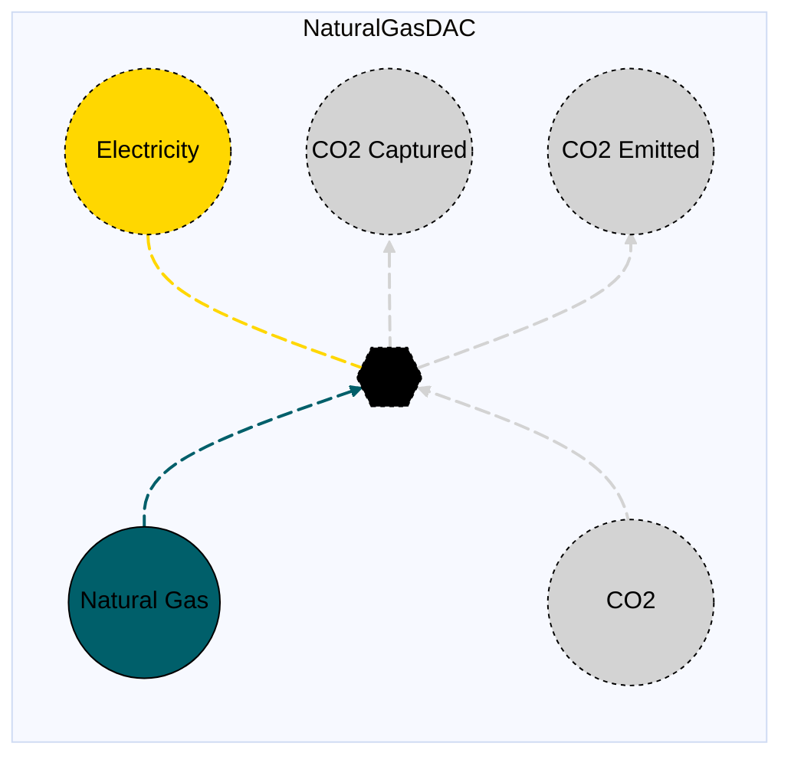

# Natural Gas DAC

## Contents

[Overview](@ref natgasdaq_overview) | [Asset Structure](@ref natgasdaq_asset_structure) | [Input File (Standard Format)](@ref natgasdaq_input_file) | [Types - Asset Structure](@ref natgasdaq_type_definition) | [Constructors](@ref natgasdaq_constructors) | [Examples](@ref natgasdaq_examples) | [Best Practices](@ref natgasdaq_best_practices) | [Input File (Advanced Format)](@ref natgasdaq_advanced_json_csv_input_format)

## [Overview](@id natgasdaq_overview)

Natural Gas DAC (Direct Air Capture) assets in Macro represent carbon dioxide removal technologies that use natural gas as a fuel source to capture CO₂ directly from the atmosphere. These assets are defined using either JSON or CSV input files placed in the `assets` directory, typically named `natgasdac.json` or `natgasdac.csv`.

## [Asset Structure](@id natgasdaq_asset_structure)

A natural gas DAC asset consists of one transformation component and five edge components:

1. **Transformation Component**: Balances the incoming and outgoing flows of natural gas, CO2, and electricity
2. **Natural Gas Edge**: Incoming edge representing natural gas fuel supply
3. **CO2 Edge**: Incoming edge representing CO2 absorption from atmosphere
4. **Electricity Edge**: Outgoing edge representing electricity production
5. **CO2 Captured Edge**: Outgoing edge representing captured CO2
6. **CO2 Emission Edge**: Outgoing edge representing CO2 emissions from the process

Here is a graphical representation of the Natural Gas DAC asset:



## [Flow Equations](@id natgasdaq_flow_equations)
The natural gas DAC asset follows these stoichiometric relationships:

```math
\begin{aligned}
\phi_{elec} &= \phi_{co2} \cdot \epsilon_{elec\_prod} \\
\phi_{ng} &= -\phi_{co2} \cdot \epsilon_{fuel\_consumption} \\
\phi_{co2} &= \phi_{ng} \cdot \epsilon_{emission\_rate} \\
\phi_{co2\_captured} + \phi_{co2} &= \phi_{ng} \cdot \epsilon_{co2\_capture\_rate} \\
\end{aligned}
```

Where:
- $\phi$ represents the flow of each commodity
- $\epsilon$ represents the stoichiometric coefficients defined in the table below (see table [Conversion Process Parameters](@ref natgasdaq_conversion_process_parameters))

## [Input File (Standard Format)](@id natgasdaq_input_file)

The easiest way to include a natural gas DAC asset in a model is to create a new file (either JSON or CSV) and place it in the `assets` directory together with the other assets.

```
your_case/
├── assets/
│   ├── natgasdac.json    # or natgasdac.csv
│   ├── other_assets.json
│   └── ...
├── system/
├── settings/
└── ...
```

This file can either be created manually, or using the `template_asset` function, as shown in the [Adding an Asset to a System](@ref) section of the User Guide. The file will be automatically loaded when you run your Macro model. 

The following is an example of a Natural Gas DAC asset input file:
```json
{
    "NaturalGasDAC": [
        {
            "type": "NaturalGasDAC",
            "global_data": {
                "co2_constraints": {
                    "RampingLimitConstraint": true
                },
                "co2_sink": "co2_sink",
                "emission_rate": 0.001810482,
                "capture_rate": 0.179237753,
                "electricity_production": 0.125,
                "fuel_consumption": 3.047059187,
                "investment_cost": 973000,
                "fixed_om_cost": 430000,
                "variable_om_cost": 65.42,
                "ramp_up_fraction": 1.0,
                "ramp_down_fraction": 1.0
            },
            "instance_data": [
                {
                    "id": "SE_Solvent_DAC",
                    "location": "SE",
                    "availability": {
                        "timeseries": {
                            "path": "system/availability.csv",
                            "header": "SE_Solvent_DAC"
                        }
                    }
                }
            ]
        }
    ]
}
```

!!! tip "Global Data vs Instance Data"
    When working with JSON input files, the `global_data` field can be used to group data that is common to all instances of the same asset type. This is useful for setting constraints that are common to all instances of the same asset type and avoid repeating the same data for each instance. See the [Examples](@ref "natgasdaq_examples") section below for an example.

The following tables outline the attributes that can be set for a Natural Gas DAC asset.

### Essential Attributes
| Field | Type | Description |
|--------------|---------|------------|
| `Type` | String | Asset type identifier: "NaturalGasDAC" |
| `id` | String | Unique identifier for the Natural Gas DAC instance |
| `location` | String | Geographic location/node identifier |
| `co2_sink` | String | ID of a CO₂ sink vertex (must be defined in the nodes input file) |

### [Conversion Process Parameters](@id natgasdaq_conversion_process_parameters)
The following set of parameters control the conversion process and stoichiometry of the natgasdaq asset (see [Flow Equations](@ref natgasdaq_flow_equations) for more details).

| Field | Type | Description | Units | Default |
|--------------|---------|------------|----------------|----------|
| `capture_rate` | Float64 | CO2 capture rate per unit natural gas | $t_{CO₂}/t_{CO₂}$ | 1.0 |
| `electricity_production` | Float64 | Electricity production per unit CO2 processed | $MWh/t_{CO₂}$ | 0.0 |
| `emission_rate` | Float64 | CO2 emission rate per unit natural gas | $t_{CO₂}/t_{CO₂}$ | 1.0 |
| `fuel_consumption` | Float64 | Natural gas consumption per unit CO2 processed | $t_{CO₂}/MWh$ | 0.0 |

### [Constraints Configuration](@id "natgasdaq_constraints")
Natural gas DAC assets can have different constraints applied to them, and the user can configure them using the following fields:

| Field | Type | Description |
|--------------|---------|------------|
| `transform_constraints` | Dict{String,Bool} | List of constraints applied to the transformation component. |
| `co2_constraints` | Dict{String,Bool} | List of constraints applied to the CO₂ edge. |
| `natgas_constraints` | Dict{String,Bool} | List of constraints applied to the natural gas edge. |
| `elec_constraints` | Dict{String,Bool} | List of constraints applied to the electricity edge. |
| `co2_emission_constraints` | Dict{String,Bool} | List of constraints applied to the CO₂ emission edge. |
| `co2_captured_constraints` | Dict{String,Bool} | List of constraints applied to the CO₂ captured edge. |

#### Default constraints
To simplify the input file and the asset configuration, the following constraints are applied to the Natural Gas DAC asset by default:

- [Balance constraint](@ref balance_constraint_ref) (applied to the transformation component)
- [Capacity constraint](@ref capacity_constraint_ref) (applied to the CO₂ edge)

Users can refer to the [Adding Asset Constraints to a System](@ref) section of the User Guide for a list of all the constraints that can be applied to a Natural Gas DAC asset.

### Investment Parameters
| Field | Type | Description | Units | Default |
|--------------|---------|------------|----------------|----------|
| `can_retire` | Boolean | Whether capacity can be retired | - | true |
| `can_expand` | Boolean | Whether capacity can be expanded | - | true |
| `existing_capacity` | Float64 | Initial installed capacity | $t_{CO₂}/yr$ | 0.0 |
| `capacity_size` | Float64 | Unit size for capacity decisions | - | 1.0 |

#### Additional Investment Parameters

**Maximum and minimum capacity constraints**

If [`MaxCapacityConstraint`](@ref max_capacity_constraint_ref) or [`MinCapacityConstraint`](@ref min_capacity_constraint_ref) are added to the constraints dictionary for the CO₂ edge, the following parameters are used by Macro:

| Field | Type | Description | Units | Default |
|--------------|---------|------------|----------------|----------|
| `max_capacity` | Float64 | Maximum allowed capacity | $t_{CO₂}/yr$ | Inf |
| `min_capacity` | Float64 | Minimum allowed capacity | $t_{CO₂}/yr$ | 0.0 |

### Economic Parameters
| Field | Type | Description | Units | Default |
|--------------|---------|------------|----------------|----------|
| `investment_cost` | Float64 | CAPEX per unit capacity | \$/$t_{CO₂}/yr$ | 0.0 |
| `annualized_investment_cost` | Union{Nothing,Float64} | Annualized CAPEX | \$/$t_{CO₂}/yr$/yr$ | calculated |
| `fixed_om_cost` | Float64 | Fixed O&M costs | \$/$t_{CO₂}/yr$/yr$ | 0.0 |
| `variable_om_cost` | Float64 | Variable O&M costs | \$/$t_{CO₂}$ | 0.0 |
| `wacc` | Float64 | Weighted average cost of capital | fraction | 0.0 |
| `lifetime` | Int | Asset lifetime in years | years | 1 |
| `capital_recovery_period` | Int | Investment recovery period | years | 1 |
| `retirement_period` | Int | Retirement period | years | 1 |

### Operational Parameters
| Field | Type | Description | Units | Default |
|--------------|---------|------------|----------------|----------|
| `availability` | Dict | Availability file path and header | - | Empty |

#### Additional Operational Parameters

**Ramping limit constraint**

If [`RampingLimitConstraint`](@ref ramping_limits_constraint_ref) is added to the constraints dictionary for the CO₂ edge, the following parameters are used:

| Field | Type | Description | Units | Default |
|--------------|---------|------------|----------------|----------|
| `ramp_up_fraction` | Float64 | Maximum increase in output between timesteps | fraction | 1.0 |
| `ramp_down_fraction` | Float64 | Maximum decrease in output between timesteps | fraction | 1.0 |

## [Types - Asset Structure](@id natgasdaq_type_definition)

The `NaturalGasDAC` asset is defined as follows:

```julia
struct NaturalGasDAC <: AbstractAsset
    id::AssetId
    transformation::Transformation
    ng_edge::Edge{<:NaturalGas}
    co2_edge::Edge{<:CO2}
    elec_edge::Edge{<:Electricity}
    co2_emission_edge::Edge{<:CO2}
    co2_captured_edge::Edge{<:CO2Captured}
end
```

## [Constructors](@ref natgasdaq_constructors)

### Default constructor

```julia
NaturalGasDAC(id::AssetId, transformation::Transformation, ng_edge::Edge{<:NaturalGas}, co2_edge::Edge{<:CO2}, elec_edge::Edge{<:Electricity}, co2_emission_edge::Edge{<:CO2}, co2_captured_edge::Edge{<:CO2Captured})
```

### Factory constructor
```julia
make(asset_type::Type{NaturalGasDAC}, data::AbstractDict{Symbol,Any}, system::System)
```

| Field | Type | Description |
|--------------|---------|------------|
| `asset_type` | `Type{NaturalGasDAC}` | Macro type of the asset |
| `data` | `AbstractDict{Symbol,Any}` | Dictionary containing the input data for the asset |
| `system` | `System` | System to which the asset belongs |

## [Examples](@id natgasdaq_examples)
This section contains examples of how to use the natural gas DAC asset in a Macro model.

### Fixed Capacity Natural Gas DAC
This example shows a natural gas DAC asset with fixed capacity (capacity cannot be expanded or retired).

**JSON Format:**
```json
{
    "NaturalGasDAC": [
        {
            "type": "NaturalGasDAC",
            "instance_data": [
                {
                    "id": "SE_Solvent_DAC",
                    "location": "SE",
                    "co2_sink": "co2_sink",
                    "co2_constraints": {
                        "RampingLimitConstraint": true
                    },
                    "emission_rate": 0.001810482,
                    "capture_rate": 0.179237753,
                    "electricity_production": 0.125,
                    "fuel_consumption": 3.047059187,
                    "investment_cost": 973000,
                    "fixed_om_cost": 430000,
                    "variable_om_cost": 65.42,
                    "ramp_up_fraction": 1.0,
                    "ramp_down_fraction": 1.0,
                    "availability": {
                        "timeseries": {
                            "path": "system/availability.csv",
                            "header": "SE_Solvent_DAC"
                        }
                    }
                }
            ]
        }
    ]
}
```

**CSV Format:**

| Type | id | location | co2\_sink | co2\_constraints--RampingLimitConstraint | emission\_rate | capture\_rate | electricity\_production | fuel\_consumption | investment\_cost | fixed\_om\_cost | variable\_om\_cost | ramp\_up\_fraction | ramp\_down\_fraction | availability--timeseries--path | availability--timeseries--header |
|------|----|----------|---------------------|------------------------------------------|------------------------|--------------------------------|------------------------------|---------------------------|---------------------------|------------------------------------------------|------------------------|---------------------|--------------------------------|---------------------------|--------------------------------|------------------------|---------------------------|
| NaturalGasDAC | SE\_Solvent\_DAC | SE | co2\_sink | true | 0.001810482 | 0.179237753 | 0.125 | 3.047059187 | 973000 | 430000 | 65.42 | 1.0 | 1.0 | system/availability.csv | SE\_Solvent\_DAC |

### Multiple Natural Gas DAC assets in different zones

**JSON Format:**

Note that the `global_data` field is used to set the fields and constraints that are common to all instances of the same asset type.

```json
{
    "NaturalGasDAC": [
        {
            "type": "NaturalGasDAC",
            "global_data": {
                "transforms_timedata": "NaturalGas",
                "co2_constraints": {
                    "RampingLimitConstraint": true
                },
                "co2_sink": "co2_sink",
                "emission_rate": 0.001810482,
                "capture_rate": 0.179237753,
                "electricity_production": 0.125,
                "fuel_consumption": 3.047059187,
                "investment_cost": 973000,
                "fixed_om_cost": 430000,
                "variable_om_cost": 65.42,
                "ramp_up_fraction": 1.0,
                "ramp_down_fraction": 1.0
            },
            "instance_data": [
                {
                    "id": "SE_Solvent_DAC",
                    "location": "SE",
                    "availability": {
                        "timeseries": {
                            "path": "system/availability.csv",
                            "header": "SE_Solvent_DAC"
                        }
                    }
                },
                {
                    "id": "MIDAT_Solvent_DAC",
                    "location": "MIDAT",
                    "availability": {
                        "timeseries": {
                            "path": "system/availability.csv",
                            "header": "MIDAT_Solvent_DAC"
                        }
                    }
                },
                {
                    "id": "NE_Solvent_DAC",
                    "location": "NE",
                    "availability": {
                        "timeseries": {
                            "path": "system/availability.csv",
                            "header": "NE_Solvent_DAC"
                        }
                    }
                }
            ]
        }
    ]
}
```

**CSV Format:**

| Type | id | location | co2\_constraints--RampingLimitConstraint | co2\_sink | emission\_rate | capture\_rate | electricity\_production | fuel\_consumption | investment\_cost | fixed\_om\_cost | variable\_om\_cost | ramp\_up\_fraction | ramp\_down\_fraction | availability--timeseries--path | availability--timeseries--header |
|------|----|----------|---------------------|------------------------------------------|-----------|----------------|---------------|------------------------|-------------------|------------------|----------------|-------------------|-------------------|---------------------|--------------------------------|----------------------------------|
| NaturalGasDAC | SE\_Solvent\_DAC | SE | true | co2\_sink | 0.001810482 | 0.179237753 | 0.125 | 3.047059187 | 973000 | 430000 | 65.42 | 1.0 | 1.0 | system/availability.csv | SE\_Solvent\_DAC |
| NaturalGasDAC | MIDAT\_Solvent\_DAC | MIDAT | true | co2\_sink | 0.001810482 | 0.179237753 | 0.125 | 3.047059187 | 973000 | 430000 | 65.42 | 1.0 | 1.0 | system/availability.csv | MIDAT\_Solvent\_DAC |
| NaturalGasDAC | NE\_Solvent\_DAC | NE | true | co2\_sink | 0.001810482 | 0.179237753 | 0.125 | 3.047059187 | 973000 | 430000 | 65.42 | 1.0 | 1.0 | system/availability.csv | NE\_Solvent\_DAC |

## [Best Practices](@id natgasdaq_best_practices)

1. **Use global data for common fields and constraints**: Use the `global_data` field to set the fields and constraints that are common to all instances of the same asset type.
2. **Set realistic stoichiometric coefficients**: Ensure the transformation parameters reflect actual technology performance
3. **Use meaningful IDs**: Choose descriptive identifiers that indicate location and technology type
4. **Consider ramping constraints**: Set appropriate ramping limits based on technology characteristics
5. **Use constraints selectively**: Only enable constraints that are necessary for your modeling needs
6. **Validate costs**: Ensure investment and O&M costs are in appropriate units
7. **Test configurations**: Start with simple configurations and gradually add complexity
8. **Account for emissions**: Include both direct emissions and electricity production in the model

## [Input File (Advanced Format)](@ref natgasdaq_advanced_json_csv_input_format)

Macro provides an advanced format for defining Natural Gas DAC assets, offering users and modelers detailed control over asset specifications. This format builds upon the standard format and is ideal for those who need more comprehensive customization.

To understand the advanced format, consider the [graph representation](@ref natgasdaq_asset_structure) and the [type definition](@ref natgasdaq_type_definition) of a Natural Gas DAC asset. The input file mirrors this hierarchical structure.

A Natural Gas DAC asset in Macro is composed of a transformation component, represented by a `Transformation` object, and two edges (CO₂ and electricity), each represented by an `Edge` object. The input file for a Natural Gas DAC asset is therefore organized as follows:

```json
{
    "transforms": {
        // ... transformation-specific attributes ...
    },
    "edges":{
        "ng_edge": {
            // ... ng_edge-specific attributes ...
        },
        "co2_edge": {
            // ... co2_edge-specific attributes ...
        },
        "elec_edge": {
            // ... elec_edge-specific attributes ...
        },
        "co2_emission_edge": {
            // ... co2_emission_edge-specific attributes ...
        },
        "co2_captured_edge": {
            // ... co2_captured_edge-specific attributes ...
        }
    }
}
```
Each top-level key (e.g., "transforms" or "edges") denotes a component type. The second-level keys either specify the attributes of the component (when there is a single instance) or identify the instances of the component (e.g., "co2_edge" or "elec_edge") when there are multiple instances. For multiple instances, a third-level key details the attributes for each instance.

Each top-level key (e.g., "transforms" or "edges") denotes a component type. The second-level keys either specify the attributes of the component (when there is a single instance) or identify the instances of the component (e.g., "ng_edge", "co2_edge", etc.) when there are multiple instances. For multiple instances, a third-level key details the attributes for each instance.

Below is an example of an input file for a natural gas DAC asset that sets up a single asset in the SE region with detailed edge specifications.

```json
{
    "NaturalGasDAC": [
        {
            "type": "NaturalGasDAC",
            "global_data": {
                "transforms": {
                    "timedata": "NaturalGas",
                    "constraints": {
                        "BalanceConstraint": true
                    }
                },
                "edges": {
                    "co2_edge": {
                        "commodity": "CO2",
                        "unidirectional": true,
                        "has_capacity": true,
                        "start_vertex": "co2_sink",
                        "can_retire": true,
                        "can_expand": true,
                        "integer_decisions": false,
                        "uc": false,
                        "constraints": {
                            "CapacityConstraint": true,
                            "RampingLimitConstraint": true
                        }
                    },
                    "co2_emission_edge": {
                        "commodity": "CO2",
                        "unidirectional": true,
                        "has_capacity": false,
                        "end_vertex": "co2_sink"
                    },
                    "natgas_edge": {
                        "commodity": "NaturalGas",
                        "unidirectional": true,
                        "has_capacity": false
                    },
                    "elec_edge": {
                        "commodity": "Electricity",
                        "unidirectional": true,
                        "has_capacity": false
                    },
                    "co2_captured_edge": {
                        "commodity": "CO2Captured",
                        "unidirectional": true,
                        "has_capacity": false
                    }
                }
            },
            "instance_data": [
                {
                    "id": "SE_Solvent_DAC",
                    "transforms": {
                        "emission_rate": 0.001810482,
                        "capture_rate": 0.179237753,
                        "electricity_production": 0.125,
                        "fuel_consumption": 3.047059187
                    },
                    "edges": {
                        "co2_edge": {
                            "availability": {
                                "timeseries": {
                                    "path": "system/availability.csv",
                                    "header": "SE_Solvent_DAC"
                                }
                            },
                            "existing_capacity": 0.0,
                            "investment_cost": 973000,
                            "fixed_om_cost": 430000,
                            "variable_om_cost": 65.42,
                            "ramp_up_fraction": 1.0,
                            "ramp_down_fraction": 1.0
                        },
                        "natgas_edge": {
                            "start_vertex": "natgas_SE"
                        },
                        "elec_edge": {
                            "end_vertex": "elec_SE"
                        },
                        "co2_captured_edge": {
                            "end_vertex": "co2_captured_SE"
                        }
                    }
                },
                {
                    "id": "MIDAT_Solvent_DAC",
                    "transforms": {
                        "emission_rate": 0.001810482,
                        "capture_rate": 0.179237753,
                        "electricity_production": 0.125,
                        "fuel_consumption": 3.047059187
                    },
                    "edges": {
                        "co2_edge": {
                            "availability": {
                                "timeseries": {
                                    "path": "system/availability.csv",
                                    "header": "MIDAT_Solvent_DAC"
                                }
                            },
                            "existing_capacity": 0.0,
                            "investment_cost": 973000,
                            "fixed_om_cost": 430000,
                            "variable_om_cost": 65.42,
                            "ramp_up_fraction": 1.0,
                            "ramp_down_fraction": 1.0
                        },
                        "natgas_edge": {
                            "start_vertex": "natgas_MIDAT"
                        },
                        "elec_edge": {
                            "end_vertex": "elec_MIDAT"
                        },
                        "co2_captured_edge": {
                            "end_vertex": "co2_captured_MIDAT"
                        }
                    }
                },
                {
                    "id": "NE_Solvent_DAC",
                    "transforms": {
                        "emission_rate": 0.001810482,
                        "capture_rate": 0.179237753,
                        "electricity_production": 0.125,
                        "fuel_consumption": 3.047059187
                    },
                    "edges": {
                        "co2_edge": {
                            "availability": {
                                "timeseries": {
                                    "path": "system/availability.csv",
                                    "header": "NE_Solvent_DAC"
                                }
                            },
                            "existing_capacity": 0.0,
                            "investment_cost": 973000,
                            "fixed_om_cost": 430000,
                            "variable_om_cost": 65.42,
                            "ramp_up_fraction": 1.0,
                            "ramp_down_fraction": 1.0
                        },
                        "natgas_edge": {
                            "start_vertex": "natgas_NE"
                        },
                        "elec_edge": {
                            "end_vertex": "elec_NE"
                        },
                        "co2_captured_edge": {
                            "end_vertex": "co2_captured_NE"
                        }
                    }
                }
            ]
        }
    ]
}
```

### Key Points

- The `global_data` field is utilized to define attributes and constraints that apply universally to all instances of a particular asset type.
- The `start_vertex` and `end_vertex` fields indicate the nodes to which the edges are connected. These nodes must be defined in the `nodes.json` file.
- Only the CO2 edge is allowed to have capacity variables and constraints, as this represents the main capacity decision for the DAC facility.
- For a comprehensive list of attributes that can be configured for the transformation and edge components, refer to the [transformation](@ref manual-transformation-fields) and [edges](@ref manual-edges-fields) pages of the Macro manual.

!!! tip "Prefixes"
    Users can apply prefixes to adjust parameters for the components of a Natural Gas DAC asset, even when using the standard format. For instance, `co2_can_retire` will adjust the `can_retire` parameter for the CO2 edge, and `co2_existing_capacity` will adjust the `existing_capacity` parameter for the CO2 edge.
    Below are the prefixes available for modifying parameters for the components of a Natural Gas DAC asset:
    - `transform_` for the transformation component
    - `natgas_` for the natural gas edge
    - `co2_` for the CO2 edge
    - `co2_emission_` for the CO2 emission edge
    - `co2_captured_` for the CO2 captured edge
    - `elec_` for the electricity edge
    