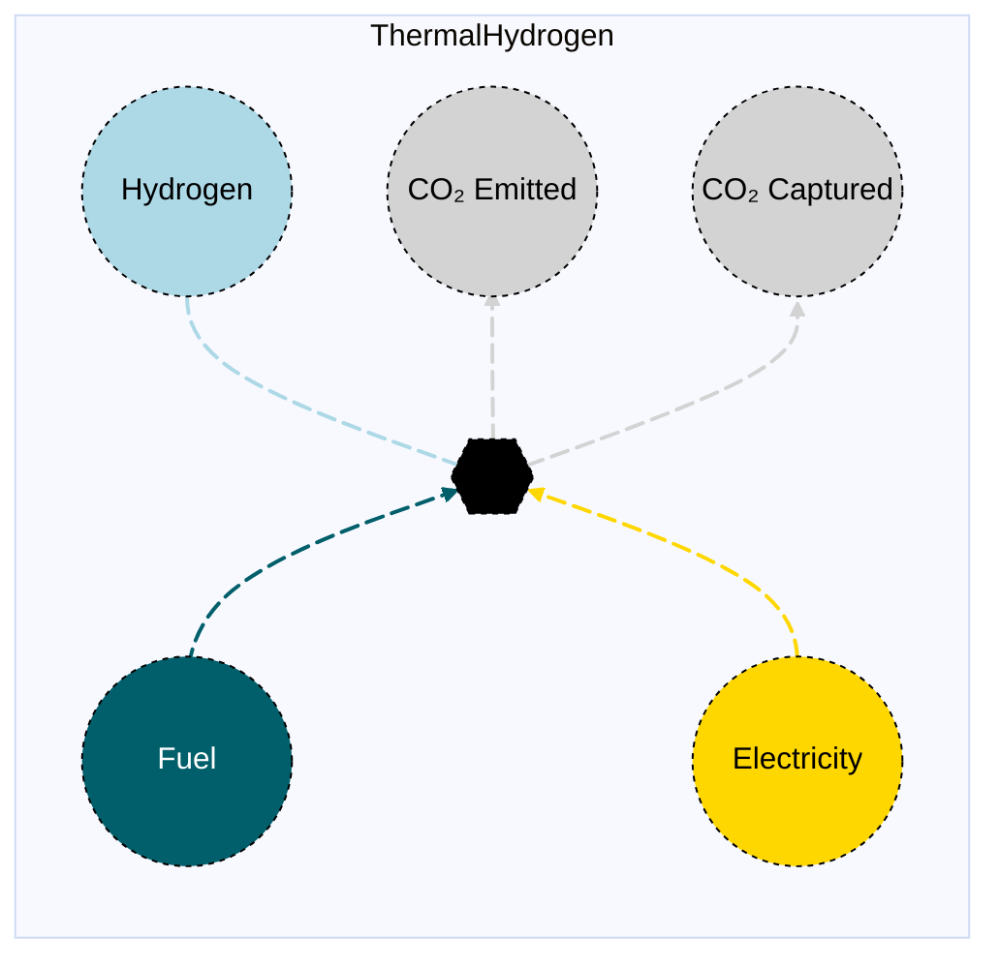

# Thermal Hydrogen Plant (with and without CCS)

## Contents

[Overview](@ref thermalhydrogen_overview) | [Asset Structure](@ref thermalhydrogen_asset_structure) | [Input File (Standard Format)](@ref thermalhydrogen_input_file) | [Types - Asset Structure](@ref thermalhydrogen_type_definition) | [Constructors](@ref thermalhydrogen_constructors) | [Examples](@ref thermalhydrogen_examples) | [Best Practices](@ref thermalhydrogen_best_practices) | [Input File (Advanced Format)](@ref thermalhydrogen_advanced_json_csv_input_format)

## [Overview](@id thermalhydrogen_overview)

Thermal Hydrogen assets in Macro represent hydrogen production technologies that use thermal processes, such as steam methane reforming (SMR) or other thermal conversion methods. These assets are defined using either JSON or CSV input files placed in the `assets` directory, typically named with descriptive identifiers like `thermalhydrogen.json` or `thermalhydrogen.csv`.

!!! note "CCS version"
    Macro supports both the standard thermal hydrogen plant asset and a CCS version. The only difference between the two is the addition of a CO₂ captured edge.

## [Asset Structure](@id thermalhydrogen_asset_structure)

A thermal hydrogen plant asset consists of one transformation component and five edge components:

1. **Transformation Component**: Balances the fuel, electricity, and hydrogen flows
2. **Fuel Edge**: Incoming edge representing fuel supply (e.g., natural gas)
3. **Electricity Edge**: Incoming edge representing electricity consumption
4. **Hydrogen Edge**: Outgoing edge representing hydrogen production (can have unit commitment operations)
5. **CO₂ Edge**: Outgoing edge representing CO₂ emissions
6. **CO₂ Captured Edge**: Outgoing edge representing captured CO₂ (only if CCS is present)

Here is a graphical representation of the thermal hydrogen plant asset:



## [Flow Equations](@id thermalhydrogen_flow_equations)
The thermal hydrogen plant asset follows these stoichiometric relationships:

```math
\begin{aligned}
\phi_{fuel} &= \phi_{h2} \cdot \epsilon_{fuel\_consumption} \\
\phi_{elec} &= \phi_{h2} \cdot \epsilon_{elec\_consumption} \\
\phi_{co2} &= \phi_{fuel} \cdot \epsilon_{emission\_rate} \\
\phi_{co2\_captured} &= \phi_{fuel} \cdot \epsilon_{co2\_capture\_rate} \quad \text{(if CCS)} \\
\end{aligned}
```

Where:
- ``\phi`` represents the flow of each commodity
- ``\epsilon`` represents the stoichiometric coefficients defined in the [Conversion Process Parameters](@ref thermalhydrogen_conversion_process_parameters) section.

## [Input File (Standard Format)](@id thermalhydrogen_input_file)

The easiest way to include a thermal hydrogen plant asset in a model is to create a new file (either JSON or CSV) and place it in the `assets` directory together with the other assets.

```
your_case/
├── assets/
│   ├── thermalhydrogen.json    # or thermalhydrogen.csv
│   ├── other_assets.json
│   └── ...
├── system/
├── settings/
└── ...
```

This file can either be created manually, or using the `template_asset` function, as shown in the [Adding an Asset to a System](@ref) section of the User Guide. The file will be automatically loaded when you run your Macro model.

The following is an example of a thermal hydrogen plant asset input file:

```json
{
    "NaturalGasH2SMR": [
        {
            "type": "ThermalHydrogen",
            "instance_data": [
                {
                    "id": "SE_Large_SMR_Non_CCS",
                    "location": "SE",
                    "fuel_commodity": "NaturalGas",
                    "co2_sink": "co2_sink",
                    "uc": true,
                    "h2_constraints": {
                        "MinFlowConstraint": true,
                        "MinUpTimeConstraint": true,
                        "MinDownTimeConstraint": true
                    },
                    "emission_rate": 0.181048235160161,
                    "fuel_consumption": 1.3009661455954666,
                    "electricity_consumption": 0.016404,
                    "investment_cost": 29902.10236,
                    "fixed_om_cost": 13685.61723,
                    "variable_om_cost": 2.250837989,
                    "capacity_size": 1082.95,
                    "startup_cost": 0.126968004,
                    "min_up_time": 3,
                    "min_down_time": 3,
                    "ramp_up_fraction": 0.5,
                    "ramp_down_fraction": 0.5,
                    "min_flow_fraction": 0.85,
                    "availability": {
                        "timeseries": {
                            "path": "system/availability.csv",
                            "header": "SE_Large_SMR_Non_CCS"
                        }
                    }
                }
            ]
        }
    ]
}
```

!!! tip "Global Data vs Instance Data"
    When working with JSON input files, the `global_data` field can be used to group data that is common to all instances of the same asset type. This is useful for setting constraints that are common to all instances of the same asset type and avoid repeating the same data for each instance. See the [Examples](@ref "thermalhydrogen_examples") section below for an example.

The following tables outline the attributes that can be set for a thermal hydrogen plant asset.

### Essential Attributes
| Field | Type | Description |
|--------------|---------|------------|
| `Type` | String | Asset type identifier: "ThermalHydrogen" or "ThermalHydrogenCCS" |
| `id` | String | Unique identifier for the thermal hydrogen plant instance |
| `location` | String | Geographic location/node identifier |
| `fuel_commodity` | String | Commodity type of the fuel |
| `timedata` | String | Time resolution for time series data (default: "Hydrogen") |
| `uc` | Boolean | Whether the asset has unit commitment operations |
| `co2_sink` | String | CO₂ sink identifier |
| `fuel_start_vertex` | String | Fuel start vertex identifier. This is **not required** if the fuel commodity is present in the location. |

### [Conversion Process Parameters](@id thermalhydrogen_conversion_process_parameters)
The following set of parameters control the conversion process and stoichiometry of the thermal hydrogen plant asset (see [Flow Equations](@ref thermalhydrogen_flow_equations) for more details).

| Field | Type | Description | Units | Default |
|--------------|---------|------------|----------------|----------|
| `fuel_consumption` | Float64 | Fuel consumption per unit hydrogen | $MWh_{fuel}/MWh_{h2}$ | 1.0 |
| `electricity_consumption` | Float64 | Electricity consumption per unit hydrogen | $MWh_{elec}/MWh_{h2}$ | 0.0 |
| `emission_rate` | Float64 | CO₂ emission rate per unit fuel | $t_{CO₂}/MWh_{fuel}$ | 0.0 |
| `capture_rate` | Float64 | CO₂ capture rate per unit fuel | $t_{CO₂}/MWh_{fuel}$ | 1.0 |

### [Constraints Configuration](@id "thermalhydrogen_constraints")
Thermal hydrogen plant assets can have different constraints applied to them, and the user can configure them using the following fields:

| Field | Type | Description |
|--------------|---------|------------|
| `transform_constraints` | Dict{String,Bool} | List of constraints applied to the transformation component. |
| `h2_constraints` | Dict{String,Bool} | List of constraints applied to the hydrogen edge. |
| `fuel_constraints` | Dict{String,Bool} | List of constraints applied to the fuel edge. |
| `elec_constraints` | Dict{String,Bool} | List of constraints applied to the electricity edge. |
| `co2_constraints` | Dict{String,Bool} | List of constraints applied to the CO₂ edge. |
| `co2_captured_constraints` | Dict{String,Bool} | List of constraints applied to the CO₂ captured edge. |

For example, if the user wants to apply the [`BalanceConstraint`](@ref balance_constraint_ref) to the transformation component and the [`CapacityConstraint`](@ref capacity_constraint_ref) to the hydrogen edge, the constraints fields should be set as follows:

```json
{
    "transform_constraints": {
        "BalanceConstraint": true
    },
    "h2_constraints": {
        "CapacityConstraint": true
    }
}
```

Users can refer to the [Adding Asset Constraints to a System](@ref) section of the User Guide for a list of all the constraints that can be applied to the different components of a thermal hydrogen plant asset.

#### Default constraints
To simplify the input file and the asset configuration, the following constraints are applied to the thermal hydrogen plant asset by default:

- [Balance constraint](@ref balance_constraint_ref) (applied to the transformation component)
- [Capacity constraint](@ref capacity_constraint_ref) (applied to the hydrogen edge)
- [Ramping limits constraint](@ref ramping_limits_constraint_ref) (applied to the hydrogen edge)

**Unit commitment constraints** (when `uc` is set to `true`):
- [Minimum up and down time constraint](@ref min_up_and_down_time_constraint_ref) (applied to the hydrogen edge)

### Investment Parameters
| Field | Type | Description | Units | Default |
|--------------|---------|------------|----------------|----------|
| `can_retire` | Boolean | Whether thermal hydrogen plant capacity can be retired | - | true |
| `can_expand` | Boolean | Whether thermal hydrogen plant capacity can be expanded | - | true |
| `existing_capacity` | Float64 | Initial installed thermal hydrogen plant capacity | MW | 0.0 |
| `capacity_size` | Float64 | Unit size for capacity decisions | MW | 1.0 |

#### Additional Investment Parameters

**Maximum and minimum capacity constraints**

If [`MaxCapacityConstraint`](@ref max_capacity_constraint_ref) or [`MinCapacityConstraint`](@ref min_capacity_constraint_ref) are added to the constraints dictionary for the hydrogen edge, the following parameters are used by Macro:

| Field | Type | Description | Units | Default |
|--------------|---------|------------|----------------|----------|
| `max_capacity` | Float64 | Maximum allowed thermal hydrogen plant capacity | MW | Inf |
| `min_capacity` | Float64 | Minimum allowed thermal hydrogen plant capacity | MW | 0.0 |

### Economic Parameters
| Field | Type | Description | Units | Default |
|--------------|---------|------------|----------------|----------|
| `investment_cost` | Float64 | CAPEX per unit thermal hydrogen plant capacity | \$/MW/yr | 0.0 |
| `fixed_om_cost` | Float64 | Fixed O&M costs of the thermal hydrogen plant | \$/MW/yr | 0.0 |
| `variable_om_cost` | Float64 | Variable O&M costs of the thermal hydrogen plant | \$/MWh | 0.0 |
| `startup_cost` | Float64 | Cost per MW of capacity to start the plant | \$/MW per start | 0.0 |

### Operational Parameters
| Field | Type | Description | Units | Default |
|--------------|---------|------------|----------------|----------|
| `availability` | Dict | Path to availability file and column name | - | Empty |


#### Additional Operational Parameters

**Unit commitment parameters** (when `uc` is set to `true`):

| Field | Type | Description | Units | Default |
|--------------|---------|------------|----------------|----------|
| `startup_fuel_consumption` | Float64 | Fuel consumption per unit hydrogen to start the plant | $MWh_{fuel}/MWh_{h2}$ | 0.0 |

**Minimum flow constraint**

If [`MinFlowConstraint`](@ref min_flow_constraint_ref) is added to the constraints dictionary for the hydrogen edge, the following parameter is used:

| Field | Type | Description | Units | Default |
|--------------|---------|------------|----------------|----------|
| `min_flow_fraction` | Float64 | Minimum flow as fraction of capacity | fraction | 0.0 |

**Ramping limit constraint**

If [`RampingLimitConstraint`](@ref ramping_limits_constraint_ref) is added to the constraints dictionary for the hydrogen edge, the following parameters are used:

| Field | Type | Description | Units | Default |
|--------------|---------|------------|----------------|----------|
| `ramp_up_fraction` | Float64 | Maximum increase in flow between timesteps | fraction | 1.0 |
| `ramp_down_fraction` | Float64 | Maximum decrease in flow between timesteps | fraction | 1.0 |

**Minimum up and down time constraints**

If [`MinUpTimeConstraint`](@ref min_up_and_down_time_constraint_ref) or [`MinDownTimeConstraint`](@ref min_up_and_down_time_constraint_ref) are added to the constraints dictionary for the hydrogen edge, the following parameters are used:

| Field | Type | Description | Units | Default |
|--------------|---------|------------|----------------|----------|
| `min_up_time` | Int64 | Minimum time the plant must remain committed | hours | 0 |
| `min_down_time` | Int64 | Minimum time the plant must remain shutdown | hours | 0 |

## [Types - Asset Structure](@id thermalhydrogen_type_definition)

The `ThermalHydrogen` and `ThermalHydrogenCCS` assets are defined as follows:

```julia
struct ThermalHydrogen{T} <: AbstractAsset
    id::AssetId
    thermalhydrogen_transform::Transformation
    h2_edge::Union{Edge{<:Hydrogen},EdgeWithUC{<:Hydrogen}}
    elec_edge::Edge{<:Electricity}
    fuel_edge::Edge{<:T}
    co2_edge::Edge{<:CO2}
end

struct ThermalHydrogenCCS{T} <: AbstractAsset
    id::AssetId
    thermalhydrogenccs_transform::Transformation
    h2_edge::Union{Edge{<:Hydrogen},EdgeWithUC{<:Hydrogen}}
    elec_edge::Edge{<:Electricity}
    fuel_edge::Edge{<:T}
    co2_edge::Edge{<:CO2}
    co2_captured_edge::Edge{<:CO2Captured}
end
```

where `T` is the type of the fuel commodity.

## [Constructors](@id thermalhydrogen_constructors)

### Default constructor

```julia
ThermalHydrogen(id::AssetId, thermalhydrogen_transform::Transformation, h2_edge::Union{Edge{<:Hydrogen},EdgeWithUC{<:Hydrogen}}, elec_edge::Edge{<:Electricity}, fuel_edge::Edge{<:T}, co2_edge::Edge{<:CO2})

ThermalHydrogenCCS(id::AssetId, thermalhydrogenccs_transform::Transformation, h2_edge::Union{Edge{<:Hydrogen},EdgeWithUC{<:Hydrogen}}, elec_edge::Edge{<:Electricity}, fuel_edge::Edge{<:T}, co2_edge::Edge{<:CO2}, co2_captured_edge::Edge{<:CO2Captured})
```

### Factory constructor
```julia
make(asset_type::Type{ThermalHydrogen}, data::AbstractDict{Symbol,Any}, system::System)
make(asset_type::Type{ThermalHydrogenCCS}, data::AbstractDict{Symbol,Any}, system::System)
```

| Field | Type | Description |
|--------------|---------|------------|
| `asset_type` | `Type{ThermalHydrogen}` or `Type{ThermalHydrogenCCS}` | Macro type of the asset |
| `data` | `AbstractDict{Symbol,Any}` | Dictionary containing the input data for the asset |
| `system` | `System` | System to which the asset belongs |

## [Examples](@id thermalhydrogen_examples)
This section contains examples of how to use the thermal hydrogen plant asset in a Macro model.

### Simple Thermal Hydrogen Plant with CCS
This example shows a thermal hydrogen plant with CCS capabilities, burning natural gas, and with unit commitment. A `MinFlowConstraint` constraint is applied to the hydrogen edge with a minimum flow fraction of 0.85. A `MinUpTimeConstraint` and `MinDownTimeConstraint` constraint is applied to the hydrogen edge with a minimum up and down time of 3 hours. A `RampingLimitConstraint` constraint is applied to the hydrogen edge with a ramping limit of 0.5. The asset has an availability time series loaded from a CSV file.

**JSON Format:**
```json
{
    "NaturalGasH2SMR": [
        {
            "type": "ThermalHydrogenCCS",
            "instance_data": [
                {
                    "id": "SE_Large_SMR",
                    "location": "SE",
                    "fuel_commodity": "NaturalGas",
                    "co2_sink": "co2_sink",
                    "uc": true,
                    "h2_constraints": {
                        "MinFlowConstraint": true,
                        "MinUpTimeConstraint": true,
                        "MinDownTimeConstraint": true
                    },
                    "emission_rate": 0.006879832936086124,
                    "fuel_consumption": 1.300184721664035,
                    "electricity_consumption": 0.051727,
                    "capture_rate": 0.17416840222407487,
                    "investment_cost": 72729.17926,
                    "fixed_om_cost": 30021.9427,
                    "variable_om_cost": 6.942084285,
                    "capacity_size": 791.739,
                    "startup_cost": 0.253871541,
                    "min_up_time": 3,
                    "min_down_time": 3,
                    "ramp_up_fraction": 0.5,
                    "ramp_down_fraction": 0.5,
                    "min_flow_fraction": 0.85,
                    "availability": {
                        "timeseries": {
                            "path": "system/availability.csv",
                            "header": "SE_Large_SMR"
                        }
                    }
                }
            ]
        }
    ]
}
```

**CSV Format:**

| Type | id | location | timedata | uc | h2\_constraints--MinFlowConstraint | h2\_constraints--MinUpTimeConstraint | h2\_constraints--MinDownTimeConstraint | emission\_rate | fuel\_consumption | electricity\_consumption | capture\_rate | investment\_cost | fixed\_om\_cost | variable\_om\_cost | capacity\_size | startup\_cost | min\_up\_time | min\_down\_time | ramp\_up\_fraction | ramp\_down\_fraction | min\_flow\_fraction |
|------|----|----------|----------|----|--------------------------------|--------------------------------|--------------------------------|--------------------------------|--------------------------------|----------------|----------------|----------------|----------------|----------------|--------------|--------------|--------------|--------------|----------------|----------------|----------------|
| ThermalHydrogenCCS | SE\_Large\_SMR | SE | Hydrogen | true | true | true | true | 0.006879832936086124 | 1.300184721664035 | 0.051727 | 0.17416840222407487 | 72729.17926 | 30021.9427 | 6.942084285 | 791.739 | 0.253871541 | 3 | 3 | 0.5 | 0.5 | 0.85 |

### Multiple Thermal Hydrogen withoutCCS Assets in Different Zones

This example shows three thermal hydrogen plant assets located in the SE, MIDAT, and NE regions. Each asset is burning natural gas, and has unit commitment enabled. A `MinFlowConstraint` constraint is applied to the hydrogen edge with a minimum flow fraction of 0.85. A `MinUpTimeConstraint` and `MinDownTimeConstraint` constraint is applied to the hydrogen edge with a minimum up and down time of 3 hours. A `RampingLimitConstraint` constraint is applied to the hydrogen edge with a ramping limit of 0.5. The asset has an availability time series loaded from a CSV file.

**JSON Format:**

Note that the `global_data` field is used to set the fields and constraints that are common to all instances of the same asset type.

```json
{
    "NaturalGasH2SMR": [
        {
            "type": "ThermalHydrogen",
            "global_data": {
                "fuel_commodity": "NaturalGas",
                "co2_sink": "co2_sink",
                "uc": true,
                "h2_constraints": {
                    "MinFlowConstraint": true,
                    "MinUpTimeConstraint": true,
                    "MinDownTimeConstraint": true
                },
                "emission_rate": 0.181048235160161,
                "fuel_consumption": 1.3009661455954666,
                "electricity_consumption": 0.016404,
                "investment_cost": 29902.10236,
                "fixed_om_cost": 13685.61723,
                "variable_om_cost": 2.250837989,
                "capacity_size": 1082.95,
                "startup_cost": 0.126968004,
                "min_up_time": 3,
                "min_down_time": 3,
                "ramp_up_fraction": 0.5,
                "ramp_down_fraction": 0.5,
                "min_flow_fraction": 0.85
            },
            "instance_data": [
                {
                    "id": "SE_Large_SMR_Non_CCS",
                    "location": "SE",
                    "availability": {
                        "timeseries": {
                            "path": "system/availability.csv",
                            "header": "SE_Large_SMR_Non_CCS"
                        }
                    }
                },
                {
                    "id": "MIDAT_Large_SMR_Non_CCS",
                    "location": "MIDAT",
                    "availability": {
                        "timeseries": {
                            "path": "system/availability.csv",
                            "header": "MIDAT_Large_SMR_Non_CCS"
                        }
                    }
                },
                {
                    "id": "NE_Large_SMR_Non_CCS",
                    "location": "NE",
                    "availability": {
                        "timeseries": {
                            "path": "system/availability.csv",
                            "header": "NE_Large_SMR_Non_CCS"
                        }
                    }
                }
            ]
        }
    ]
}
```

**CSV Format:**

| Type | id | location | timedata | uc | h2\_constraints--MinFlowConstraint | h2\_constraints--MinUpTimeConstraint | h2\_constraints--MinDownTimeConstraint | emission\_rate | fuel\_consumption | electricity\_consumption | capture\_rate | investment\_cost | fixed\_om\_cost | variable\_om\_cost | capacity\_size | startup\_cost | min\_up\_time | min\_down\_time | ramp\_up\_fraction | ramp\_down\_fraction | min\_flow\_fraction |
|------|----|----------|----------|----|--------------------------------|--------------------------------|--------------------------------|--------------------------------|--------------------------------|----------------|----------------|----------------|----------------|----------------|--------------|--------------|--------------|--------------|----------------|----------------|----------------|
| ThermalHydrogen | SE\_Large\_SMR\_Non\_CCS | SE | Hydrogen | true | true | true | true | 0.181048235160161 | 1.3009661455954666 | 0.016404 | 0.0 | 29902.10236 | 13685.61723 | 2.250837989 | 1082.95 | 0.126968004 | 3 | 3 | 0.5 | 0.5 | 0.85 |

## [Best Practices](@id thermalhydrogen_best_practices)

1. **Use global data for common fields and constraints**: Use the `global_data` field to set the fields and constraints that are common to all instances of the same asset type.
2. **Set realistic stoichiometric coefficients**: Ensure the transformation parameters reflect actual technology performance
3. **Use meaningful IDs**: Choose descriptive identifiers that indicate location and technology type
4. **Consider unit commitment carefully**: Enable unit commitment only when detailed operational modeling is needed
5. **Set appropriate minimum up/down times**: These should reflect the actual thermal characteristics of the plant
6. **Validate costs**: Ensure investment and O&M costs are in appropriate units and time periods
7. **Test configurations**: Start with simple configurations and gradually add complexity

## [Input File (Advanced Format)](@id thermalhydrogen_advanced_json_csv_input_format)

Macro provides an advanced format for defining thermal hydrogen plant assets, offering users and modelers detailed control over asset specifications. This format builds upon the standard format and is ideal for those who need more comprehensive customization.

To understand the advanced format, consider the [graph representation](@ref thermalhydrogen_asset_structure) and the [type definition](@ref thermalhydrogen_type_definition) of a thermal hydrogen plant asset. The input file mirrors this hierarchical structure.

A thermal hydrogen plant asset in Macro is composed of a transformation component, represented by a `Transformation` object, and five edges, each represented by an `Edge` object. The input file for a thermal hydrogen plant asset is therefore organized as follows:

```json
{
    "transforms":{
        // ... transformation-specific attributes ...
    },
    "edges":{
        "fuel_edge": {
            // ... fuel_edge-specific attributes ...
        },
        "elec_edge": {
            // ... elec_edge-specific attributes ...
        },
        "h2_edge": {
            // ... h2_edge-specific attributes ...
        },
        "co2_edge": {
            // ... co2_edge-specific attributes ...
        },
        "co2_captured_edge": {
            // ... co2_captured_edge-specific attributes, only if CCS is present ...
        }
    }
}
```

Each top-level key (e.g., "transforms" or "edges") denotes a component type. The second-level keys either specify the attributes of the component (when there is a single instance) or identify the instances of the component (e.g., "fuel\_edge", "h2\_edge", etc.) when there are multiple instances. For multiple instances, a third-level key details the attributes for each instance.

Below is an example of an input file for a thermal hydrogen with CCS asset that sets up multiple thermal plants across different regions. 

```json
{
    "NaturalGasH2ATRCCS": [
        {
            "type": "ThermalHydrogenCCS",
            "global_data": {
                "nodes": {},
                "transforms": {
                    "timedata": "Hydrogen",
                    "constraints": {
                        "BalanceConstraint": true
                    }
                },
                "edges": {
                    "h2_edge": {
                        "commodity": "Hydrogen",
                        "unidirectional": true,
                        "has_capacity": true,
                        "can_retire": true,
                        "can_expand": true,
                        "integer_decisions": false,
                        "uc": true,
                        "constraints": {
                            "CapacityConstraint": true,
                            "RampingLimitConstraint": true,
                            "MinFlowConstraint": true,
                            "MinUpTimeConstraint": true,
                            "MinDownTimeConstraint": true
                        }
                    },
                    "fuel_edge": {
                        "commodity": "NaturalGas",
                        "unidirectional": true,
                        "has_capacity": false
                    },
                    "co2_edge": {
                        "commodity": "CO2",
                        "unidirectional": true,
                        "has_capacity": false,
                        "end_vertex": "co2_sink"
                    },
                    "co2_captured_edge": {
                        "commodity": "CO2Captured",
                        "unidirectional": true,
                        "has_capacity": false
                    },
                    "elec_edge": {
                        "commodity": "Electricity",
                        "unidirectional": true,
                        "has_capacity": false
                    }
                }
            },
            "instance_data": [
                {
                    "id": "SE_Large_SMR_wCCS_96pct",
                    "transforms": {
                        "emission_rate": 0.006879832936086124,
                        "fuel_consumption": 1.300184721664035,
                        "electricity_consumption": 0.051727,
                        "capture_rate": 0.17416840222407487
                    },
                    "edges": {
                        "h2_edge": {
                            "end_vertex": "h2_SE",
                            "availability": {
                                "timeseries": {
                                    "path": "system/availability.csv",
                                    "header": "SE_Large_SMR_wCCS_96pct"
                                }
                            },
                            "existing_capacity": 0.0,
                            "investment_cost": 72729.17926,
                            "fixed_om_cost": 30021.9427,
                            "variable_om_cost": 6.942084285,
                            "capacity_size": 791.739,
                            "startup_cost": 0.253871541,
                            "min_up_time": 3,
                            "min_down_time": 3,
                            "ramp_up_fraction": 0.5,
                            "ramp_down_fraction": 0.5,
                            "min_flow_fraction": 0.85
                        },
                        "fuel_edge": {
                            "start_vertex": "natgas_SE"
                        },
                        "elec_edge": {
                            "start_vertex": "elec_SE"
                        },
                        "co2_captured_edge": {
                            "end_vertex": "co2_captured_SE"
                        }
                    }
                },
                {
                    "id": "MIDAT_Large_SMR_wCCS_96pct",
                    "transforms": {
                        "emission_rate": 0.006879832936086124,
                        "fuel_consumption": 1.300184721664035,
                        "electricity_consumption": 0.051727,
                        "capture_rate": 0.17416840222407487
                    },
                    "edges": {
                        "h2_edge": {
                            "end_vertex": "h2_MIDAT",
                            "availability": {
                                "timeseries": {
                                    "path": "system/availability.csv",
                                    "header": "MIDAT_Large_SMR_wCCS_96pct"
                                }
                            },
                            "existing_capacity": 0.0,
                            "investment_cost": 72729.17926,
                            "fixed_om_cost": 30021.9427,
                            "variable_om_cost": 6.942084285,
                            "capacity_size": 791.739,
                            "startup_cost": 0.253871541,
                            "min_up_time": 3,
                            "min_down_time": 3,
                            "ramp_up_fraction": 0.5,
                            "ramp_down_fraction": 0.5,
                            "min_flow_fraction": 0.85
                        },
                        "fuel_edge": {
                            "start_vertex": "natgas_MIDAT"
                        },
                        "elec_edge": {
                            "start_vertex": "elec_MIDAT"
                        },
                        "co2_captured_edge": {
                            "end_vertex": "co2_captured_MIDAT"
                        }
                    }
                },
                {
                    "id": "NE_Large_SMR_wCCS_96pct",
                    "transforms": {
                        "emission_rate": 0.006879832936086124,
                        "fuel_consumption": 1.300184721664035,
                        "electricity_consumption": 0.051727,
                        "capture_rate": 0.17416840222407487
                    },
                    "edges": {
                        "h2_edge": {
                            "end_vertex": "h2_NE",
                            "availability": {
                                "timeseries": {
                                    "path": "system/availability.csv",
                                    "header": "NE_Large_SMR_wCCS_96pct"
                                }
                            },
                            "existing_capacity": 0.0,
                            "investment_cost": 72729.17926,
                            "fixed_om_cost": 30021.9427,
                            "variable_om_cost": 6.942084285,
                            "capacity_size": 791.739,
                            "startup_cost": 0.253871541,
                            "min_up_time": 3,
                            "min_down_time": 3,
                            "ramp_up_fraction": 0.5,
                            "ramp_down_fraction": 0.5,
                            "min_flow_fraction": 0.85
                        },
                        "fuel_edge": {
                            "start_vertex": "natgas_NE"
                        },
                        "elec_edge": {
                            "start_vertex": "elec_NE"
                        },
                        "co2_captured_edge": {
                            "end_vertex": "co2_captured_NE"
                        }
                    }
                }
            ]
        }
    ]
}
```

### Key Points

- The `global_data` field is utilized to define attributes and constraints that apply universally to all instances of a particular asset type.
- The `start_vertex` and `end_vertex` fields indicate the nodes to which the edges are connected. These nodes must be defined in the `nodes.json` file.
- By default, only the hydrogen edge is allowed to have capacity variables and constraints, as this represents the main capacity decision for the hydrogen production facility (*see note below*).
- Unit commitment operations can be enabled for the hydrogen edge to model detailed operational constraints.
- For a comprehensive list of attributes that can be configured for the transformation and edge components, refer to the [transformation](@ref manual-transformation-fields) and [edges](@ref manual-edges-fields) pages of the Macro manual. 

!!! note "The `has_capacity` Edge Attribute"
    The `has_capacity` attribute is a flag that indicates whether a specific edge of an asset has a capacity variable, allowing it to be expanded or retired. Typically, users do not need to manually adjust this flag, as the asset creators in Macro have already configured it correctly for each edge. However, advanced users can use this flag to override the default settings for each edge if needed.

!!! tip "Prefixes"
    Users can apply prefixes to adjust parameters for the components of a thermal hydrogen plant asset, even when using the standard format. For instance, `co2_can_retire` will adjust the `can_retire` parameter for the CO2 edge, and `co2_existing_capacity` will adjust the `existing_capacity` parameter for the CO2 edge.
    Below are the prefixes available for modifying parameters for the components of a thermal hydrogen plant asset:
    - `transform_` for the transformation component
    - `h2_` for the hydrogen edge
    - `co2_` for the CO2 edge
    - `co2_captured_` for the CO2 captured edge
    - `elec_` for the electricity edge
    - `fuel_` for the fuel edge