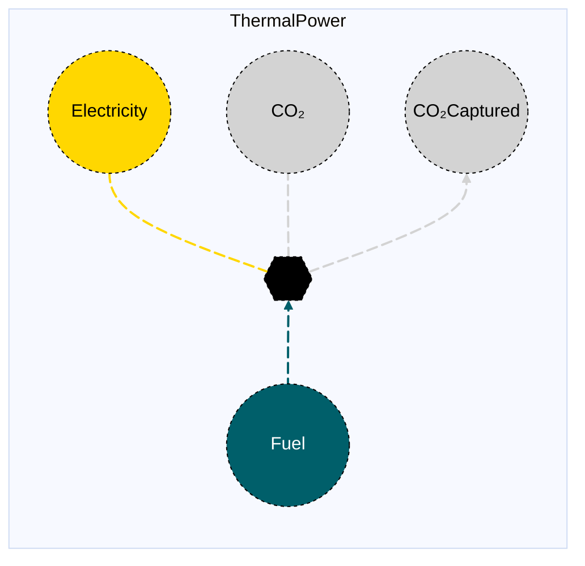

# Thermal Power Plant (with and without CCS)

## Contents

[Overview](@ref thermalpower_overview) | [Asset Structure](@ref thermalpower_asset_structure) | [Flow Equations](@ref thermalpower_flow_equations) | [Input File (Standard Format)](@ref thermalpower_input_file) | [Types - Asset Structure](@ref thermalpower_type_definition) | [Constructors](@ref thermalpower_constructors) | [Examples](@ref thermalpower_examples) | [Best Practices](@ref thermalpower_best_practices) | [Input File (Advanced Format)](@ref thermalpower_advanced_json_csv_input_format)

## [Overview](@id thermalpower_overview)

Thermal power plant assets in Macro represent electricity generation technologies that convert fuel into electricity through combustion or other thermal processes. These assets can include conventional thermal plants (coal, natural gas) and those with carbon capture and storage (CCS) capabilities. They are defined using either JSON or CSV input files placed in the `assets` directory, typically named with descriptive identifiers like `natgas_power.json`, `nuclear_power.json`, or `coal_power.json`.

!!! note "CCS version"
    Macro supports both the standard thermal power plant asset and a CCS version. The only difference between the two is the addition of a CO₂ captured edge.

## [Asset Structure](@id thermalpower_asset_structure)

A thermal power plant asset consists of five main components:

1. **Transformation Component**: Balances the fuel and electricity flows
2. **Fuel Edge**: Represents the fuel supply to the plant
3. **Electricity Edge**: Represents the electricity production (can have unit commitment operations)
4. **CO₂ Edge**: Represents the CO₂ emissions
5. **CO₂ Captured Edge**: Represents the CO₂ captured (only if CCS is present)

Here is a graphical representation of the thermal power plant asset:



## [Flow Equations](@id thermalpower_flow_equations)
The thermal power plant asset follows these stoichiometric relationships:

```math
\begin{aligned}
\phi_{fuel} &= \phi_{elec} \cdot \epsilon_{fuel\_consumption} \\
\phi_{co2} &= \phi_{fuel} \cdot \epsilon_{emission\_rate} \\
\phi_{co2\_captured} &= \phi_{fuel} \cdot \epsilon_{co2\_capture\_rate} \quad \text{(if CCS)} \\
\end{aligned}
```

Where:
- ``\phi`` represents the flow of each commodity
- ``\epsilon`` represents the stoichiometric coefficients defined in the [Conversion Process Parameters](@ref thermalpower_conversion_process_parameters) section.

## [Input File (Standard Format)](@id thermalpower_input_file)

The easiest way to include a thermal power plant asset in a model is to create a new file (either JSON or CSV) and place it in the `assets` directory together with the other assets. 

```
your_case/
├── assets/
│   ├── thermal_power.json    # or thermal_power.csv
│   ├── other_assets.json
│   └── ...
├── system/
├── settings/
└── ...
```

This file can either be created manually, or using the `template_asset` function, as shown in the [Adding an Asset to a System](@ref) section of the User Guide. The file will be automatically loaded when you run your Macro model. 

The following is an example of a thermal power plant asset input file with unit commitment enabled and burning natural gas:
```json
{
    "NaturalGasPowerCCS": [
        {
            "type": "ThermalPowerCCS",
            "instance_data": [
                {
                    "id": "SE_naturalgas_ccccsavgcf_conservative_0",
                    "location": "SE",
                    "fuel_commodity": "NaturalGas",
                    "uc": true,
                    "co2_sink": "co2_sink",
                    "elec_constraints": {
                        "MinFlowConstraint": true,
                        "MinUpTimeConstraint": true,
                        "MinDownTimeConstraint": true
                    },
                    "capacity_size": 377,
                    "fuel_consumption": 2.09809579,
                    "emission_rate": 0.018104824,
                    "capture_rate": 0.162943412,
                    "investment_cost": 105122.0711,
                    "fixed_om_cost": 47800,
                    "variable_om_cost": 3.76,
                    "startup_cost": 97,
                    "startup_fuel_consumption": 0.058614214,
                    "min_up_time": 4,
                    "min_down_time": 4,
                    "ramp_up_fraction": 1,
                    "ramp_down_fraction": 1,
                    "min_flow_fraction": 0.5
                }
            ]
        }
    ]
}
```

!!! tip "Global Data vs Instance Data"
    When working with JSON input files, the `global_data` field can be used to group data that is common to all instances of the same asset type. This is useful for setting constraints that are common to all instances of the same asset type and avoid repeating the same data for each instance. See the [Examples](@ref "thermalpower_examples") section below for an example.

The following tables outline the attributes that can be set for a thermal power plant asset.

### Essential Attributes
| Field | Type | Description |
|--------------|---------|------------|
| `Type` | String | Asset type identifier: "ThermalPower" or "ThermalPowerCCS" |
| `id` | String | Unique identifier for the thermal power plant instance |
| `location` | String | Geographic location/node identifier |
| `fuel_commodity` | String | Fuel commodity identifier |
| `uc` | Boolean | Whether unit commitment is enabled (default: false) |
| `timedata` | String | Time resolution for time series data (default: "Electricity") |
| `co2_sink` | String | CO₂ sink identifier |
| `fuel_start_vertex` | String | Fuel start vertex identifier. This is **not required** if the fuel commodity is present in the location. |

### [Conversion Process Parameters](@id thermalpower_conversion_process_parameters)
The following set of parameters control the conversion process and stoichiometry of the thermal power plant asset (see [Flow Equations](@ref thermalpower_flow_equations) for more details).

| Field | Type | Description | Units | Default |
|--------------|---------|------------|----------------|----------|
| `fuel_consumption` | Float64 | Fuel consumption rate | $MWh_{fuel}/MWh_{elec}$ | 1.0 |
| `emission_rate` | Float64 | CO₂ emission rate | $t_{CO₂}/MWh_{fuel}$ | 0.0 |
| `capture_rate` | Float64 | CO₂ capture rate (CCS only) | $t_{CO₂}/MWh_{fuel}$ | 1.0 |

### [Constraints Configuration](@id "thermalpower_constraints")
Thermal power plant assets can have different constraints applied to them, and the user can configure them using the following fields:

| Field | Type | Description |
|--------------|---------|------------|
| `transform_constraints` | Dict{String,Bool} | List of constraints applied to the transformation component. |
| `elec_constraints` | Dict{String,Bool} | List of constraints applied to the electricity edge. |
| `fuel_constraints` | Dict{String,Bool} | List of constraints applied to the fuel edge. |
| `co2_constraints` | Dict{String,Bool} | List of constraints applied to the CO₂ edge. |
| `co2_captured_constraints` | Dict{String,Bool} | List of constraints applied to the CO₂ captured edge (CCS only). |

For example, if the user wants to apply the [`BalanceConstraint`](@ref balance_constraint_ref) to the transformation component and the [`CapacityConstraint`](@ref capacity_constraint_ref) to the electricity edge, the constraints fields should be set as follows:

```json
{
    "transform_constraints": {
        "BalanceConstraint": true
    },
    "elec_constraints": {
        "CapacityConstraint": true
    }
}
```

Users can refer to the [Adding Asset Constraints to a System](@ref) section of the User Guide for a list of all the constraints that can be applied to the different components of a thermal power plant asset.

#### Default constraints
To simplify the input file and the asset configuration, the following constraints are applied to the thermal power plant asset by default:

- [Balance constraint](@ref balance_constraint_ref) (applied to the transformation component)
- [Capacity constraint](@ref capacity_constraint_ref) (applied to the electricity edge)
- [Ramping limits constraint](@ref ramping_limits_constraint_ref) (applied to the electricity edge)

**Unit commitment constraints** (when `uc` is set to `true`):
- [Minimum up and down time constraint](@ref min_up_and_down_time_constraint_ref) (applied to the electricity edge)

### Investment Parameters
| Field | Type | Description | Units | Default |
|--------------|---------|------------|----------------|----------|
| `can_retire` | Boolean | Whether capacity can be retired | - | true |
| `can_expand` | Boolean | Whether capacity can be expanded | - | true |
| `existing_capacity` | Float64 | Initial installed capacity | MW | 0.0 |
| `capacity_size` | Float64 | Unit size for capacity decisions | - | 1.0 |

#### Additional Investment Parameters

**Maximum and minimum capacity constraints**

If [`MaxCapacityConstraint`](@ref max_capacity_constraint_ref) or [`MinCapacityConstraint`](@ref min_capacity_constraint_ref) are added to the constraints dictionary for the electricity edge, the following parameters are used by Macro:

| Field | Type | Description | Units | Default |
|--------------|---------|------------|----------------|----------|
| `max_capacity` | Float64 | Maximum allowed capacity | MW | Inf |
| `min_capacity` | Float64 | Minimum allowed capacity | MW | 0.0 |

### Economic Parameters
| Field | Type | Description | Units | Default |
|--------------|---------|------------|----------------|----------|
| `investment_cost` | Float64 | CAPEX per unit capacity | \$/MW | 0.0 |
| `annualized_investment_cost` | Union{Nothing,Float64} | Annualized CAPEX | \$/MW/yr | calculated |
| `fixed_om_cost` | Float64 | Fixed O&M costs | \$/MW/yr | 0.0 |
| `variable_om_cost` | Float64 | Variable O&M costs | \$/MWh | 0.0 |
| `startup_cost` | Float64 | Cost per MW of capacity to start a generator | \$/MW per start | 0.0 |
| `wacc` | Float64 | Weighted average cost of capital | fraction | 0.0 |
| `lifetime` | Int | Asset lifetime in years | years | 1 |
| `capital_recovery_period` | Int | Investment recovery period | years | 1 |
| `retirement_period` | Int | Retirement period | years | 0 |

### Operational Parameters
| Field | Type | Description | Units | Default |
|--------------|---------|------------|----------------|----------|
| `availability` | Dict | Availability file path and header | - | Empty |

#### Additional Operational Parameters

**Unit commitment parameters** (when `uc` is set to `true`)

| Field | Type | Description | Units | Default |
|--------------|---------|------------|----------------|----------|
| `startup_fuel_consumption` | Float64 | Fuel consumption per unit electricity to start the plant | $MWh_{fuel}/MWh_{elec}$ | 0.0 |

**Minimum flow constraint**

If [`MinFlowConstraint`](@ref min_flow_constraint_ref) is added to the constraints dictionary for the electricity edge, the following parameter is used:

| Field | Type | Description | Units | Default |
|--------------|---------|------------|----------------|----------|
| `min_flow_fraction` | Float64 | Minimum flow as fraction of capacity | fraction | 0.0 |

**Ramping limit constraint**

If [`RampingLimitConstraint`](@ref ramping_limits_constraint_ref) is added to the constraints dictionary for the electricity edge, the following parameters are used:

| Field | Type | Description | Units | Default |
|--------------|---------|------------|----------------|----------|
| `ramp_up_fraction` | Float64 | Maximum increase in flow between timesteps | fraction | 1.0 |
| `ramp_down_fraction` | Float64 | Maximum decrease in flow between timesteps | fraction | 1.0 |

**Minimum up and down time constraints**

If [`MinUpTimeConstraint`](@ref min_up_and_down_time_constraint_ref) or [`MinDownTimeConstraint`](@ref min_up_and_down_time_constraint_ref) are added to the constraints dictionary for the electricity edge, the following parameters are used:

| Field | Type | Description | Units | Default |
|--------------|---------|------------|----------------|----------|
| `min_up_time` | Int64 | Minimum time the plant must remain committed | hours | 0 |
| `min_down_time` | Int64 | Minimum time the plant must remain shutdown | hours | 0 |

## [Types - Asset Structure](@id thermalpower_type_definition)

The `ThermalPower` and `ThermalPowerCCS` assets are defined as follows:

```julia
struct ThermalPower{T} <: AbstractAsset
    id::AssetId
    thermal_transform::Transformation
    elec_edge::Union{Edge{<:Electricity},EdgeWithUC{<:Electricity}}
    fuel_edge::Edge{<:T}
    co2_edge::Edge{<:CO2}
end

struct ThermalPowerCCS{T} <: AbstractAsset
    id::AssetId
    thermalpowerccs_transform::Transformation
    elec_edge::Union{Edge{<:Electricity},EdgeWithUC{<:Electricity}}
    fuel_edge::Edge{<:T}
    co2_edge::Edge{<:CO2}
    co2_captured_edge::Edge{<:CO2Captured}
end
```

## [Constructors](@id thermalpower_constructors)

### Default constructor

```julia
ThermalPower(id::AssetId, thermal_transform::Transformation, elec_edge::Union{Edge{<:Electricity},EdgeWithUC{<:Electricity}}, fuel_edge::Edge{<:Fuel}, co2_edge::Edge{<:CO2})

ThermalPowerCCS(id::AssetId, thermalpowerccs_transform::Transformation, elec_edge::Union{Edge{<:Electricity},EdgeWithUC{<:Electricity}}, fuel_edge::Edge{<:Fuel}, co2_edge::Edge{<:CO2}, co2_captured_edge::Edge{<:CO2Captured})
```

### Factory constructor
```julia
make(asset_type::Type{ThermalPower}, data::AbstractDict{Symbol,Any}, system::System)
make(asset_type::Type{ThermalPowerCCS}, data::AbstractDict{Symbol,Any}, system::System)
```

| Field | Type | Description |
|--------------|---------|------------|
| `asset_type` | `Type{ThermalPower}` or `Type{ThermalPowerCCS}` | Macro type of the asset |
| `data` | `AbstractDict{Symbol,Any}` | Dictionary containing the input data for the asset |
| `system` | `System` | System to which the asset belongs |

## [Examples](@id thermalpower_examples)
This section contains examples of how to use the thermal power plant asset in a Macro model.

### Nuclear Power Plant

This example shows a nuclear power plant with unit commitment enabled and using uranium as fuel. The asset has an existing capacity that is only allowed to be retired. A `MinFlowConstraint` constraint is applied to the electricity edge with a minimum flow fraction of 0.5. A `MinUpTimeConstraint` and `MinDownTimeConstraint` constraint is applied to the electricity edge with a minimum up and down time of 36 hours. A `RampingLimitConstraint` constraint is applied to the electricity edge with a ramping limit of 0.25. The asset has an availability time series loaded from a CSV file.

**JSON Format:**

Note that the `global_data` field is used to set the fields and constraints that are common to all instances of the same asset type.

```json
{
    "NuclearPower": [
        {
            "type": "ThermalPower",
            "instance_data": [
                {
                    "id": "SE_nuclear_1",
                    "location": "SE",
                    "timedata": "Uranium",
                    "fuel_commodity": "Uranium",
                    "fuel_start_vertex": "uranium_source",
                    "co2_sink": "co2_sink",
                    "uc": true,
                    "can_retire": true,
                    "can_expand": false,
                    "existing_capacity": 33632.288,
                    "capacity_size": 1051.009,
                    "elec_constraints": {
                        "MinFlowConstraint": true,
                        "MinUpTimeConstraint": true,
                        "MinDownTimeConstraint": true
                    },
                    "fuel_consumption": 3.064351108,
                    "fixed_om_cost": 199087.824,
                    "variable_om_cost": 2.34,
                    "min_flow_fraction": 0.5,
                    "startup_cost": 1000,
                    "min_up_time": 36,
                    "min_down_time": 36,
                    "ramp_up_fraction": 0.25,
                    "ramp_down_fraction": 0.25,
                    "startup_fuel_consumption": 0.0
                }
            ]
        }
    ]
}
```

**CSV Format:**

| Type | id | location | timedata | fuel\_commodity | fuel\_start\_vertex | co2\_sink | uc | can\_retire | can\_expand | existing\_capacity | capacity\_size | elec\_constraints--MinFlowConstraint | elec\_constraints--MinUpTimeConstraint | elec\_constraints--MinDownTimeConstraint | fuel\_consumption | fixed\_om\_cost | variable\_om\_cost | startup\_cost | startup\_fuel\_consumption | min\_up\_time | min\_down\_time | ramp\_up\_fraction | ramp\_down\_fraction | min\_flow\_fraction |
|------|----|----------|---------------------|----------------------------------------|---------------------------|------------------------|----------------------|----------------------|---------------------------|------------------------|----------------------|----------------------|------------------------------------------|------------------------------------------|--------------------------------|--------------------------------|----------------------------------|---------------------|---------------------------|------------------------|---------------------|------------------------|---------------------|---------------------|
| ThermalPower | SE\_nuclear\_1 | SE | Uranium | Uranium| uranium\_source | co2\_sink | true | true | true | 33632.288 | 1051.009 | true | true | true | 3.064351108 | 199087.824 | 2.34 | 1000 | 0.0 | 36 | 36 | 0.25 | 0.25 | 0.5 | 

### Multiple Natural Gas Fired Combined Cycle Plants in Different Zones with CCS

This example shows three natural gas fired combined cycle plants with unit commitment enabled and using natural gas as fuel. Each asset has an existing capacity that is only allowed to be retired. A `MinFlowConstraint` constraint is applied to the electricity edge with a minimum flow fraction of 0.444, 0.526, and 0.41. A `MinUpTimeConstraint` and `MinDownTimeConstraint` constraint is applied to the electricity edge with a minimum up and down time of 6 hours. A `RampingLimitConstraint` constraint is applied to the electricity edge with a ramping limit of 0.64. The asset has an availability time series loaded from a CSV file.

**JSON Format:**

```json
{
    "NaturalGasPower": [
        {
            "type": "ThermalPower",
            "global_data": {
                "timedata": "NaturalGas",
                "fuel_commodity": "NaturalGas",
                "co2_sink": "co2_sink",
                "uc": true,
                "elec_constraints": {
                    "MinFlowConstraint": true,
                    "MinUpTimeConstraint": true,
                    "MinDownTimeConstraint": true
                }
            },
            "instance_data": [
                {
                    "id": "MIDAT_natural_gas_fired_combined_cycle_1",
                    "location": "MIDAT",
                    "emission_rate": 0.181048235160161,
                    "fuel_consumption": 2.249613533,
                    "can_retire": true,
                    "can_expand": false,
                    "existing_capacity": 4026.4,
                    "investment_cost": 0.0,
                    "fixed_om_cost": 16001,
                    "variable_om_cost": 4.415,
                    "capacity_size": 125.825,
                    "startup_cost": 89.34,
                    "startup_fuel_consumption": 0.58614214,
                    "min_up_time": 6,
                    "min_down_time": 6,
                    "ramp_up_fraction": 0.64,
                    "ramp_down_fraction": 0.64,
                    "min_flow_fraction": 0.444
                },
                {
                    "id": "NE_natural_gas_fired_combined_cycle_1",
                    "location": "NE",
                    "emission_rate": 0.181048235160161,
                    "fuel_consumption": 2.511912141,
                    "can_retire": true,
                    "can_expand": false,
                    "existing_capacity": 6119.616,
                    "investment_cost": 0.0,
                    "fixed_om_cost": 16001,
                    "variable_om_cost": 4.415,
                    "capacity_size": 127.492,
                    "startup_cost": 89.34,
                    "startup_fuel_consumption": 0.58614214,
                    "min_up_time": 6,
                    "min_down_time": 6,
                    "ramp_up_fraction": 0.64,
                    "ramp_down_fraction": 0.64,
                    "min_flow_fraction": 0.526
                },
                {
                    "id": "SE_natural_gas_fired_combined_cycle_1",
                    "location": "SE",
                    "emission_rate": 0.181048235160161,
                    "fuel_consumption": 2.132092034,
                    "can_retire": true,
                    "can_expand": false,
                    "existing_capacity": 26218.712,
                    "investment_cost": 0.0,
                    "fixed_om_cost": 9496,
                    "variable_om_cost": 3.504,
                    "capacity_size": 504.206,
                    "startup_cost": 89.34,
                    "startup_fuel_consumption": 0.58614214,
                    "min_up_time": 6,
                    "min_down_time": 6,
                    "ramp_up_fraction": 0.64,
                    "ramp_down_fraction": 0.64,
                    "min_flow_fraction": 0.41
                }
            ]
        }
    ]
}
```

**CSV Format:**

| Type | id | location | timedata | fuel\_commodity | co2\_sink | uc | can\_retire | can\_expand | existing\_capacity | capacity\_size | elec\_constraints--MinFlowConstraint | elec\_constraints--MinUpTimeConstraint | elec\_constraints--MinDownTimeConstraint | fuel\_consumption | fixed\_om\_cost | variable\_om\_cost | startup\_cost | startup\_fuel\_consumption | min\_up\_time | min\_down\_time | ramp\_up\_fraction | ramp\_down\_fraction | min\_flow\_fraction |
|------|----|----------|---------------------|----------------------------------------|---------------------------|------------------------|----------------------|----------------------|---------------------------|----------------------|----------------------|------------------------------------------|------------------------------------------|--------------------------------|--------------------------------|----------------------------------|---------------------|---------------------------|------------------------|---------------------|------------------------|---------------------|---------------------|
| ThermalPower | MIDAT\_natural\_gas\_fired\_combined\_cycle\_1 | MIDAT | NaturalGas | NaturalGas | co2\_sink | true | true | false | 4026.4 | 125.825 | true | true | true | 2.249613533 | 16001 | 4.415 | 89.34 | 0.58614214 | 6 | 6 | 0.64 | 0.64 | 0.444 |
| ThermalPower | NE\_natural\_gas\_fired\_combined\_cycle\_1 | NE | NaturalGas | NaturalGas | co2\_sink | true | true | false | 6119.616 | 127.492 | true | true | true | 2.511912141 | 16001 | 4.415 | 89.34 | 0.58614214 | 6 | 6 | 0.64 | 0.64 | 0.526 |
| ThermalPower | SE\_natural\_gas\_fired\_combined\_cycle\_1 | SE | NaturalGas | NaturalGas | co2\_sink | true | true | false | 26218.712 | 504.206 | true | true | true | 2.132092034 | 9496 | 3.504 | 89.34 | 0.58614214 | 6 | 6 | 0.64 | 0.64 | 0.41 |

## [Best Practices](@id thermalpower_best_practices)

1. **Use global data for common parameters**: Use the `global_data` field to set the fields and constraints that are common to all instances of the same asset type.
2. **Set realistic efficiency parameters**: Ensure fuel consumption, emission rates, and capture rates are accurate for the technology being modeled
3. **Use meaningful IDs**: Choose descriptive identifiers that indicate location and technology type
4. **Consider unit commitment carefully**: Enable unit commitment only when detailed operational modeling is needed
5. **Use constraints selectively**: Only enable constraints that are necessary for your modeling needs
6. **Validate costs**: Ensure investment and O&M costs are in appropriate units and time periods
7. **Test configurations**: Start with simple configurations and gradually add complexity
8. **Separate conventional vs CCS plants**: Use different asset types for conventional and CCS thermal plants
9. **Set appropriate ramp rates**: Consider the actual operational characteristics of the technology

## [Input File (Advanced Format)](@id thermalpower_advanced_json_csv_input_format)

Macro provides an advanced format for defining thermal power plant assets, offering users and modelers detailed control over asset specifications. This format builds upon the standard format and is ideal for those who need more comprehensive customization.

To understand the advanced format, consider the [graph representation](@ref thermalpower_asset_structure) and the [type definition](@ref thermalpower_type_definition) of a thermal power plant asset. The input file mirrors this hierarchical structure.

A thermal power plant asset in Macro is composed of a transformation component, represented by a `Transformation` object, and multiple edges (fuel, electricity, CO2, and optionally CO2 captured), each represented by an `Edge` object. The input file for a thermal power plant asset is therefore organized as follows:

```json
{
    "transforms":{
        // ... transformation-specific attributes ...
    },
    "edges":{
        "fuel_edge": {
            // ... fuel_edge-specific attributes ...
        },
        "elec_edge": {
            // ... elec_edge-specific attributes ...
        },
        "co2_edge": {
            // ... co2_edge-specific attributes ...
        },
        "co2_captured_edge": {
            // ... co2_captured_edge-specific attributes, only if CCS is present ...
        }
    }
}
```

Each top-level key (e.g., "transforms" or "edges") denotes a component type. The second-level keys either specify the attributes of the component (when there is a single instance) or identify the instances of the component when there are multiple instances.

Below is an example of an input file for a thermal power plant asset that sets up multiple thermal plants across different regions:

```json
{
    "NaturalGasPower": [
        {
            "type": "ThermalPower",
            "global_data": {
                "transforms": {
                    "timedata": "NaturalGas",
                    "constraints": {
                        "BalanceConstraint": true
                    }
                },
                "edges": {
                    "elec_edge": {
                        "commodity": "Electricity",
                        "unidirectional": true,
                        "has_capacity": true,
                        "uc": true,
                        "integer_decisions": false,
                        "constraints": {
                            "CapacityConstraint": true,
                            "RampingLimitConstraint": true,
                            "MinFlowConstraint": true,
                            "MinUpTimeConstraint": true,
                            "MinDownTimeConstraint": true
                        }
                    },
                    "fuel_edge": {
                        "commodity": "NaturalGas",
                        "unidirectional": true,
                        "has_capacity": false
                    },
                    "co2_edge": {
                        "commodity": "CO2",
                        "unidirectional": true,
                        "has_capacity": false,
                        "end_vertex": "co2_sink"
                    }
                }
            },
            "instance_data": [
                {
                    "id": "MIDAT_natural_gas_fired_combined_cycle_1",
                    "transforms": {
                        "emission_rate": 0.181048235160161,
                        "fuel_consumption": 2.249613533
                    },
                    "edges": {
                        "elec_edge": {
                            "end_vertex": "elec_MIDAT",
                            "can_retire": true,
                            "can_expand": false,
                            "existing_capacity": 4026.4,
                            "investment_cost": 0.0,
                            "fixed_om_cost": 16001,
                            "variable_om_cost": 4.415,
                            "capacity_size": 125.825,
                            "startup_cost": 89.34,
                            "startup_fuel_consumption": 0.58614214,
                            "min_up_time": 6,
                            "min_down_time": 6,
                            "ramp_up_fraction": 0.64,
                            "ramp_down_fraction": 0.64,
                            "min_flow_fraction": 0.444
                        },
                        "fuel_edge": {
                            "start_vertex": "natgas_MIDAT"
                        }
                    }
                },
                {
                    "id": "NE_natural_gas_fired_combined_cycle_1",
                    "transforms": {
                        "emission_rate": 0.181048235160161,
                        "fuel_consumption": 2.511912141
                    },
                    "edges": {
                        "elec_edge": {
                            "end_vertex": "elec_NE",
                            "can_retire": true,
                            "can_expand": false,
                            "existing_capacity": 6119.616,
                            "investment_cost": 0.0,
                            "fixed_om_cost": 16001,
                            "variable_om_cost": 4.415,
                            "capacity_size": 127.492,
                            "startup_cost": 89.34,
                            "startup_fuel_consumption": 0.58614214,
                            "min_up_time": 6,
                            "min_down_time": 6,
                            "ramp_up_fraction": 0.64,
                            "ramp_down_fraction": 0.64,
                            "min_flow_fraction": 0.526
                        },
                        "fuel_edge": {
                            "start_vertex": "natgas_NE"
                        }
                    }
                },
                {
                    "id": "SE_natural_gas_fired_combined_cycle_1",
                    "transforms": {
                        "emission_rate": 0.181048235160161,
                        "fuel_consumption": 2.132092034
                    },
                    "edges": {
                        "elec_edge": {
                            "end_vertex": "elec_SE",
                            "can_retire": true,
                            "can_expand": false,
                            "existing_capacity": 26218.712,
                            "investment_cost": 0.0,
                            "fixed_om_cost": 9496,
                            "variable_om_cost": 3.504,
                            "capacity_size": 504.206,
                            "startup_cost": 89.34,
                            "startup_fuel_consumption": 0.58614214,
                            "min_up_time": 6,
                            "min_down_time": 6,
                            "ramp_up_fraction": 0.64,
                            "ramp_down_fraction": 0.64,
                            "min_flow_fraction": 0.41
                        },
                        "fuel_edge": {
                            "start_vertex": "natgas_SE"
                        }
                    }
                }
            ]
        }
    ]
}
```

### Key Points

- The `global_data` field is utilized to define attributes and constraints that apply universally to all instances of a particular asset type.
- The `start_vertex` and `end_vertex` fields indicate the nodes to which the edges are connected. These nodes must be defined in the `nodes.json` file.
- By default, only the electricity edge is allowed to expand as a modeling decision (*see note below*)
- The electricity edge can have unit commitment operations enabled by setting the `uc` attribute to `true`.
- For a comprehensive list of attributes that can be configured for the transformation and edge components, refer to the [transformation](@ref manual-transformation-fields) and [edges](@ref manual-edges-fields) pages of the Macro manual. 

!!! note "The `has_capacity` Edge Attribute"
    The `has_capacity` attribute is a flag that indicates whether a specific edge of an asset has a capacity variable, allowing it to be expanded or retired. Typically, users do not need to manually adjust this flag, as the asset creators in Macro have already configured it correctly for each edge. However, advanced users can use this flag to override the default settings for each edge if needed.

!!! tip "Prefixes"
    Users can apply prefixes to adjust parameters for the components of a thermal power plant asset, even when using the standard format. For instance, `co2_can_retire` will adjust the `can_retire` parameter for the CO2 edge, and `co2_existing_capacity` will adjust the `existing_capacity` parameter for the CO2 edge.
    Below are the prefixes available for modifying parameters for the components of a thermal power plant asset:
    - `transform_` for the transformation component
    - `elec_` for the electricity edge
    - `co2_` for the CO2 edge
    - `co2_captured_` for the CO2 captured edge
    - `fuel_` for the fuel edge