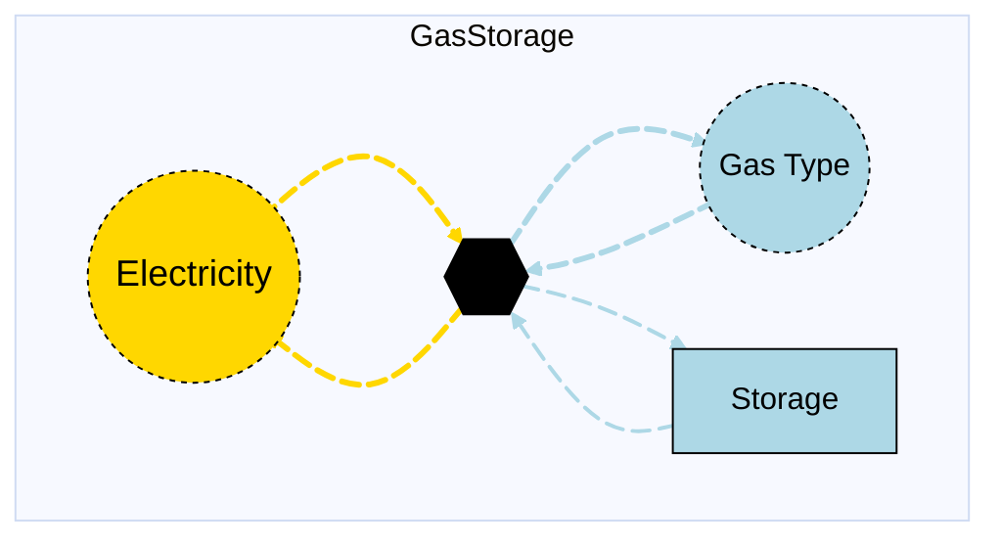

# Test

## Gas Storage

```mermaid
%%{init: {'theme': 'base', 'themeVariables': { 'background': '#D1EBDE' }}}%%
flowchart LR
  subgraph GasStorage
  direction LR
    A((Electricity)) e1@--> C{{..}} e2@--> A((Electricity))
    B((Gas Type)) e3@--> C{{..}} e4@--> B((Gas Type))
    C e5@--> D[Storage] e6@--> C
    e1@{ animate: true }
    e2@{ animate: true }
    e3@{ animate: true }
    e4@{ animate: true }
    e5@{ animate: true }
    
 end
    style A font-size:19px,r:55px,fill:#FFD700,stroke:black,color:black, stroke-dasharray: 3,5;
    style B r:44px,fill:lightblue,stroke:black,color:black, stroke-dasharray: 3,5;
    style C fill:black,stroke:black,color:black;
    style D fill:lightblue,stroke:black,color:black;

    linkStyle 0,1 stroke:#FFD700, stroke-width: 3px;
    linkStyle 2,3 stroke:lightblue, stroke-width: 3px;
    linkStyle 4,5 stroke:lightblue, stroke-width: 2px; e6@{ animate: true };
    
```